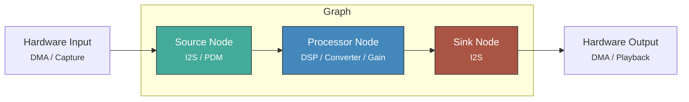
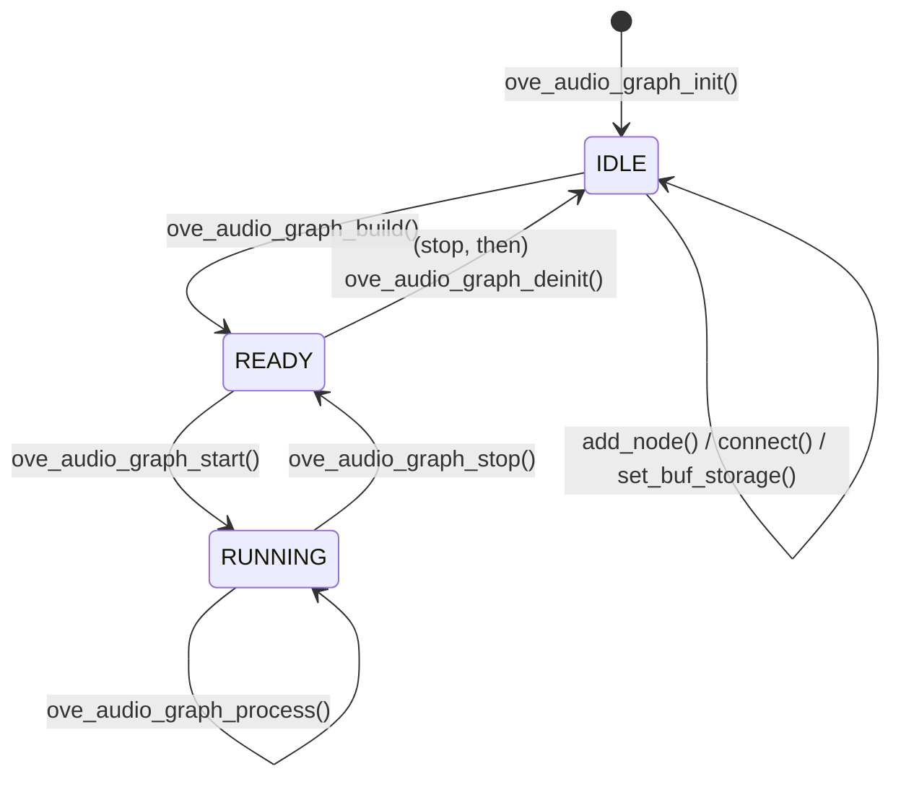
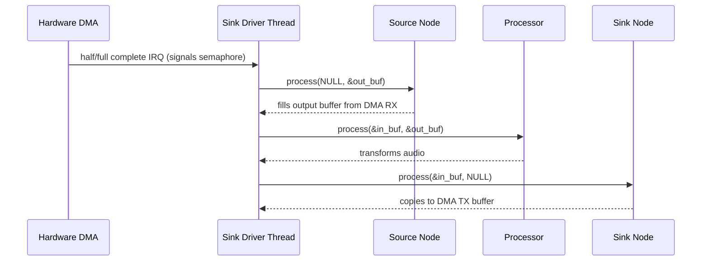
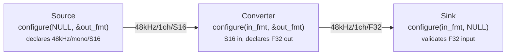
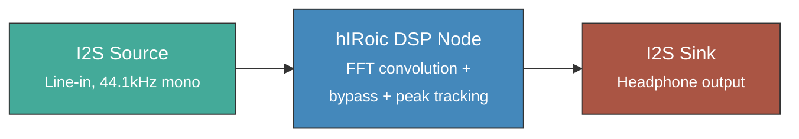
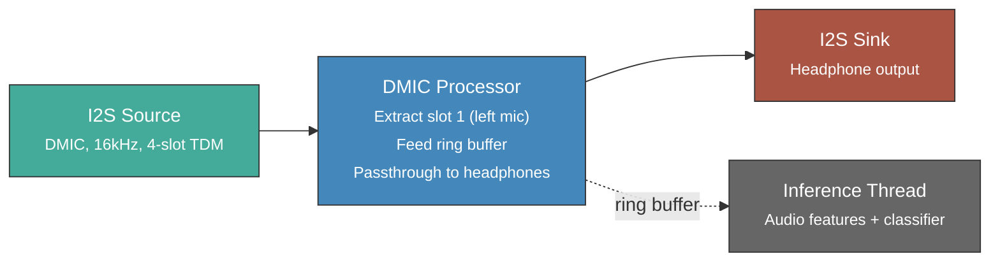

# Audio Engine

The oveRTOS audio engine is a graph-based processing framework. Audio flows through a directed acyclic graph (DAG) of typed nodes, validated at build time and executed in topological order.

## Architecture



**Node types:**

| Type | Role | `process()` contract |
|------|------|---------------------|
| **Source** | Produces audio from hardware or memory | `in` = NULL, fills `out` |
| **Processor** | Transforms audio (DSP, format conversion, gain) | Reads `in`, writes `out` |
| **Sink** | Consumes audio to hardware or memory | Reads `in`, `out` = NULL |

## Graph Lifecycle



1. **IDLE** -- Add nodes and connect them. The graph is mutable.
2. **build()** -- Validates edges, propagates formats via `configure()`, resolves topological execution order, allocates inter-node buffers. Transitions to **READY**.
3. **READY** -- Graph is immutable. Start begins hardware streaming.
4. **RUNNING** -- Hardware callbacks drive `process()` each buffer period.

`ove_audio_graph_deinit()` must be called only after stopping the graph. It frees the heap-allocated buffer storage; storage attached with `ove_audio_graph_set_buf_storage()` is left untouched.

## Execution Modes

### Sink-driven (real-time)

The sink device node's driver thread blocks on DMA half/full completion, then drives `ove_audio_graph_process()` on every period boundary. The engine walks all nodes in topological order on that driver thread (not on the DMA ISR — the ISR only signals the driver thread).



### App-driven (testing / offline)

The application calls `ove_audio_graph_process()` directly to pump one cycle. No hardware is involved -- useful for unit tests with mock source/sink nodes.

## Format Negotiation

Each node declares its output format during `build()` via the `configure()` callback:



Format propagation happens in topological order during `build()`. If any node rejects its input format, `build()` returns `OVE_ERR_INVALID_PARAM`. Connected nodes must agree on sample rate (no built-in resampler).

## Built-in Nodes

| Node | Factory | Purpose |
|------|---------|---------|
| **Converter** | `ove_audio_node_converter()` | Sample format conversion (S16/S32/F32, all combinations) |
| **Channel Map** | `ove_audio_node_channel_map()` | Remap, extract, or silence channels |
| **Gain** | `ove_audio_node_gain()` | Volume control in dB (applies linear gain with clamping) |
| **Tap** | `ove_audio_node_tap()` | Passthrough with observer callback (VU meters, ring buffers) |

## Device Nodes (Transports)

Device nodes are hardware-backed sources and sinks created via factory functions:

```c
int ove_audio_device_source(struct ove_audio_graph *g,
                            const struct ove_audio_device_cfg *cfg,
                            const char *name);

int ove_audio_device_sink(struct ove_audio_graph *g,
                          const struct ove_audio_device_cfg *cfg,
                          const char *name);
```

| Transport | Source | Sink | Backend |
|-----------|--------|------|---------|
| `OVE_AUDIO_TRANSPORT_I2S` | Yes | Yes | FreeRTOS (STM32 SAI/DMA), Zephyr (device tree), NuttX (`/dev/audio`) |
| `OVE_AUDIO_TRANSPORT_PDM` | Yes | No | FreeRTOS (STM32 DFSDM), Zephyr |

## Custom Nodes

Implement the `ove_audio_node_ops` vtable to create custom processing nodes:

```c
static int my_dsp_configure(void *ctx, const struct ove_audio_fmt *in,
                            struct ove_audio_fmt *out)
{
    *out = *in;  /* same format as input */
    return OVE_OK;
}

static int my_dsp_process(void *ctx, const struct ove_audio_buf *in,
                          struct ove_audio_buf *out)
{
    const int16_t *src = (const int16_t *)in->data;
    int16_t *dst = (int16_t *)out->data;
    /* ... transform audio ... */
    return OVE_OK;
}

static const struct ove_audio_node_ops my_dsp_ops = {
    .configure = my_dsp_configure,
    .process   = my_dsp_process,
};
```

Register it with:

```c
int node = ove_audio_graph_add_node(&graph, &my_dsp_ops, my_ctx,
                                    "my-dsp", OVE_AUDIO_NODE_PROCESSOR);
```

## Buffer Storage and Zero-Heap Mode

The graph holds one intermediate audio buffer per non-sink node. In heap mode the buffers are allocated by `ove_audio_graph_build()`; in zero-heap mode the caller must supply storage before `build()`:

```c
/* Compile-time storage upper bound. */
static uint8_t graph_buf[OVE_AUDIO_GRAPH_STORAGE_BYTES(
    /*nodes=*/3, /*frames=*/512, /*channels=*/1, /*sample_bytes=*/2)]
    __attribute__((aligned(4)));

ove_audio_graph_init(&graph, 512);
ove_audio_graph_set_buf_storage(&graph, graph_buf, sizeof(graph_buf));
```

The `OVE_AUDIO_GRAPH_DEFINE(name, nodes, frames, channels, sample_bytes)` macro combines the storage array and the `struct ove_audio_graph` declaration into one file-scope statement. The companion `ove_audio_graph_create(pg, frames, nodes, channels, sample_bytes)` macro initialises a graph and (in heap mode) calls `_init`. In heap mode the `nodes`/`channels`/`sample_bytes` arguments are unused — the macro signature is shared with the zero-heap path for source compatibility.

## Example: Guitar IR Convolution

The hIRoic app uses the graph engine for real-time cabinet impulse response convolution:



```c
static struct ove_audio_graph graph;

void app_init(void)
{
    struct ove_audio_device_cfg dev_cfg = {
        .transport = OVE_AUDIO_TRANSPORT_I2S,
        .fmt = { .sample_rate = 44100, .channels = 1,
                 .sample_fmt = OVE_AUDIO_FMT_S16 },
    };

    ove_audio_graph_init(&graph, 512);
    /* In zero-heap mode call ove_audio_graph_set_buf_storage(&graph, …)
     * here with caller-provided storage; see "Buffer Storage" above. */

    int src  = ove_audio_device_source(&graph, &dev_cfg, "i2s-in");
    int dsp  = ove_audio_graph_add_node(&graph, &hiroic_dsp_ops,
                                        NULL, "dsp", OVE_AUDIO_NODE_PROCESSOR);
    int sink = ove_audio_device_sink(&graph, &dev_cfg, "i2s-out");

    ove_audio_graph_connect(&graph, src, dsp);
    ove_audio_graph_connect(&graph, dsp, sink);
    ove_audio_graph_build(&graph);
    ove_audio_graph_start(&graph);
}

void app_shutdown(void)
{
    ove_audio_graph_stop(&graph);
    ove_audio_graph_deinit(&graph);
}
```

## Example: Keyword Detection with DMIC

The example_keyword_live app extracts DMIC audio from a TDM stream, feeds a ring buffer for ML inference, and passes audio to headphones:



## Diagnostics

Query runtime statistics with `ove_audio_graph_get_stats()`:

| Field | Description |
|-------|-------------|
| `cycles` | Total completed process cycles |
| `underruns` | Sink starvation events (e.g., DMA phase skip) |
| `overruns` | Source overflow events (e.g., short capture read) |
| `node_errors` | Count of `process()` failures (output zeroed on error) |
| `max_process_us` | Worst-case cycle time in microseconds |
| `avg_process_us` | Rolling average cycle time in microseconds |

Timing fields are populated when `CONFIG_OVE_TIME` is enabled.

## Kconfig and Heap Gating

| Option | Default | Description |
|--------|---------|-------------|
| `CONFIG_OVE_AUDIO` | `n` | Enable the audio graph engine. When unset, the public functions become inline stubs returning `OVE_ERR_NOT_SUPPORTED`. |
| `CONFIG_OVE_TIME` | `n` | When set, populates `max_process_us` / `avg_process_us` in `struct ove_audio_graph_stats`. |

The built-in node factories (`ove_audio_node_converter`, `ove_audio_node_channel_map`, `ove_audio_node_gain`, `ove_audio_node_tap`) and the `ove_audio_graph_create`/`destroy` heap helpers are declared only when `OVE_HEAP_AUDIO` is defined — i.e. when `CONFIG_OVE_ZERO_HEAP` is **not** set. In zero-heap mode, use the static-storage path: `OVE_AUDIO_GRAPH_DEFINE` + `ove_audio_graph_init` + `ove_audio_graph_set_buf_storage`, with custom processor nodes (the bundled factories are heap-only).

## Headers

| Header | Contents |
|--------|----------|
| `ove/audio.h` | `struct ove_audio_graph`, graph state enum, init/deinit/build/start/stop/process/get_stats, `set_buf_storage`, `OVE_AUDIO_GRAPH_STORAGE_BYTES`, `OVE_AUDIO_GRAPH_DEFINE`, `ove_audio_graph_create`/`destroy` (heap mode). |
| `ove/audio_node.h` | Format types, buffer type, node vtable, built-in node factories (heap mode). |
| `ove/audio_device.h` | Transport enum, device config, device source/sink factories. |
