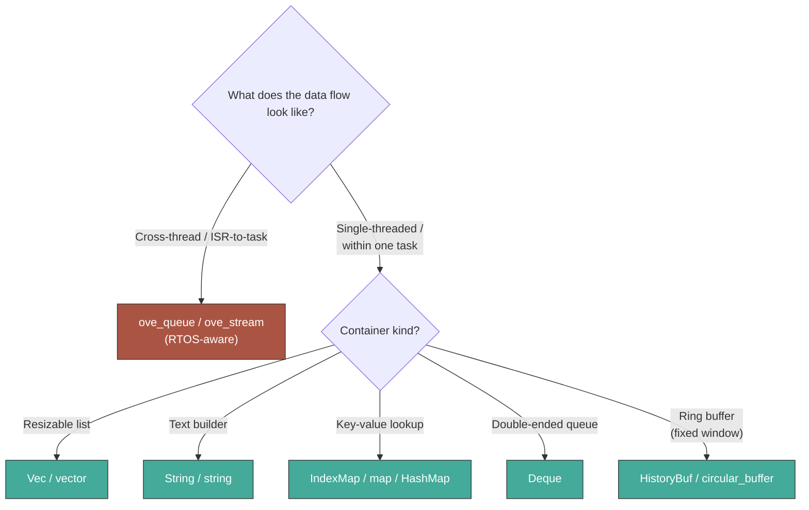

# General-Purpose Containers

oveRTOS exposes a small set of fixed-capacity containers — vectors, strings, hashmaps, deques — that compile in **both heap and zeroheap modes** without conditional compilation at the use site. They complement the RTOS-aware primitives (`Queue`, `Stream`) by covering everyday "I need a resizable buffer / lookup table" cases without forcing app code to roll its own `[T; N]` + `len` patterns.

Every container is **fixed-capacity at compile time** and **never touches the global allocator**. Capacity overflow is reported as a typed error (no panic, no UB), matching the rest of the binding's "errors are values" posture.

## Per-binding choice

| Binding | Library | License | How |
|---------|---------|---------|-----|
| **C++** | [ETL](https://www.etlcpp.com/) (Embedded Template Library) | MIT | Vendored under `dl/etl-<rev>/`; included automatically for C++ apps via `cmake/OveEtl.cmake`. |
| **Rust** | [`heapless`](https://docs.rs/heapless) crate | MIT/Apache-2.0 | Re-exported as `ove::containers::*` from a `Cargo.toml` dep. |
| **Zig** | Hybrid: thin custom wrappers + stdlib `Unmanaged` containers | n/a | `ove.Vec(T,N)` / `ove.String(N)` for hot paths; `ove.fixedBufferAlloc(buf)` to back `std.ArrayListUnmanaged`, `std.AutoHashMapUnmanaged`, etc. |

All three pair naturally with oveRTOS's existing template-with-capacity-parameter pattern — `etl::vector<T,N>`, `heapless::Vec<T,N>`, and `ove.Vec(T,N)` mirror the shape of `ove::Queue<T,N>`, `Queue<T, const N: usize>`, and `Queue(T, N)` already in each binding.

## Choosing a container



**Rule of thumb**: reach for the RTOS primitives (`ove_queue`, `ove_stream`, etc.) when crossing a task or ISR boundary; reach for the general-purpose containers below for purely intra-task storage. The RTOS primitives include a kernel object and synchronisation; the general-purpose containers are pure data structures with no synchronisation.

---

## C++ — ETL

ETL is header-only and exception-free in oveRTOS's configuration (`ETL_NO_EXCEPTIONS` is set automatically by `cmake/OveEtl.cmake`, matching the project's `-fno-exceptions` defaults). Capacity-full / out-of-range / illegal-state conditions invoke ETL's global error handler instead of throwing.

```cpp
#include <etl/vector.h>
#include <etl/string.h>
#include <etl/map.h>

etl::vector<uint8_t, 64>  buf;
etl::string<32>           name;
etl::map<int, int, 8>     score;

buf.push_back(0xAB);
name.assign("hello");
score.insert({ 42, 100 });
```

### What's available

| Container | Header |
|-----------|--------|
| `etl::vector<T, N>` | `<etl/vector.h>` |
| `etl::string<N>` | `<etl/string.h>` |
| `etl::map<K, V, N>` / `etl::flat_map<K, V, N>` | `<etl/map.h>` / `<etl/flat_map.h>` |
| `etl::set<T, N>` / `etl::flat_set<T, N>` | `<etl/set.h>` / `<etl/flat_set.h>` |
| `etl::list<T, N>` / `etl::forward_list<T, N>` | `<etl/list.h>` / `<etl/forward_list.h>` |
| `etl::deque<T, N>` | `<etl/deque.h>` |
| `etl::queue<T, N>` / `etl::stack<T, N>` | `<etl/queue.h>` / `<etl/stack.h>` |
| `etl::array<T, N>` / `etl::bitset<N>` | `<etl/array.h>` / `<etl/bitset.h>` |
| `etl::optional<T>` / `etl::variant<...>` / `etl::expected<T, E>` | `<etl/optional.h>` / `<etl/variant.h>` / `<etl/expected.h>` |
| `etl::circular_buffer<T, N>` | `<etl/circular_buffer.h>` |
| `etl::intrusive_list<T>` / `etl::intrusive_forward_list<T>` | `<etl/intrusive_list.h>` / `<etl/intrusive_forward_list.h>` |
| `etl::pool<T, N>` | `<etl/pool.h>` |
| `etl::delegate<...>` | `<etl/delegate.h>` |

`etl::ivector<T>&`, `etl::istring&`, `etl::imap<K, V>&` are size-erased base types — pass these to functions that don't care about capacity, the same way `ove::Queue<T, N>` is passed by ref to capacity-agnostic helpers.

### Error handling

When a container hits its capacity, the configured ETL error handler runs. By default it asserts; apps can install a custom handler at startup:

```cpp
#include <etl/error_handler.h>

class TraceErrorHandler : public etl::ierror_handler {
public:
    void error(const etl::exception& e) override {
        OVE_LOG_ERR("ETL: %s @ %s:%lu", e.what(), e.file_name(),
                    static_cast<unsigned long>(e.line_number()));
    }
};

static TraceErrorHandler g_etl_handler;

// During init:
etl::error_handler::set_callback<TraceErrorHandler>(g_etl_handler);
```

---

## Rust — `heapless`

Re-exported as `ove::containers::*`. `ove::heap::Vec` (re-exported from `alloc::vec::Vec` when the `alloc` feature is enabled) remains available for **heap-mode-only** dynamic vectors; `ove::containers::Vec<T, N>` is the right choice when zeroheap-mode compatibility matters or when capacity is statically known.

```rust
use ove::containers::{Vec, String, IndexMap};
use ove::containers::ContainerExt;

let mut buf: Vec<u8, 64> = Vec::new();
buf.ove_push(0xAB)?;          // Result<(), ove::Error>
buf.push(0xCD).unwrap_or(()); // native heapless API also available

let mut name: String<32> = String::new();
name.push_str("hello").unwrap();
```

### What's available

| Type | Description |
|------|-------------|
| `Vec<T, N>` | Fixed-capacity vector, `push` returns `Result<(), T>` |
| `String<N>` | Fixed-capacity UTF-8 string |
| `Deque<T, N>` | Fixed-capacity double-ended queue |
| `IndexMap<K, V, S, N>` / `IndexSet<T, S, N>` | Insertion-ordered hashmap / set |
| `LinearMap<K, V, N>` | Linear-scan map (no hashing required) |
| `HistoryBuf<T, N>` | Ring buffer of the last *N* items |
| `binary_heap::BinaryHeap<T, K, N>` | Fixed-capacity priority queue |
| `sorted_linked_list::SortedLinkedList` | Sorted intrusive linked list |

The `ContainerExt` trait adapts `heapless`'s capacity-overflow returns to `ove::Error::NoMemory` for consistent `?` flow with the rest of the binding:

```rust
use ove::containers::{Vec, ContainerExt};
fn fill(buf: &mut Vec<u32, 8>) -> ove::Result<()> {
    for i in 0..16 {
        buf.ove_push(i)?;     // returns ove::Error::NoMemory at i == 8
    }
    Ok(())
}
```

`heapless::spsc` and `heapless::mpmc` are intentionally **not** re-exported under `ove::containers::*` to avoid confusion with the kernel-aware `ove::Queue`. Apps that explicitly want a lock-free SPSC ring should `use heapless::spsc;` directly.

---

## Zig — Hybrid

Two tiers complement each other. Use **Tier 1** for hot paths and ergonomic local buffers; use **Tier 2** when you need the full stdlib container surface (hashmaps, deques, priority queues).

### Tier 1: thin custom wrappers

`ove.Vec(T, N)` and `ove.String(N)` mirror the existing `Queue(T, N)` / `Stream(N)` shape: comptime capacity, embedded storage, no allocator.

```zig
const std = @import("std");
const ove = @import("ove");

var buf = ove.Vec(u8, 64).init();
try buf.append(0xAB);
try buf.appendSlice(&[_]u8{ 1, 2, 3 });

var name = ove.String(32).init();
try name.appendSlice("count=");
try name.format("{d}", .{42});
std.debug.print("{s}\n", .{name.slice()});
```

Methods return `error.NoMemory` on overflow — also a member of `ove.Error`, so `try v.append(x)` composes cleanly inside a function returning `ove.Error!void`.

### Tier 2: stdlib `Unmanaged` + `fixedBufferAlloc`

For hashmaps, deques, priority queues, linked lists, and other complex containers, lean on `std.*Unmanaged` and feed them an allocator carved out of a static byte slice via `ove.fixedBufferAlloc(buffer)`.

```zig
const std = @import("std");
const ove = @import("ove");

var hash_storage: [1024]u8 = undefined;
var fba = ove.fixedBufferAlloc(&hash_storage);
const allocator = fba.allocator();

var map: std.AutoHashMapUnmanaged(u32, u32) = .{};
try map.put(allocator, 1, 100);
try map.put(allocator, 2, 200);

var list: std.ArrayListUnmanaged(u32) = .{};
try list.append(allocator, 42);
```

`ove.fixedBufferAlloc(buf)` returns a `std.heap.FixedBufferAllocator` (a struct holding a cursor); the caller must keep it alive for as long as any container backed by `.allocator()` is in use.

### Note on Zig 0.15

Zig 0.15 removed `std.BoundedArray` from the standard library. The recommended replacements are:

- `ove.Vec(T, N)` (Tier 1) — for ergonomic embedded use, the natural successor.
- `std.ArrayListUnmanaged(T)` plus its new `Bounded` methods (`appendBounded`, etc.) backed by `ove.fixedBufferAlloc(buf)` — when stdlib interop matters.

---

## When to use `ove::Queue` / `ove::Stream` instead

These are **kernel-aware** primitives — not pure data structures. They include a kernel object, blocking semantics, and ISR-safe variants:

- **`ove::Queue` / `Queue<T, N>` / `Queue(T, N)`** — fixed-capacity FIFO with blocking `send`/`receive`, ISR-safe variants, and timeout support. Use when crossing a task or ISR boundary.
- **`ove::Stream` / `Stream` / `Stream(N)`** — byte ring buffer with a flow-control threshold. Use for unframed serial-style byte transfer between a producer task/ISR and a consumer task.

If you find yourself wrapping `etl::vector` / `heapless::Vec` / `ove.Vec` with a mutex to protect cross-thread access, reach for `ove::Queue` instead — that's exactly what it solves.
