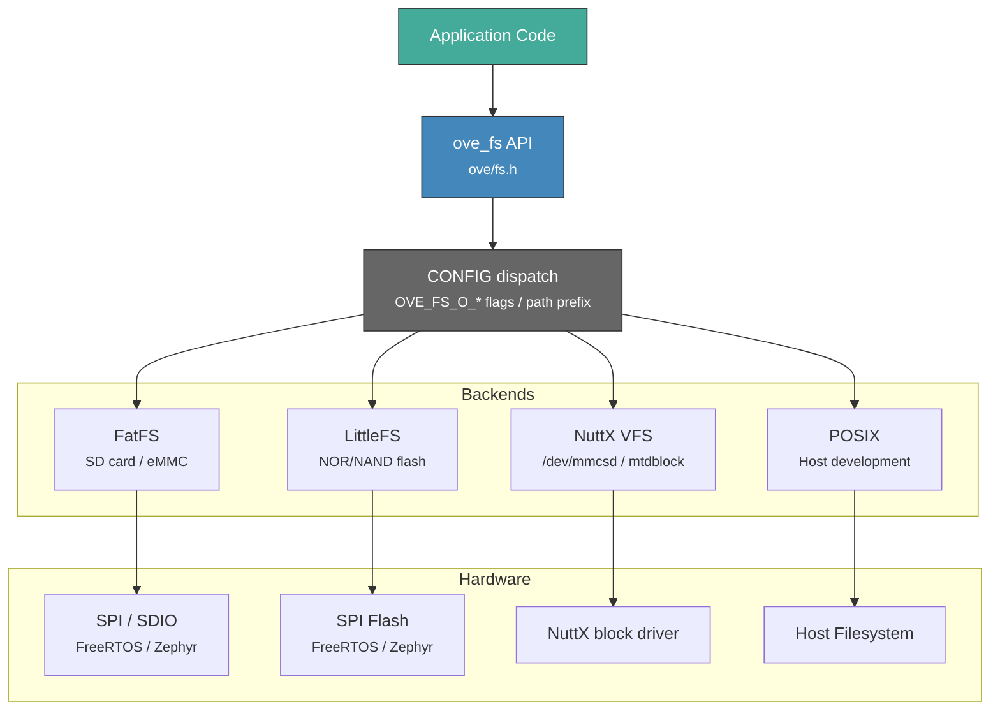

# Filesystem

The oveRTOS filesystem module provides a VFS abstraction that maps POSIX-like file and directory operations onto the underlying RTOS storage backend. Volumes are mounted by path prefix and all subsequent operations use absolute path strings. The same application code runs unchanged across FatFS (SD card), LittleFS, NuttX VFS, and POSIX host filesystem.

## Architecture



## File Operations

| Function | Signature | Description |
|----------|-----------|-------------|
| `ove_fs_mount` | `(dev_path, mount_point) → int` | Mount a storage device at a virtual path prefix |
| `ove_fs_unmount` | `(mount_point) → void` | Unmount a previously mounted device; flush pending data |
| `ove_fs_open_init` | `(file, storage, path, flags) → int` | Open using caller-supplied static storage (no heap) |
| `ove_fs_close_deinit` | `(file) → int` | Close a statically-allocated file handle |
| `ove_fs_open` | `(file, path, flags) → int` | Open a file (heap or backend-managed allocation) |
| `ove_fs_close` | `(file) → int` | Close a file handle returned by `ove_fs_open` |
| `ove_fs_read` | `(file, buf, count, bytes_read) → int` | Read bytes from an open file |
| `ove_fs_write` | `(file, buf, count, bytes_written) → int` | Write bytes to an open file |
| `ove_fs_seek` | `(file, offset, whence) → int` | Reposition the file read/write offset |
| `ove_fs_tell` | `(file) → long` | Return the current file position |
| `ove_fs_size` | `(file, out_size) → int` | Query the total size of an open file |
| `ove_fs_unlink` | `(path) → int` | Delete a file by path |
| `ove_fs_rename` | `(old_path, new_path) → int` | Rename or move a file |

## Directory Operations

| Function | Signature | Description |
|----------|-----------|-------------|
| `ove_fs_opendir_init` | `(dir, storage, path) → int` | Open a directory using caller-supplied static storage |
| `ove_fs_closedir_deinit` | `(dir) → int` | Close a statically-allocated directory handle |
| `ove_fs_opendir` | `(dir, path) → int` | Open a directory (heap or backend-managed allocation) |
| `ove_fs_readdir` | `(dir, entry) → int` | Read the next entry; returns `OVE_ERR_EOF` when exhausted |
| `ove_fs_closedir` | `(dir) → int` | Close a directory handle returned by `ove_fs_opendir` |

Each `ove_fs_readdir` call fills an `ove_dirent` structure:

```c
struct ove_dirent {
    char         name[256]; /* null-terminated entry name (not full path) */
    unsigned int size;      /* file size in bytes; 0 for directories       */
    int          is_dir;    /* non-zero if the entry is a directory         */
};
```

## Open Flags

Flags are combined with bitwise OR and passed to `ove_fs_open` or `ove_fs_open_init`.

| Flag | Value | Description |
|------|-------|-------------|
| `OVE_FS_O_READ` | `0x01` | Open for reading |
| `OVE_FS_O_WRITE` | `0x02` | Open for writing |
| `OVE_FS_O_CREATE` | `0x04` | Create the file if it does not exist |
| `OVE_FS_O_APPEND` | `0x08` | Seek to end of file before each write |

## Seek Whence Constants

| Constant | Value | Description |
|----------|-------|-------------|
| `OVE_FS_SEEK_SET` | `0` | Seek relative to the beginning of the file |
| `OVE_FS_SEEK_CUR` | `1` | Seek relative to the current file position |
| `OVE_FS_SEEK_END` | `2` | Seek relative to the end of the file |

## Allocation Strategies

File and directory handles follow the same dual-allocation pattern used throughout oveRTOS.

**Static (zero-heap) — `open_init` / `close_deinit`:**

The caller declares storage with `OVE_FILE_DEFINE()` and passes it to `ove_fs_open_init`. No heap allocation is performed; the storage must remain valid for the lifetime of the open file. Use this on targets where `CONFIG_OVE_ZERO_HEAP=y`.

```c
static ove_file_storage_t file_storage;

ove_file_t f;
ove_fs_open_init(&f, &file_storage, "/sd/data.bin", OVE_FS_O_READ);
/* ... read ... */
ove_fs_close_deinit(f);
```

**Heap — `open` / `close`:**

Available when `OVE_HEAP_FS` is defined (i.e. `CONFIG_OVE_ZERO_HEAP` is not set). The backend allocates the handle from the RTOS heap.

```c
ove_file_t f;
ove_fs_open(&f, "/sd/data.bin", OVE_FS_O_READ);
/* ... read ... */
ove_fs_close(f);
```

Both `ove_fs_opendir` / `ove_fs_closedir` and `ove_fs_opendir_init` / `ove_fs_closedir_deinit` follow the same pattern for directories.

## Example: Reading a WAV File from SD Card

```c
#include "ove/ove.h"

/* Mount the SD card (FatFS backend, SDIO interface) */
ove_fs_mount("/dev/sdcard", "/sd");

ove_file_t f;
if (ove_fs_open(&f, "/sd/sample.wav", OVE_FS_O_READ) != OVE_OK) {
    OVE_LOG_ERR("Failed to open WAV file");
    return;
}

/* Read WAV header (44 bytes) */
uint8_t header[44];
size_t nr;
ove_fs_read(f, header, sizeof(header), &nr);

/* Determine file size and audio data length */
size_t file_size;
ove_fs_size(f, &file_size);
size_t audio_len = file_size - sizeof(header);

/* Stream audio data in 512-byte chunks */
uint8_t chunk[512];
while (audio_len > 0) {
    size_t to_read = audio_len < sizeof(chunk) ? audio_len : sizeof(chunk);
    ove_fs_read(f, chunk, to_read, &nr);
    /* feed nr bytes of PCM to the audio graph ... */
    audio_len -= nr;
}

ove_fs_close(f);
ove_fs_unmount("/sd");
```

## Kconfig Options

| Option | Default | Description |
|--------|---------|-------------|
| `CONFIG_OVE_FS` | `n` | Enable the filesystem abstraction layer |

## Header

| Header | Contents |
|--------|----------|
| `ove/fs.h` | Mount/unmount, file handle types, open flags, seek constants, all file and directory operations |
