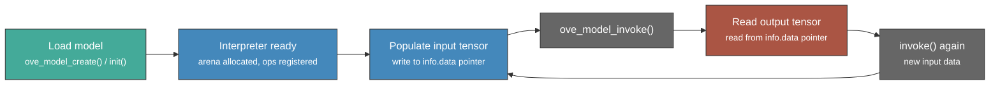
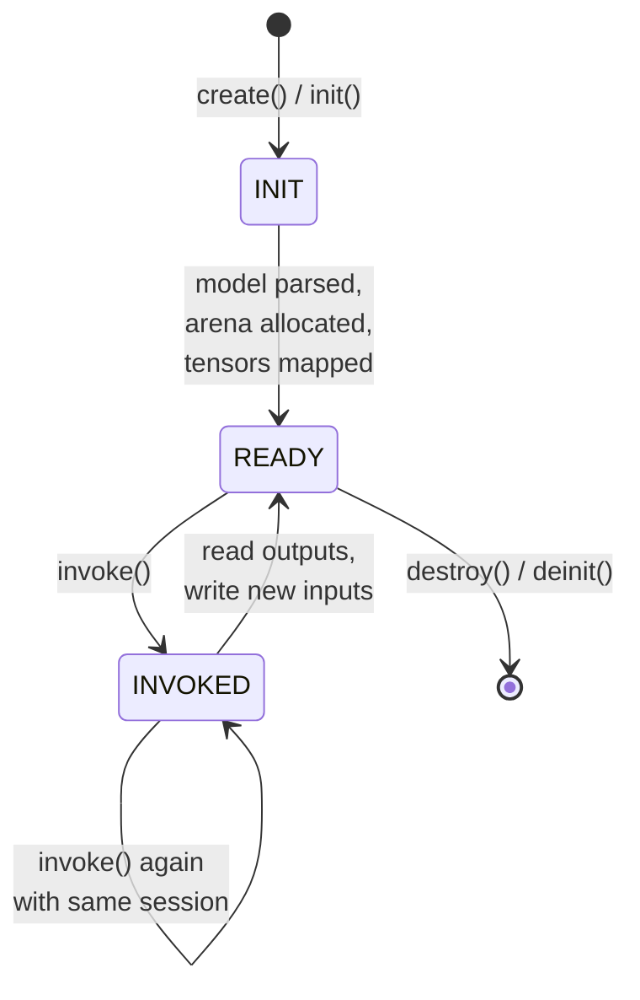
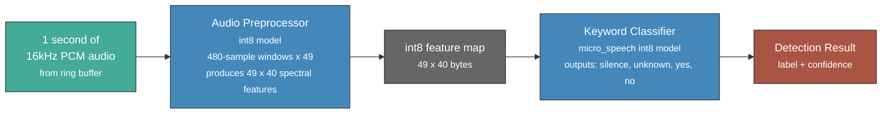

# ML Inference

The oveRTOS inference module provides a portable C API for loading pre-trained `.tflite` FlatBuffer models and running inference via LiteRT (formerly TensorFlow Lite Micro). The same model binary runs unchanged across all four oveRTOS backends — FreeRTOS, Zephyr, NuttX, and POSIX. Models are typically compiled into flash as `const` C arrays using `xxd` or `flatc`.

## Pipeline



## Tensor Types

| Enum Value | Description |
|------------|-------------|
| `OVE_TENSOR_FLOAT32` | 32-bit IEEE 754 float — full-precision models |
| `OVE_TENSOR_INT8` | Signed 8-bit integer — standard quantised MCU models |
| `OVE_TENSOR_UINT8` | Unsigned 8-bit integer — legacy TFLite quantisation |
| `OVE_TENSOR_INT16` | Signed 16-bit integer — higher-precision quantisation |
| `OVE_TENSOR_INT32` | Signed 32-bit integer — accumulator and index tensors |

## Model Lifecycle



1. **INIT** -- `ove_model_create()` or `ove_model_init()` parses the FlatBuffer, allocates the tensor arena, and registers TFLM operators. Fails with `OVE_ERR_ML_FAILED` if the model is malformed or the arena is too small.
2. **READY** -- The session is ready. Call `ove_model_input()` to get a pointer into the tensor arena, write input data there, then call `ove_model_invoke()`.
3. **INVOKED** -- Inference has run. Call `ove_model_output()` to read results. The session can be reused — write new inputs and call `invoke()` again without re-creating the model.

## API Reference

| Function | Signature | Description |
|----------|-----------|-------------|
| `ove_model_init` | `(model, storage, arena, cfg) → int` | Initialise using caller-supplied storage and arena; no heap allocation |
| `ove_model_deinit` | `(model) → void` | Release resources; static storage and arena are not freed |
| `ove_model_create` | `(model, cfg) → int` | Allocate and initialise from heap (or static per-call-site in zero-heap mode) |
| `ove_model_destroy` | `(model) → void` | Destroy and free a heap-allocated model session |
| `ove_model_invoke` | `(model) → int` | Run inference on the currently populated input tensors |
| `ove_model_input` | `(model, index, info) → int` | Get a descriptor for input tensor at `index`; write to `info->data` before invoking |
| `ove_model_output` | `(model, index, info) → int` | Get a descriptor for output tensor at `index`; read from `info->data` after invoking |
| `ove_model_last_inference_us` | `(model) → uint64_t` | Return the duration of the last `invoke()` in microseconds (requires `CONFIG_OVE_TIME`) |

## Model Config Struct

```c
struct ove_model_config {
    const void *model_data;  /* pointer to .tflite FlatBuffer (typically in flash) */
    size_t      model_size;  /* size of model_data in bytes                        */
    size_t      arena_size;  /* tensor arena size in bytes — must fit all layers   */
};
```

`arena_size` controls how much memory is reserved for intermediate tensors. The required size depends on the model architecture. Use the TFLite interpreter's profiling output or start with a generous estimate and reduce until `ove_model_create()` no longer fails. For CMSIS-NN kernels, the arena should be 16-byte aligned.

## Tensor Info Struct

```c
struct ove_tensor_info {
    void                *data;    /* pointer into the tensor arena — valid for model lifetime */
    size_t               size;   /* total size of tensor data in bytes                        */
    enum ove_tensor_type type;   /* element type (FLOAT32, INT8, etc.)                        */
    unsigned int         ndims;  /* number of dimensions                                      */
    int                  dims[5]; /* shape, e.g. {1, 49, 40, 1} for a spectrogram             */
};
```

Write input data directly to `info->data` before calling `ove_model_invoke()`. Read output data from `info->data` after the call returns. The pointer remains valid for the lifetime of the model session.

## Allocation Strategies

**Static (zero-heap) — `init` / `deinit`:**

Supply a caller-allocated storage struct and arena buffer. Both must remain valid for the session lifetime. The arena should be 16-byte aligned for CMSIS-NN.

```c
static ove_model_storage_t model_storage;
static uint8_t __attribute__((aligned(16))) arena[32768];

ove_model_t model;
struct ove_model_config cfg = {
    .model_data  = my_model_data,
    .model_size  = my_model_data_size,
    .arena_size  = sizeof(arena),
};
ove_model_init(&model, &model_storage, arena, &cfg);
```

**Heap-mode — `create` / `destroy`:**

`ove_model_create()` is heap-mode only — it allocates storage and arena from the RTOS heap. In zero-heap builds the symbol is unavailable; use `ove_model_init()` with a caller-supplied arena, or `OVE_MODEL_DEFINE_STATIC()` at file scope (which works in both modes).

```c
ove_model_t model;
ove_model_create(&model, &cfg);
/* ... run inference ... */
ove_model_destroy(model);
```

## Example: Keyword Detection with Audio Preprocessor and Classifier

The `example_keyword_live` application runs a two-stage inference pipeline on live DMIC audio. Stage 1 converts 30ms audio windows into log-mel spectral features; stage 2 classifies the 49-frame spectrogram as silence, unknown, "yes", or "no".



```c
#include "ove/ove.h"
#include "ove/infer.h"

#define ARENA_SIZE 32768

/* Static storage reused for both model stages */
static ove_model_storage_t model_storage;
static uint8_t __attribute__((aligned(16))) arena[ARENA_SIZE];

/* Stage 1: raw audio → spectral features (int8) */
static int generate_features(const int16_t *audio, unsigned int len,
                              int8_t *features_out)
{
    struct ove_model_config cfg = {
        .model_data = g_audio_preprocessor_int8_model_data,
        .model_size = g_audio_preprocessor_int8_model_data_size,
        .arena_size = ARENA_SIZE,
    };

    ove_model_t preproc;
    if (ove_model_init(&preproc, &model_storage, arena, &cfg) != OVE_OK)
        return OVE_ERR_ML_FAILED;

    struct ove_tensor_info in_info, out_info;
    ove_model_input(preproc, 0, &in_info);
    ove_model_output(preproc, 0, &out_info);

    /* Run one 30ms window per spectrogram row */
    for (unsigned int frame = 0; frame < 49; frame++) {
        memcpy(in_info.data, audio + frame * 320, 480 * sizeof(int16_t));
        ove_model_invoke(preproc);
        memcpy(features_out + frame * 40, out_info.data, 40);
    }

    ove_model_deinit(preproc);
    return OVE_OK;
}

/* Stage 2: spectral features → keyword label */
static int classify(const int8_t *features, const char **label_out)
{
    static const char *labels[] = { "silence", "unknown", "yes", "no" };

    struct ove_model_config cfg = {
        .model_data = g_micro_speech_quantized_model_data,
        .model_size = g_micro_speech_quantized_model_data_size,
        .arena_size = ARENA_SIZE,
    };

    ove_model_t classifier;
    if (ove_model_init(&classifier, &model_storage, arena, &cfg) != OVE_OK)
        return OVE_ERR_ML_FAILED;

    struct ove_tensor_info in_info, out_info;
    ove_model_input(classifier, 0, &in_info);
    ove_model_output(classifier, 0, &out_info);

    memcpy(in_info.data, features, 49 * 40);
    ove_model_invoke(classifier);

    /* Find highest-scoring class */
    const int8_t *scores = (const int8_t *)out_info.data;
    int best = 0;
    for (int i = 1; i < 4; i++)
        if (scores[i] > scores[best]) best = i;

    *label_out = labels[best];
    OVE_LOG_INF("Inference time: %llu us",
                (unsigned long long)ove_model_last_inference_us(classifier));

    ove_model_deinit(classifier);
    return OVE_OK;
}
```

## Kconfig Options

| Option | Default | Description |
|--------|---------|-------------|
| `CONFIG_OVE_INFER` | `n` | Enable the ML inference subsystem (requires LiteRT/TFLM) |
| `CONFIG_OVE_INFER_CMSIS_NN` | `n` | Use CMSIS-NN optimised kernels on Arm Cortex-M (requires CMSIS-NN library) |
| `CONFIG_OVE_INFER_ARENA_SIZE` | `32768` | Default tensor arena size in bytes when `ove_model_create()` is called without an explicit config (heap mode only) |

## Headers

| Header | Contents |
|--------|----------|
| `ove/infer.h` | `ove_tensor_type` enum, `ove_tensor_info` struct, `ove_model_config` struct, all model lifecycle functions |
| `ove/storage.h` | `ove_model_storage_t` opaque type (selected per backend) |
