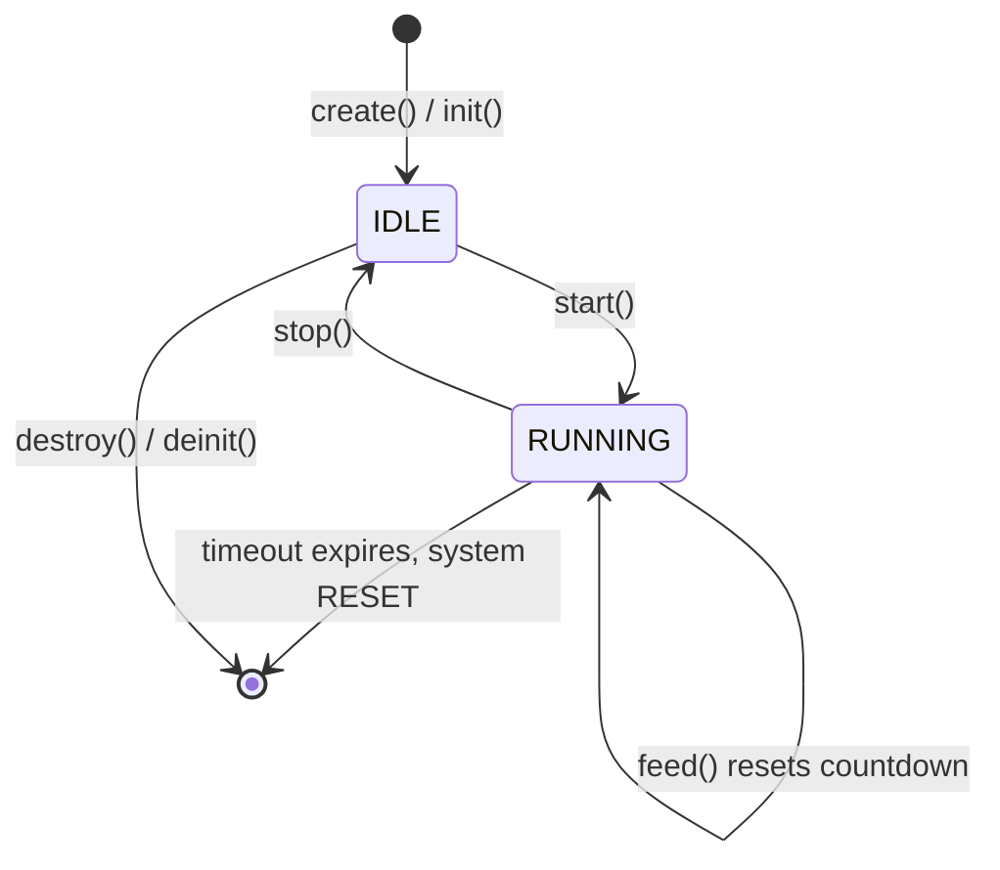

# Hardware I/O

The oveRTOS hardware I/O layer provides portable abstractions for GPIO pins, on-board LEDs, board identity, and the system watchdog timer. Each subsystem is independently enabled via Kconfig and degrades gracefully to no-op stubs when disabled.

## GPIO

The GPIO subsystem (`ove/gpio.h`) provides pin configuration, digital read/write, and edge-triggered interrupt registration.

### Pin Modes

| Mode | Enum Value | Description |
|------|------------|-------------|
| `OVE_GPIO_MODE_INPUT` | `0` | High-impedance digital input |
| `OVE_GPIO_MODE_OUTPUT_PP` | `1` | Push-pull digital output |
| `OVE_GPIO_MODE_OUTPUT_OD` | `2` | Open-drain digital output |

### IRQ Trigger Modes

| Mode | Value | Description |
|------|-------|-------------|
| `OVE_GPIO_IRQ_RISING` | `0x01` | Trigger on rising edge only |
| `OVE_GPIO_IRQ_FALLING` | `0x02` | Trigger on falling edge only |
| `OVE_GPIO_IRQ_BOTH` | `0x03` | Trigger on both edges |

### GPIO API

| Function | Signature | Description |
|----------|-----------|-------------|
| `ove_gpio_configure` | `(port, pin, mode) → int` | Configure the direction and drive mode of a pin |
| `ove_gpio_set` | `(port, pin, value) → int` | Set the output level of a configured output pin |
| `ove_gpio_get` | `(port, pin) → int` | Read the current logical level (returns 0 or 1, or negative on error) |
| `ove_gpio_irq_register` | `(port, pin, mode, callback, user_data) → int` | Register an interrupt callback; does not enable the interrupt |
| `ove_gpio_irq_enable` | `(port, pin) → int` | Enable a previously registered GPIO interrupt |
| `ove_gpio_irq_disable` | `(port, pin) → int` | Disable an interrupt without unregistering the callback |

The interrupt callback type is:

```c
typedef void (*ove_gpio_irq_cb)(unsigned int port, unsigned int pin,
                                void *user_data);
```

Callbacks may be invoked from interrupt context or a deferred work item depending on the backend. Keep handlers short and non-blocking.

### Example: Button Interrupt Handler

```c
#include "ove/ove.h"

static void button_cb(unsigned int port, unsigned int pin, void *user_data)
{
    (void)user_data;
    /* Button on port 0, pin 13 (active-low, falling edge) */
    OVE_LOG_INF("Button pressed: port=%u pin=%u", port, pin);
}

void setup_button(void)
{
    /* Configure pin as input */
    ove_gpio_configure(0, 13, OVE_GPIO_MODE_INPUT);

    /* Register falling-edge interrupt */
    ove_gpio_irq_register(0, 13, OVE_GPIO_IRQ_FALLING, button_cb, NULL);

    /* Arm the interrupt */
    ove_gpio_irq_enable(0, 13);
}
```

---

## LED

The LED subsystem (`ove/led.h`) provides simple control of board LEDs described by the active board descriptor. LED indices are 0-based. Active-low polarity is handled transparently; callers always pass a logical level.

### LED API

| Function | Signature | Description |
|----------|-----------|-------------|
| `ove_led_set` | `(led, on) → void` | Turn an LED on (`on != 0`) or off (`on == 0`) |
| `ove_led_toggle` | `(led) → void` | Toggle the current state of an LED |
| `ove_led_count` | `(void) → unsigned int` | Return the number of LEDs available on the current board |

---

## Board

The board subsystem (`ove/board.h`) exposes hardware identity information and a single initialisation entry point. It must be called before any other oveRTOS API.

### Board API

| Function | Signature | Description |
|----------|-----------|-------------|
| `ove_board_init` | `(void) → int` | Configure system clocks, enable peripherals, and perform board-specific low-level setup |
| `ove_board_name` | `(void) → const char *` | Return a human-readable board name string (e.g. `"STM32F746G-Discovery"`) |
| `ove_board_desc` | `(void) → const struct ove_board_desc *` | Return a pointer to the board descriptor, or NULL if none is registered |

The board descriptor structure:

```c
struct ove_board_desc {
    const char             *name;               /* human-readable board name  */
    const char             *mcu_family;         /* MCU family, e.g. "STM32F7" */
    const char             *mcu;                /* specific part number        */
    unsigned int            gpio_port_count;    /* number of GPIO ports        */
    unsigned int            gpio_pins_per_port; /* pins per port               */
    unsigned int            led_count;          /* number of on-board LEDs     */
    const struct ove_led_desc *leds;            /* array of LED descriptors    */
};
```

---

## Watchdog

The watchdog subsystem (`ove/watchdog.h`) provides a portable interface for arming, servicing, and disarming a hardware or software watchdog timer. If the watchdog is not fed within the configured timeout after being started, the system resets.

### Watchdog Lifecycle



1. **IDLE** -- The watchdog is configured but not counting. Safe to remain in this state indefinitely.
2. **RUNNING** -- Countdown active. Call `feed()` periodically at intervals shorter than `timeout_ms` or the system will reset.
3. **RESET** -- The system resets if the watchdog expires while RUNNING. This is a terminal event; there is no recovery path.

### Watchdog API

| Function | Signature | Description |
|----------|-----------|-------------|
| `ove_watchdog_init` | `(wdt, storage, timeout_ms) → int` | Initialise using caller-supplied static storage |
| `ove_watchdog_deinit` | `(wdt) → void` | Stop and release resources; storage is not freed |
| `ove_watchdog_create` | `(wdt, timeout_ms) → int` | Allocate and initialise from heap (or static in zero-heap mode) |
| `ove_watchdog_destroy` | `(wdt) → void` | Stop and free a heap-allocated watchdog |
| `ove_watchdog_start` | `(wdt) → int` | Arm the watchdog; begin countdown |
| `ove_watchdog_stop` | `(wdt) → int` | Disarm the watchdog; halt countdown without reset |
| `ove_watchdog_feed` | `(wdt) → int` | Reset the countdown to `timeout_ms`; must be called periodically |

### Example: Feeding the Watchdog from a Heartbeat Thread

```c
#include "ove/ove.h"

#define WDT_TIMEOUT_MS 5000

static ove_watchdog_t wdt;

static void heartbeat_thread(void *arg)
{
    (void)arg;

    /* Create watchdog with a 5-second timeout */
    if (ove_watchdog_create(&wdt, WDT_TIMEOUT_MS) != OVE_OK) {
        OVE_LOG_ERR("Watchdog create failed");
        return;
    }

    ove_watchdog_start(wdt);
    OVE_LOG_INF("Watchdog armed (%d ms)", WDT_TIMEOUT_MS);

    for (;;) {
        /* Feed every 2 seconds — well within the 5-second window */
        ove_thread_sleep_ms(2000);
        ove_watchdog_feed(wdt);
        OVE_LOG_DBG("Watchdog fed");
    }
}
```

---

## Kconfig Options

| Option | Default | Description |
|--------|---------|-------------|
| `CONFIG_OVE_GPIO` | `n` | Enable GPIO pin control and interrupt support |
| `CONFIG_OVE_LED` | `n` | Enable on-board LED control |
| `CONFIG_OVE_BOARD` | `y` | Enable board initialisation and identity APIs |
| `CONFIG_OVE_WATCHDOG` | `n` | Enable watchdog timer support |

## Headers

| Header | Contents |
|--------|----------|
| `ove/gpio.h` | Pin mode enum, IRQ mode enum, IRQ callback typedef, all GPIO functions |
| `ove/led.h` | LED set, toggle, and count |
| `ove/board.h` | Board init, name, and descriptor pointer |
| `ove/board_types.h` | `ove_board_desc` and `ove_led_desc` struct definitions |
| `ove/watchdog.h` | Watchdog storage type, all watchdog functions |
