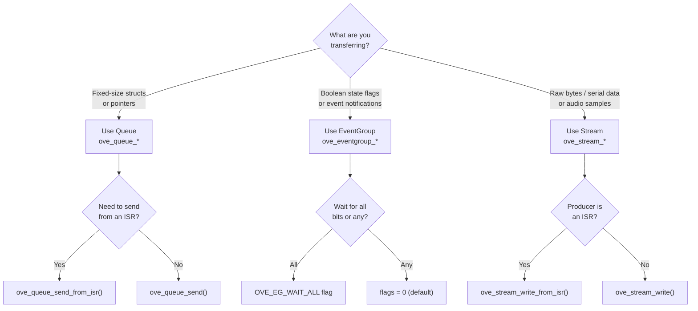
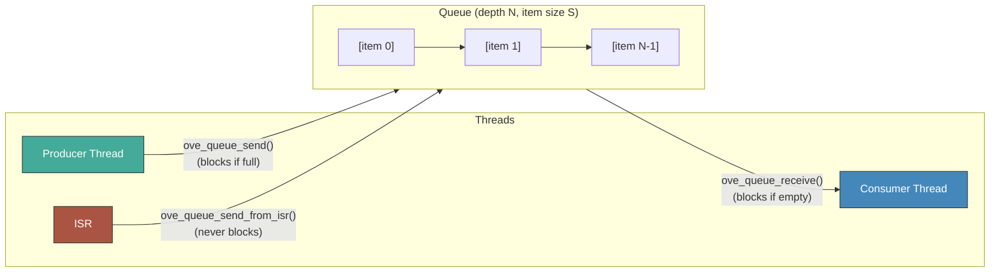
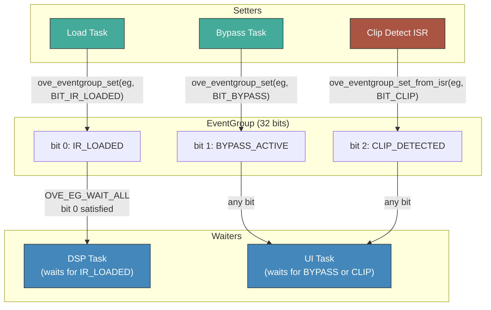

# Inter-Thread Communication

oveRTOS provides three IPC primitives for coordinating work across threads and interrupt service routines. Each is optimised for a distinct communication pattern:

| Primitive | Best for | Data model |
|-----------|----------|------------|
| **Queue** | Passing discrete, fixed-size items between threads | N typed items, FIFO |
| **EventGroup** | Signalling state transitions with bit flags | Up to 32 boolean bits |
| **Stream** | Moving a continuous byte stream with a flow-control threshold | Circular byte buffer |

## Choosing a Primitive



---

## Queue

A thread-safe FIFO that transfers fixed-size items by value. The sender copies the item into the queue; the receiver copies it back out. Both blocking and non-blocking variants are available, and ISR-safe variants allow interrupt handlers to enqueue items without blocking.



### API

| Function | Description |
|----------|-------------|
| `ove_queue_init(cfg)` | Initialise queue subsystem (called once at startup) |
| `ove_queue_deinit()` | Tear down queue subsystem |
| `ove_queue_create(depth, item_size)` | Allocate a queue with `depth` slots of `item_size` bytes; returns handle |
| `ove_queue_destroy(q)` | Free a queue and all pending items |
| `ove_queue_send(q, item, timeout_ms)` | Copy `item` into queue; blocks up to `timeout_ms` (-1 = forever) if full |
| `ove_queue_receive(q, item, timeout_ms)` | Copy oldest item out of queue; blocks if empty |
| `ove_queue_send_from_isr(q, item, woken)` | ISR-safe send; sets `*woken` if a higher-priority task was unblocked |
| `ove_queue_receive_from_isr(q, item, woken)` | ISR-safe receive |

All functions return `OVE_OK` on success. `ove_queue_send` / `ove_queue_receive` return `OVE_ERR_TIMEOUT` when the timeout expires.

### Example: IR Load Requests

The hIRoic app uses a queue to pass cabinet IR load requests from the control task (UI/CLI) to the DSP task without blocking the audio path.

```c
/* Shared handle, created at startup */
static ove_queue_t g_ir_req_q;

struct ir_request {
    uint8_t  slot;          /* IR preset slot 0–7 */
    uint32_t file_offset;   /* byte offset in flash */
    uint32_t length;        /* IR length in samples */
};

/* Startup */
g_ir_req_q = ove_queue_create(4, sizeof(struct ir_request));

/* Control task — posts a load request */
struct ir_request req = { .slot = 2, .file_offset = 0x8000, .length = 1024 };
ove_queue_send(g_ir_req_q, &req, OVE_WAIT_FOREVER);

/* DSP task — drains requests between audio cycles */
struct ir_request req;
while (ove_queue_receive(g_ir_req_q, &req, 0) == OVE_OK) {
    hiroic_load_ir(req.slot, req.file_offset, req.length);
}
```

---

## EventGroup

An EventGroup holds up to 32 independent boolean bits. Any thread (or ISR) can set or clear bits; waiting threads are unblocked when a target bit pattern is satisfied. EventGroups are ideal for broadcasting state transitions without copying data.



### Flags

| Flag | Value | Behaviour |
|------|-------|-----------|
| `OVE_EG_WAIT_ALL` | `0x01` | Block until **all** bits in the mask are set simultaneously |
| `OVE_EG_CLEAR_ON_EXIT` | `0x02` | Atomically clear the waited bits when unblocked |

Combining both flags (`OVE_EG_WAIT_ALL | OVE_EG_CLEAR_ON_EXIT`) is the recommended pattern for one-shot synchronisation barriers: the thread wakes exactly once and the bits are cleared automatically.

### API

| Function | Description |
|----------|-------------|
| `ove_eventgroup_init(cfg)` | Initialise EventGroup subsystem |
| `ove_eventgroup_deinit()` | Tear down subsystem |
| `ove_eventgroup_create()` | Allocate a new EventGroup (all bits clear); returns handle |
| `ove_eventgroup_destroy(eg)` | Free EventGroup |
| `ove_eventgroup_set(eg, bits)` | Set one or more bits (bitwise OR); unblocks matching waiters |
| `ove_eventgroup_clear(eg, bits)` | Clear one or more bits |
| `ove_eventgroup_get(eg)` | Read current bit mask without blocking |
| `ove_eventgroup_wait(eg, bits, flags, timeout_ms)` | Block until bit pattern satisfied; returns actual bits at wake |
| `ove_eventgroup_set_from_isr(eg, bits, woken)` | ISR-safe set |

### Example: Coordinating Load and Bypass State

```c
#define BIT_IR_LOADED     (1u << 0)
#define BIT_BYPASS_ACTIVE (1u << 1)
#define BIT_CLIP_DETECTED (1u << 2)

static ove_eventgroup_t g_state_eg;

/* Startup */
g_state_eg = ove_eventgroup_create();

/* Load task — signal that a new IR is ready */
hiroic_load_ir_blocking(slot);
ove_eventgroup_set(g_state_eg, BIT_IR_LOADED);

/* DSP task — wait for first IR before processing audio */
ove_eventgroup_wait(g_state_eg, BIT_IR_LOADED,
                    OVE_EG_WAIT_ALL, OVE_WAIT_FOREVER);

/* Bypass button ISR — toggle bypass bit */
bool bypass = !!(ove_eventgroup_get(g_state_eg) & BIT_BYPASS_ACTIVE);
uint32_t new_bit = bypass ? 0 : BIT_BYPASS_ACTIVE;
ove_eventgroup_clear(g_state_eg, BIT_BYPASS_ACTIVE);
ove_eventgroup_set_from_isr(g_state_eg, new_bit, NULL);
```

---

## Stream

A Stream is a lock-free ring buffer that transfers an unframed byte sequence from a producer to a consumer. An optional threshold allows the consumer to sleep until a minimum number of bytes are available, reducing task wake-up overhead for bursty producers.


### API

| Function | Description |
|----------|-------------|
| `ove_stream_init(cfg)` | Initialise Stream subsystem |
| `ove_stream_deinit()` | Tear down subsystem |
| `ove_stream_create(capacity, threshold)` | Allocate ring buffer; `threshold` bytes triggers consumer wake |
| `ove_stream_destroy(s)` | Free stream |
| `ove_stream_write(s, buf, len, timeout_ms)` | Write up to `len` bytes; blocks if buffer full |
| `ove_stream_read(s, buf, len, timeout_ms)` | Read up to `len` bytes; blocks until `threshold` bytes available |
| `ove_stream_write_from_isr(s, buf, len, woken)` | ISR-safe write (non-blocking) |
| `ove_stream_read_from_isr(s, buf, len, woken)` | ISR-safe read (non-blocking) |
| `ove_stream_available(s)` | Bytes currently readable |
| `ove_stream_space(s)` | Free bytes remaining in buffer |

`ove_stream_write` returns the number of bytes actually written (may be less than `len` if the buffer fills and the timeout expires). `ove_stream_read` returns the number of bytes read.

### Example: Serial Data Buffering

```c
#define STREAM_CAP    512   /* ring buffer capacity in bytes  */
#define STREAM_THRESH  64   /* wake consumer after 64 bytes   */

static ove_stream_t g_uart_stream;

/* Startup */
g_uart_stream = ove_stream_create(STREAM_CAP, STREAM_THRESH);

/* UART RX ISR — one byte at a time */
void USART1_IRQHandler(void)
{
    uint8_t byte = USART1->RDR;
    bool woken = false;
    ove_stream_write_from_isr(g_uart_stream, &byte, 1, &woken);
    portYIELD_FROM_ISR(woken);
}

/* Consumer task — process frames in bulk */
static void uart_task(void *arg)
{
    uint8_t buf[64];
    for (;;) {
        int n = ove_stream_read(g_uart_stream, buf, sizeof(buf),
                                OVE_WAIT_FOREVER);
        if (n > 0)
            process_frame(buf, n);
    }
}
```

---

## Kconfig Options

| Option | Default | Description |
|--------|---------|-------------|
| `CONFIG_OVE_QUEUE` | `y` | Enable Queue primitive |
| `CONFIG_OVE_EVENTGROUP` | `y` | Enable EventGroup primitive |
| `CONFIG_OVE_STREAM` | `n` | Enable Stream primitive (adds ring-buffer memory overhead) |

## Headers

| Header | Contents |
|--------|----------|
| `ove/queue.h` | Queue handle type, create/destroy, send/receive API |
| `ove/eventgroup.h` | EventGroup handle type, set/clear/wait API, flag constants |
| `ove/stream.h` | Stream handle type, create/destroy, read/write API |
