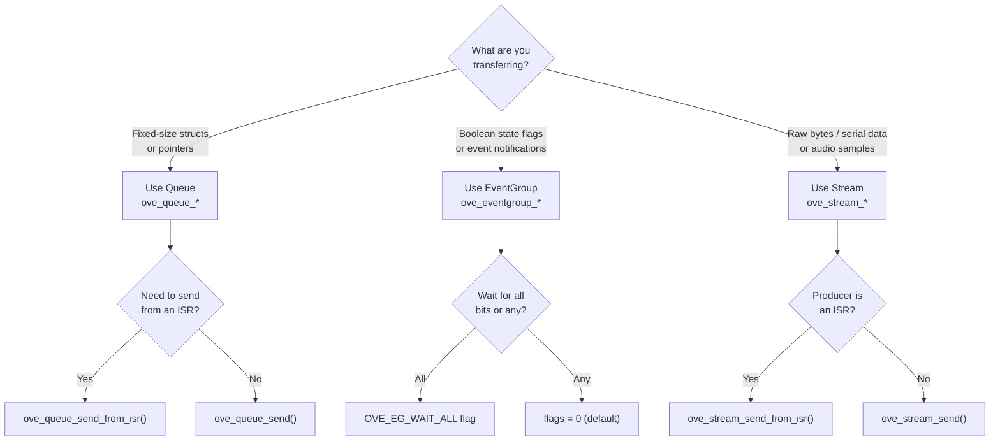
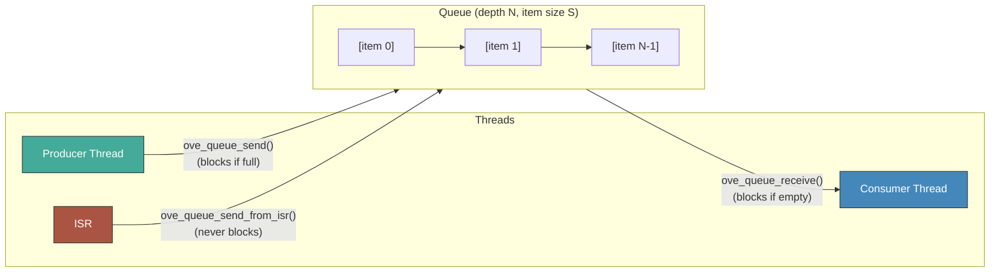
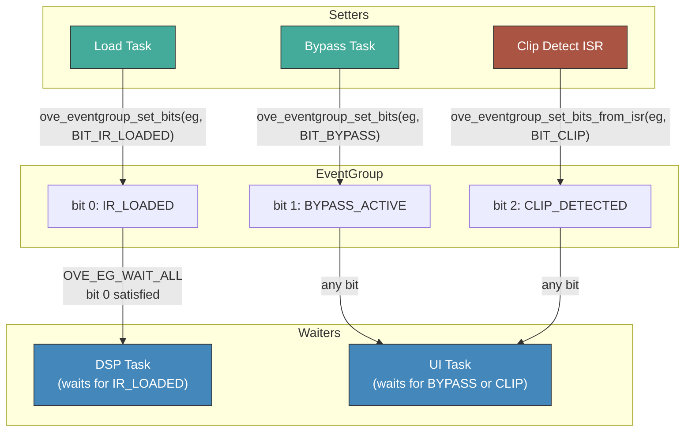
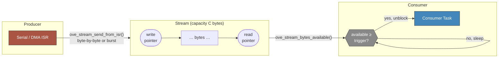

# Inter-Thread Communication

oveRTOS provides three IPC primitives for coordinating work across threads and interrupt service routines. Each is optimised for a distinct communication pattern:

| Primitive | Best for | Data model |
|-----------|----------|------------|
| **Queue** | Passing discrete, fixed-size items between threads | N typed items, FIFO |
| **EventGroup** | Signalling state transitions with bit flags | Bitmask of boolean flags |
| **Stream** | Moving a continuous byte stream with a trigger threshold | Circular byte buffer |

All three follow the same allocation pattern as the rest of oveRTOS: `_init()` / `_deinit()` consume caller-supplied static storage (work in zero-heap mode), while `_create()` / `_destroy()` allocate from the heap (only when `OVE_HEAP_*` is defined). The `OVE_*_DEFINE_STATIC` macros in `ove/storage.h` combine declaration and init into one statement.

## Choosing a Primitive



---

## Queue

A thread-safe FIFO that transfers fixed-size items by value. The sender copies the item into the queue; the receiver copies it back out. Both blocking and non-blocking variants are available, and ISR-safe variants allow interrupt handlers to enqueue items without blocking.



### API

| Function | Signature | Description |
|----------|-----------|-------------|
| `ove_queue_init` | `int (ove_queue_t *q, ove_queue_storage_t *storage, void *buffer, size_t item_size, unsigned int max_items)` | Initialise a queue from caller-supplied storage and data buffer. |
| `ove_queue_deinit` | `void (ove_queue_t q)` | Release the queue. Static storage is not freed. |
| `ove_queue_create` | `int (ove_queue_t *q, size_t item_size, unsigned int max_items)` | Heap-allocate storage and data buffer. Requires `OVE_HEAP_QUEUE`. |
| `ove_queue_destroy` | `void (ove_queue_t q)` | Free a heap-allocated queue. |
| `ove_queue_send` | `int (ove_queue_t q, const void *data, uint64_t timeout_ns)` | Copy an item into the queue. Blocks up to `timeout_ns` if full (use `OVE_WAIT_FOREVER` for indefinite). Returns `OVE_OK`, `OVE_ERR_TIMEOUT`, or `OVE_ERR_QUEUE_FULL`. |
| `ove_queue_receive` | `int (ove_queue_t q, void *buf, uint64_t timeout_ns)` | Copy the oldest item out of the queue. Blocks if empty. |
| `ove_queue_send_from_isr` | `int (ove_queue_t q, const void *data)` | ISR-safe non-blocking send. Returns `OVE_ERR_QUEUE_FULL` if no space. |
| `ove_queue_receive_from_isr` | `int (ove_queue_t q, void *buf)` | ISR-safe non-blocking receive. |

Static-storage macro: `OVE_QUEUE_DEFINE_STATIC(name, item_sz, max)` (in `ove/storage.h`).

### Example: IR Load Requests

```c
#include <ove/ove.h>

#define IR_REQ_DEPTH 4

struct ir_request {
    uint8_t  slot;          /* IR preset slot 0–7 */
    uint32_t file_offset;   /* byte offset in flash */
    uint32_t length;        /* IR length in samples */
};

/* Heap mode: allocate at startup */
static ove_queue_t g_ir_req_q;

void app_init(void)
{
    ove_queue_create(&g_ir_req_q, sizeof(struct ir_request), IR_REQ_DEPTH);
}

/* Or, zero-heap mode: one-shot static helper */
/* OVE_QUEUE_DEFINE_STATIC(g_ir_req_q, sizeof(struct ir_request), IR_REQ_DEPTH); */

/* Control task — posts a load request */
struct ir_request req = { .slot = 2, .file_offset = 0x8000, .length = 1024 };
ove_queue_send(g_ir_req_q, &req, OVE_WAIT_FOREVER);

/* DSP task — drains requests between audio cycles */
struct ir_request rx;
while (ove_queue_receive(g_ir_req_q, &rx, 0) == OVE_OK) {
    hiroic_load_ir(rx.slot, rx.file_offset, rx.length);
}
```

---

## EventGroup

An EventGroup holds a small bitmask of independent boolean bits (the exact width is `ove_eventbits_t`). Any thread (or ISR) can set or clear bits; waiting threads are unblocked when a target bit pattern is satisfied. EventGroups are ideal for broadcasting state transitions without copying data.



### Flags

| Flag | Value | Behaviour |
|------|-------|-----------|
| `OVE_EG_WAIT_ALL` | `0x01` | Block until **all** bits in the mask are set simultaneously |
| `OVE_EG_CLEAR_ON_EXIT` | `0x02` | Atomically clear the waited bits when unblocked |

Combining both flags (`OVE_EG_WAIT_ALL | OVE_EG_CLEAR_ON_EXIT`) is the recommended pattern for one-shot synchronisation barriers: the thread wakes exactly once and the bits are cleared automatically.

### API

| Function | Signature | Description |
|----------|-----------|-------------|
| `ove_eventgroup_init` | `int (ove_eventgroup_t *eg, ove_eventgroup_storage_t *storage)` | Initialise from caller-supplied storage. |
| `ove_eventgroup_deinit` | `void (ove_eventgroup_t eg)` | Release the EventGroup. |
| `ove_eventgroup_create` | `int (ove_eventgroup_t *eg)` | Heap-allocate. Requires `OVE_HEAP_EVENTGROUP`. |
| `ove_eventgroup_destroy` | `void (ove_eventgroup_t eg)` | Free a heap-allocated EventGroup. |
| `ove_eventgroup_set_bits` | `ove_eventbits_t (ove_eventgroup_t eg, ove_eventbits_t bits)` | Set one or more bits (bitwise OR). Returns the new bit value after the operation. Unblocks matching waiters. |
| `ove_eventgroup_clear_bits` | `ove_eventbits_t (ove_eventgroup_t eg, ove_eventbits_t bits)` | Clear one or more bits. Returns the previous bit value. |
| `ove_eventgroup_get_bits` | `ove_eventbits_t (ove_eventgroup_t eg)` | Read current bit mask without blocking. |
| `ove_eventgroup_wait_bits` | `int (ove_eventgroup_t eg, ove_eventbits_t bits, uint32_t flags, uint64_t timeout_ns, ove_eventbits_t *result)` | Block until bit pattern satisfied. Writes the bits value at wake-time to `*result` if non-NULL. |
| `ove_eventgroup_set_bits_from_isr` | `ove_eventbits_t (ove_eventgroup_t eg, ove_eventbits_t bits)` | ISR-safe set. |

Static-storage macro: `OVE_EVENTGROUP_DEFINE_STATIC(name)` (in `ove/storage.h`).

### Example: Coordinating Load and Bypass State

```c
#include <ove/ove.h>

#define BIT_IR_LOADED     (1u << 0)
#define BIT_BYPASS_ACTIVE (1u << 1)
#define BIT_CLIP_DETECTED (1u << 2)

static ove_eventgroup_t g_state_eg;

void app_init(void)
{
    ove_eventgroup_create(&g_state_eg);
}

/* Load task — signal that a new IR is ready */
hiroic_load_ir_blocking(slot);
ove_eventgroup_set_bits(g_state_eg, BIT_IR_LOADED);

/* DSP task — wait for first IR before processing audio */
ove_eventgroup_wait_bits(g_state_eg, BIT_IR_LOADED,
                         OVE_EG_WAIT_ALL, OVE_WAIT_FOREVER, NULL);

/* Bypass button ISR — toggle bypass bit */
bool bypass = !!(ove_eventgroup_get_bits(g_state_eg) & BIT_BYPASS_ACTIVE);
if (bypass) {
    ove_eventgroup_clear_bits(g_state_eg, BIT_BYPASS_ACTIVE);
} else {
    ove_eventgroup_set_bits_from_isr(g_state_eg, BIT_BYPASS_ACTIVE);
}
```

---

## Stream

A Stream is a ring buffer that transfers an unframed byte sequence from a producer to a consumer. A configurable **trigger** lets the consumer sleep until a minimum number of bytes are available, reducing task wake-up overhead for bursty producers.



### API

| Function | Signature | Description |
|----------|-----------|-------------|
| `ove_stream_init` | `int (ove_stream_t *stream, ove_stream_storage_t *storage, void *buffer, size_t size, size_t trigger)` | Initialise from caller-supplied storage and byte buffer. |
| `ove_stream_deinit` | `void (ove_stream_t stream)` | Release the stream. |
| `ove_stream_create` | `int (ove_stream_t *stream, size_t size, size_t trigger)` | Heap-allocate. Requires `OVE_HEAP_STREAM`. |
| `ove_stream_destroy` | `void (ove_stream_t stream)` | Free a heap-allocated stream. |
| `ove_stream_send` | `int (ove_stream_t stream, const void *data, size_t len, uint64_t timeout_ns, size_t *bytes_sent)` | Send bytes; blocks up to `timeout_ns` if there is no space. Actual bytes written written to `*bytes_sent` (may be NULL). |
| `ove_stream_receive` | `int (ove_stream_t stream, void *buf, size_t len, uint64_t timeout_ns, size_t *bytes_received)` | Receive bytes; blocks until `trigger` bytes are available. |
| `ove_stream_send_from_isr` | `int (ove_stream_t stream, const void *data, size_t len, size_t *bytes_sent)` | ISR-safe non-blocking send. |
| `ove_stream_receive_from_isr` | `int (ove_stream_t stream, void *buf, size_t len, size_t *bytes_received)` | ISR-safe non-blocking receive. |
| `ove_stream_reset` | `int (ove_stream_t stream)` | Discard all buffered bytes. |
| `ove_stream_bytes_available` | `size_t (ove_stream_t stream)` | Bytes currently readable. |

Static-storage macro: `OVE_STREAM_DEFINE_STATIC(name, buf_sz, trigger)` (in `ove/storage.h`).

### Example: Serial Data Buffering

```c
#include <ove/ove.h>

#define STREAM_CAP    512   /* ring buffer capacity in bytes  */
#define STREAM_TRIG    64   /* wake consumer once ≥64 bytes   */

static ove_stream_t g_uart_stream;

void app_init(void)
{
    ove_stream_create(&g_uart_stream, STREAM_CAP, STREAM_TRIG);
}

/* UART RX ISR — one byte at a time. oveRTOS internally requests a
 * context switch when a higher-priority waiter is unblocked. */
void USART1_IRQHandler(void)
{
    uint8_t byte = USART1->RDR;
    ove_stream_send_from_isr(g_uart_stream, &byte, 1, NULL);
}

/* Consumer task — process frames in bulk */
static void uart_task(void *arg)
{
    uint8_t buf[128];
    size_t got;
    for (;;) {
        if (ove_stream_receive(g_uart_stream, buf, sizeof(buf),
                               OVE_WAIT_FOREVER, &got) == OVE_OK && got > 0) {
            process_frame(buf, got);
        }
    }
}
```

---

## Kconfig Options

| Option | Default | Description |
|--------|---------|-------------|
| `CONFIG_OVE_QUEUE` | `n` | Enable Queue primitive. |
| `CONFIG_OVE_EVENTGROUP` | `n` | Enable EventGroup primitive. |
| `CONFIG_OVE_STREAM` | `n` | Enable Stream primitive (adds ring-buffer memory overhead). |

When the corresponding `CONFIG_OVE_*` is unset, every function in that subsystem becomes a static inline stub returning `OVE_ERR_NOT_SUPPORTED`.

## Headers

| Header | Contents |
|--------|----------|
| `ove/queue.h` | Queue handle type, init/deinit, create/destroy, send/receive (incl. ISR variants). |
| `ove/eventgroup.h` | EventGroup handle, `ove_eventbits_t`, bit-manipulation API, wait flags. |
| `ove/stream.h` | Stream handle, init/deinit, create/destroy, send/receive, reset, bytes_available. |
| `ove/storage.h` | `OVE_QUEUE_DEFINE_STATIC`, `OVE_EVENTGROUP_DEFINE_STATIC`, `OVE_STREAM_DEFINE_STATIC`. |
