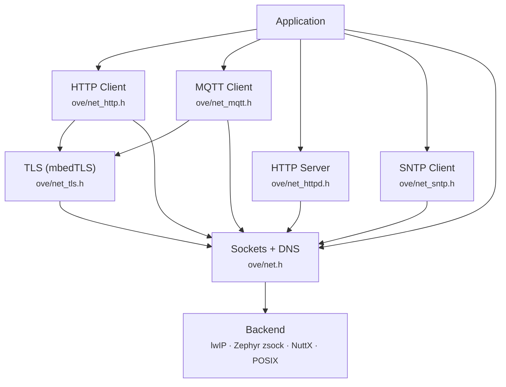
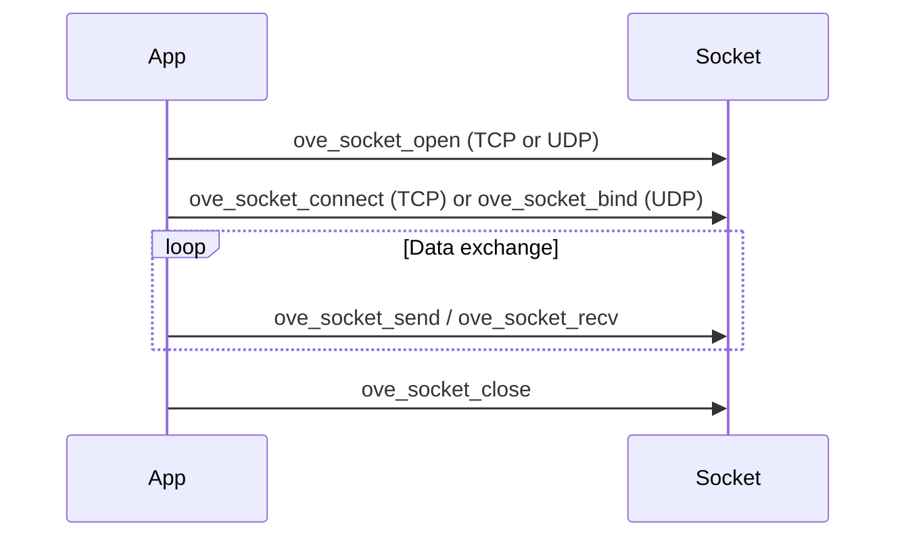

# Networking

The oveRTOS networking subsystem provides a portable BSD-like socket API, DNS resolution, TLS encryption, and higher-level protocol clients (HTTP, MQTT) and servers (HTTPD with WebSocket support). The stack runs on all four backends with zero-heap support throughout.

All networking modules require `CONFIG_OVE_NET`. When it is not set, every function is replaced by a static inline stub that returns `OVE_ERR_NOT_SUPPORTED`.

## Architecture



Each layer only depends on the layer directly below it. The socket layer is the only backend-specific code; everything above it is portable C shared across all RTOSes.

## Kconfig Options

| Option | Default | Description |
|--------|---------|-------------|
| `CONFIG_OVE_NET` | n | Core socket API, DNS, network interface |
| `CONFIG_OVE_NET_TLS` | n | TLS sessions via mbedTLS |
| `CONFIG_OVE_NET_HTTP` | n | HTTP/1.1 client |
| `CONFIG_OVE_NET_MQTT` | n | MQTT 3.1.1 client |
| `CONFIG_OVE_NET_HTTPD` | n | Embedded HTTP server |
| `CONFIG_OVE_NET_HTTPD_WS` | n | WebSocket support for HTTPD |
| `CONFIG_OVE_NET_SNTP` | n | Simple NTP time sync |
| `CONFIG_OVE_NET_TLS_HEAP_SIZE` | 32768 | Static TLS heap size (zero-heap mode) |
| `CONFIG_OVE_NET_HTTP_MAX_RESPONSE` | 8192 | Max HTTP response buffer |
| `CONFIG_OVE_NET_HTTPD_MAX_BODY` | 1024 | Max POST body for HTTPD |
| `CONFIG_OVE_NET_MQTT_RX_BUF` | 1024 | MQTT receive buffer |
| `CONFIG_OVE_NET_MQTT_TX_BUF` | 512 | MQTT transmit buffer |

### Bounded protocol pools (zero-heap mode)

The protocol stacks (lwIP, mbedTLS) own internal allocators. Following the
LVGL precedent (`LV_MEM_SIZE` + no libc spillover), each stack is pinned
to a BSS pool sized at compile time. Overflow returns
`OVE_ERR_NO_MEMORY` rather than spilling to libc — `ove_heap_lock()`
post-init catches any regression.

#### lwIP (FreeRTOS)

| Option | Default | Description |
|--------|---------|-------------|
| `CONFIG_OVE_NET_LWIP_MEM_SIZE` | 16384 | lwIP heap (`MEM_SIZE`); BSS-resident, `MEM_LIBC_MALLOC` pinned to 0 |
| `CONFIG_OVE_NET_LWIP_PBUF_POOL_SIZE` | 16 | RX pbuf count (`PBUF_POOL_SIZE`) |
| `CONFIG_OVE_NET_LWIP_PBUF_BUFSIZE` | 1536 | Bytes per pbuf (one MTU) |
| `CONFIG_OVE_NET_LWIP_NUM_TCP_PCB` | 16 | Active TCP connections |
| `CONFIG_OVE_NET_LWIP_NUM_TCP_PCB_LISTEN` | 4 | Listening sockets |
| `CONFIG_OVE_NET_LWIP_NUM_UDP_PCB` | 8 | UDP sockets |
| `CONFIG_OVE_NET_LWIP_NUM_NETCONN` | 16 | Socket-API handles |
| `CONFIG_OVE_NET_LWIP_DNS_TABLE_SIZE` | 4 | DNS cache entries |

#### Zephyr net stack

| Option | Default | Description |
|--------|---------|-------------|
| `CONFIG_OVE_ZEPHYR_NET_MAX_CONN` | 16 | `CONFIG_NET_MAX_CONN` — concurrent TCP/UDP connections |
| `CONFIG_OVE_ZEPHYR_NET_MAX_CONTEXTS` | 16 | `CONFIG_NET_MAX_CONTEXTS` — socket-like contexts |
| `CONFIG_OVE_ZEPHYR_NET_PKT_RX_COUNT` | 14 | RX `net_pkt` slab |
| `CONFIG_OVE_ZEPHYR_NET_PKT_TX_COUNT` | 14 | TX `net_pkt` slab |
| `CONFIG_OVE_ZEPHYR_NET_BUF_RX_COUNT` | 36 | RX `net_buf` payload pool |
| `CONFIG_OVE_ZEPHYR_NET_BUF_TX_COUNT` | 36 | TX `net_buf` payload pool |

#### NuttX net stack (zero-heap only)

| Option | Default | Description |
|--------|---------|-------------|
| `CONFIG_OVE_NUTTX_TCP_CONNS` | 8 | `CONFIG_NET_TCP_PREALLOC_TCBS` |
| `CONFIG_OVE_NUTTX_UDP_CONNS` | 8 | `CONFIG_NET_UDP_PREALLOC_CONNS` |
| `CONFIG_OVE_NUTTX_IOB_NBUFFERS` | 24 | I/O buffer count |
| `CONFIG_OVE_NUTTX_IOB_BUFSIZE` | 196 | Bytes per IOB |

POSIX uses host BSD sockets directly; pool sizing is the host kernel's
responsibility, and zero-heap mode on POSIX is a smoke test of the binding
control flow only.

### Sizing example

For a device serving ~5 concurrent HTTPS sessions plus MQTT and a small
HTTPD:

- TLS: 5 × ~24 KB peak per session → `CONFIG_OVE_NET_TLS_HEAP_SIZE=131072`
- lwIP heap: 5 TLS + 1 MQTT + 4 HTTPD listen + slack → `CONFIG_OVE_NET_LWIP_MEM_SIZE=32768`
- TCP PCBs: same → `CONFIG_OVE_NET_LWIP_NUM_TCP_PCB=12`
- pbufs: 16 RX + outbound TLS chunks → `CONFIG_OVE_NET_LWIP_PBUF_POOL_SIZE=24`
- HTTP response borrow buffer: largest expected response →
  `CONFIG_OVE_NET_HTTP_MAX_RESPONSE=16384`

Total static cost: ~200 KB, all in BSS, no runtime growth.

### Static-storage convenience macros

`OVE_NETIF_DEFINE_STATIC`, `OVE_TLS_DEFINE_STATIC`,
`OVE_HTTP_CLIENT_DEFINE_STATIC`, and `OVE_MQTT_CLIENT_DEFINE_STATIC`
declare a handle plus its storage in BSS, with a constructor that calls
the matching `_init()` before `main()`. `OVE_SOCKET_DEFINE` declares
just the storage (the socket family/type are decided at
`ove_socket_open()` time).

## Networking Error Codes

In addition to the common error codes, networking functions may return:

| Constant | Value | Meaning |
|----------|-------|---------|
| `OVE_ERR_NET_REFUSED` | -8 | Connection refused by remote host |
| `OVE_ERR_NET_UNREACHABLE` | -9 | Network or host unreachable |
| `OVE_ERR_NET_ADDR_IN_USE` | -10 | Local address already bound |
| `OVE_ERR_NET_RESET` | -11 | Connection reset by peer |
| `OVE_ERR_NET_DNS_FAIL` | -12 | DNS name resolution failed |
| `OVE_ERR_NET_CLOSED` | -13 | Connection closed by peer |

## Address and Network Interface

### Address Type

`ove_sockaddr_t` holds an IPv4 or IPv6 address with port. Use the helper to construct IPv4 addresses:

```c
ove_sockaddr_t addr;
ove_sockaddr_ipv4(&addr, 192, 168, 1, 100, 8080);
```

### Network Interface

Before any networking, bring up the interface with static IP or DHCP:

```c
ove_netif_t netif;
ove_netif_storage_t storage;
ove_netif_init(&netif, &storage);

ove_netif_config_t cfg = {0};
cfg.use_dhcp = 0;
ove_sockaddr_ipv4(&cfg.static_ip, 172, 1, 1, 2, 0);
ove_sockaddr_ipv4(&cfg.netmask,   255, 255, 255, 0, 0);
ove_sockaddr_ipv4(&cfg.gateway,   172, 1, 1, 1, 0);
ove_sockaddr_ipv4(&cfg.dns,       8, 8, 8, 8, 0);

ove_netif_up(netif, &cfg);
```

For DHCP, set `cfg.use_dhcp = 1` and leave the address fields zeroed.

### Network Interface API

| Function | Description |
|----------|-------------|
| `ove_netif_init` | Initialise from caller-supplied storage |
| `ove_netif_deinit` | Release resources |
| `ove_netif_create` | Heap-allocate and initialise (heap mode) |
| `ove_netif_destroy` | Destroy heap-allocated interface |
| `ove_netif_up` | Bring interface up with config |
| `ove_netif_down` | Tear down interface |
| `ove_netif_get_addr` | Query current IP, gateway, netmask |

## Sockets (TCP and UDP)

### Socket Lifecycle



### TCP Example

```c
ove_socket_t sock;
ove_socket_storage_t storage;
ove_socket_open(&sock, &storage, OVE_AF_INET, OVE_SOCK_STREAM);

ove_sockaddr_t dest;
ove_dns_resolve("example.com", &dest, OVE_SEC(5));
dest.port = 80;
ove_socket_connect(sock, &dest, OVE_SEC(5));

const char *req = "GET / HTTP/1.0\r\nHost: example.com\r\n\r\n";
size_t sent;
ove_socket_send(sock, req, strlen(req), &sent);

char buf[512];
size_t received;
ove_socket_recv(sock, buf, sizeof(buf), &received, OVE_SEC(5));

ove_socket_close(sock);
```

### UDP Example

```c
ove_socket_t sock;
ove_socket_storage_t storage;
ove_socket_open(&sock, &storage, OVE_AF_INET, OVE_SOCK_DGRAM);

ove_sockaddr_t local = {0};
ove_sockaddr_ipv4(&local, 0, 0, 0, 0, 9999);
ove_socket_bind(sock, &local);

ove_sockaddr_t dest;
ove_sockaddr_ipv4(&dest, 127, 0, 0, 1, 9999);
size_t sent;
ove_socket_sendto(sock, "hello", 5, &sent, &dest);

char buf[64];
size_t received;
ove_sockaddr_t src;
ove_socket_recvfrom(sock, buf, sizeof(buf), &received, &src, 2000);

ove_socket_close(sock);
```

### Socket API

| Function | Description |
|----------|-------------|
| `ove_socket_open` | Open a socket with caller-supplied storage |
| `ove_socket_close` | Close a socket |
| `ove_socket_connect` | Connect to a remote address (TCP) |
| `ove_socket_bind` | Bind to a local address |
| `ove_socket_listen` | Mark socket as listening (TCP server) |
| `ove_socket_accept` | Accept an incoming connection |
| `ove_socket_send` | Send data on a connected socket |
| `ove_socket_recv` | Receive data with timeout |
| `ove_socket_sendto` | Send a datagram to a destination (UDP) |
| `ove_socket_recvfrom` | Receive a datagram with source address |
| `ove_socket_create` | Heap-allocate a socket (heap mode) |
| `ove_socket_destroy` | Destroy a heap-allocated socket |

## DNS

```c
ove_sockaddr_t addr;
int rc = ove_dns_resolve("example.com", &addr, OVE_SEC(10));
if (rc == OVE_OK) {
    /* addr.addr[0..3] contains the IPv4 address */
    addr.port = 80;  /* set port for subsequent connect */
}
```

The hostname must be a null-terminated C string. The timeout is in nanoseconds; use `OVE_MS(...)` or `OVE_SEC(...)` for ergonomic values.

## TLS

TLS wraps an existing TCP socket with mbedTLS encryption. Requires `CONFIG_OVE_NET_TLS`.

```c
ove_tls_t tls;
ove_tls_storage_t tls_storage;
ove_tls_init(&tls, &tls_storage);

ove_tls_config_t cfg = {0};
cfg.hostname = "example.com";  /* SNI hostname for verification */
/* A non-NULL ca_cert is required for a verified handshake.  To opt out of
 * certificate validation (test/dev only) set cfg.allow_insecure = 1 — the
 * handshake refuses to complete otherwise. */

ove_tls_handshake(tls, sock, &cfg);  /* sock is an already-connected TCP socket */

size_t sent;
ove_tls_send(tls, "GET / HTTP/1.1\r\n...", len, &sent);

char buf[512];
size_t received;
ove_tls_recv(tls, buf, sizeof(buf), &received);

ove_tls_close(tls);
ove_tls_deinit(tls);
```

For certificate verification, set `cfg.ca_cert` and `cfg.ca_cert_len` to a PEM or DER certificate.

## HTTP Client

Requires `CONFIG_OVE_NET_HTTP`. Handles DNS, TCP connection, optional TLS, request formatting, and response parsing internally.

```c
ove_http_client_t client;
ove_http_client_storage_t storage;
ove_http_client_init(&client, &storage);

ove_http_response_t resp;
ove_http_get(client, "http://example.com/", &resp);
/* resp.status = 200, resp.body = "...", resp.body_len = 540 */
ove_http_response_free(&resp);

ove_http_post(client, "http://httpbin.org/post",
              "application/json", "{\"key\":\"value\"}", 15, &resp);
ove_http_response_free(&resp);

ove_http_client_deinit(client);
```

### HTTP Methods

| Method | Enum Value |
|--------|------------|
| GET | `OVE_HTTP_GET` |
| POST | `OVE_HTTP_POST` |
| PUT | `OVE_HTTP_PUT` |
| DELETE | `OVE_HTTP_DELETE` |
| PATCH | `OVE_HTTP_PATCH` |

### HTTP Client API

| Function | Description |
|----------|-------------|
| `ove_http_client_init` | Initialise from caller-supplied storage |
| `ove_http_client_deinit` | Release resources |
| `ove_http_get` | Perform a GET request |
| `ove_http_post` | Perform a POST request |
| `ove_http_request` | Generic request with method, body, content type |
| `ove_http_request_ex` | Extended request with custom headers |
| `ove_http_response_free` | Free response body/header buffers |

## MQTT Client

Requires `CONFIG_OVE_NET_MQTT`. Implements MQTT 3.1.1 with QoS 0 and 1.

```c
static void on_message(const char *topic, size_t topic_len,
                       const void *payload, size_t payload_len,
                       void *user_data)
{
    OVE_LOG_INF("MQTT: [%.*s] %.*s", (int)topic_len, topic,
                (int)payload_len, (const char *)payload);
}

ove_mqtt_client_t mqtt;
ove_mqtt_client_storage_t storage;
ove_mqtt_client_init(&mqtt, &storage);

ove_mqtt_config_t cfg = {
    .host = "test.mosquitto.org",
    .port = 1883,
    .client_id = "my-device",
    .keep_alive_s = 30,
    .on_message = on_message,
    /* Optional authentication */
    .username = NULL,
    .password = NULL,
    /* Optional TLS — set use_tls = 1 and supply tls_ca_cert (+ tls_ca_cert_len),
     * or set tls_allow_insecure = 1 for test/dev. */
    .use_tls = 0,
    .user_data = NULL,
};
ove_mqtt_connect(mqtt, &cfg);

ove_mqtt_subscribe(mqtt, "my/topic", OVE_MQTT_QOS0);
ove_mqtt_publish(mqtt, "my/topic", "hello", 5, OVE_MQTT_QOS1);

/* Call periodically to process incoming messages and send keep-alive */
ove_mqtt_loop(mqtt, OVE_MS(500));

ove_mqtt_disconnect(mqtt);
ove_mqtt_client_deinit(mqtt);
```

### MQTT Client API

| Function | Description |
|----------|-------------|
| `ove_mqtt_connect` | Connect to broker with config |
| `ove_mqtt_disconnect` | Disconnect from broker |
| `ove_mqtt_publish` | Publish a message (QoS 0 or 1) |
| `ove_mqtt_subscribe` | Subscribe to a topic filter |
| `ove_mqtt_unsubscribe` | Unsubscribe from a topic |
| `ove_mqtt_loop` | Process packets and send keep-alive |

## HTTP Server

Requires `CONFIG_OVE_NET_HTTPD`. Single-threaded HTTP/1.1 server with path-based routing and a built-in Tasmota-style web dashboard.

```c
ove_httpd_config_t cfg = { .port = 80, .max_body_size = 1024 };
ove_httpd_start(&cfg);
ove_httpd_register_builtin_routes();  /* /api/info, /api/leds, /api/gpio, etc. */
```

### Custom Routes

```c
static int my_handler(ove_httpd_req_t *req, ove_httpd_resp_t *resp)
{
    const char *path = ove_httpd_req_path(req);
    const char *seg  = ove_httpd_req_segment(req, 1); /* e.g. "0" from /api/items/0 */
    return ove_httpd_resp_json(resp, 200, "{\"status\":\"ok\"}");
}

ove_httpd_route("GET", "/api/items/*", my_handler);
```

### Built-in Dashboard Routes

| Route | Method | Description |
|-------|--------|-------------|
| `/` | GET | Web dashboard (HTML/CSS/JS) |
| `/api/info` | GET | Device info (RTOS, board, uptime, memory) |
| `/api/leds` | GET/POST | LED state query and control |
| `/api/gpio` | GET/POST | GPIO pin read/write |
| `/api/network` | GET | Network interface status |
| `/api/log` | GET | Recent log messages |
| `/api/system/memory` | GET | System heap totals (free / used / peak). |
| `/api/system/threads` | GET | Thread list with state, priority, stack usage, CPU%. |
| `/api/audio/stats` | GET | Audio graph runtime statistics (requires `CONFIG_OVE_AUDIO`). |
| `/api/infer/stats` | GET | Last inference latency and stats (requires `CONFIG_OVE_INFER`). |

### HTTPD API

| Function | Description |
|----------|-------------|
| `ove_httpd_start` | Start the HTTP server. |
| `ove_httpd_stop` | Stop the server. |
| `ove_httpd_set_netif` | Bind the server to a specific network interface for the `/api/network` route. |
| `ove_httpd_set_audio_graph` | Register an `ove_audio_graph` for the `/api/audio/stats` route (requires `CONFIG_OVE_AUDIO`). |
| `ove_httpd_set_model` | Register an `ove_model_t` for the `/api/infer/stats` route (requires `CONFIG_OVE_INFER`). |
| `ove_httpd_route` | Register a route handler. |
| `ove_httpd_register_builtin_routes` | Register the built-in dashboard. |
| `ove_httpd_req_method` | Get request method string. |
| `ove_httpd_req_path` | Get request path. |
| `ove_httpd_req_query` | Get query string. |
| `ove_httpd_req_body` | Get POST body. |
| `ove_httpd_req_body_len` | Get POST body length. |
| `ove_httpd_req_segment` | Get path segment by index. |
| `ove_httpd_resp_json` | Send JSON response. |
| `ove_httpd_resp_html` | Send HTML response (requires explicit `len`, not NUL-terminated). |
| `ove_httpd_resp_send` | Send response with caller-chosen content type. |
| `ove_httpd_resp_send_gz` | Send a pre-compressed gzip response (used for the bundled dashboard). |
| `ove_httpd_resp_error` | Send error response. |
| `ove_httpd_log_append` | Append a line to the in-memory log ring buffer surfaced at `/api/log`. |

### WebSocket Support

When `CONFIG_OVE_NET_HTTPD_WS` is enabled, the server supports RFC 6455 WebSocket connections. Both handlers return `void`; the third argument to `ove_httpd_ws_route` is an `ove_httpd_ws_close_handler_t` invoked on disconnect (pass `NULL` if not needed).

```c
static void ws_on_message(ove_httpd_ws_conn_t *conn,
                          const void *data, size_t len)
{
    /* Echo back */
    ove_httpd_ws_send(conn, data, len);
}

ove_httpd_ws_route("/ws", ws_on_message, NULL);
ove_httpd_ws_broadcast("/ws", "hello", 5);
```

## SNTP

Requires `CONFIG_OVE_NET_SNTP`. Performs a single NTP query to get UTC time.

```c
ove_sntp_config_t cfg = { .server = "pool.ntp.org", .timeout_ns = OVE_SEC(5) };
ove_sntp_sync(&cfg);
/* Passing NULL uses the built-in defaults (pool.ntp.org, 5 s timeout). */

uint32_t utc_s;
ove_sntp_get_utc(&utc_s);    /* seconds since 1970-01-01 */

int64_t offset_us;
ove_sntp_get_offset_us(&offset_us);  /* microseconds offset between local
                                        clock and the last successful sync */
```

## Zero-Heap Networking

When `CONFIG_OVE_ZERO_HEAP` is enabled, the entire networking stack operates without any dynamic memory allocation:

- **lwIP** (FreeRTOS): Uses static memory pools for PCBs, packet buffers, and ARP entries
- **mbedTLS**: Uses `MBEDTLS_MEMORY_BUFFER_ALLOC_C` with a static buffer (`CONFIG_OVE_NET_TLS_HEAP_SIZE`)
- **HTTP client**: Response buffer embedded in the client storage struct
- **MQTT client**: Socket storage embedded in the client struct
- **All sockets**: Use `_init()`/`_deinit()` with caller-supplied `ove_*_storage_t`

The `_create()`/`_destroy()` convenience macros automatically expand to static storage in zero-heap mode (see [Allocation Strategies](index.md#allocation-strategies)).

## Language Bindings

All four languages provide equivalent networking APIs. Key type mappings:

| Concept | C | C++ | Rust | Zig |
|---------|---|-----|------|-----|
| Address | `ove_sockaddr_t` | `ove::Address` | `ove::net::Address` | `ove.Address` |
| Net interface | `ove_netif_t` | `ove::NetIf` | `ove::net::NetIf` | `ove.NetIf` |
| TCP socket | `ove_socket_t` | `ove::TcpSocket` | `ove::net::TcpStream` | `ove.TcpStream` |
| UDP socket | `ove_socket_t` | `ove::UdpSocket` | `ove::net::UdpSocket` | `ove.UdpSocket` |
| DNS resolve | `ove_dns_resolve()` | `ove::dns::resolve()` | `ove::net::dns_resolve()` | `ove.net.dns.resolve()` |
| HTTP client | `ove_http_client_t` | `ove::http::Client` | `ove::net_http::Client` | `ove.HttpClient` |
| MQTT client | `ove_mqtt_client_t` | `ove::mqtt::Client` | `ove::net_mqtt::Client` | `ove.MqttClient` |
| TLS session | `ove_tls_t` | `ove::tls::Session` | `ove::net_tls::Session` | `ove.TlsSession` |
| HTTPD start | `ove_httpd_start()` | `ove::httpd::start()` | `ove::net_httpd::start()` | `ove.net_httpd.start()` |
| Cleanup | `_deinit()` / `_destroy()` | Destructor | `Drop` trait | `defer obj.destroy()` |

### RAII Patterns by Language

- **C**: Manual `_init()`/`_deinit()` or `_create()`/`_destroy()`
- **C++**: Automatic via destructor; move-only types (no copy)
- **Rust**: Automatic via `Drop` trait; `Result<T>` error handling
- **Zig**: Explicit `destroy()` with `defer`; `Error!T` return types; comptime zero-heap dispatch

### MQTT Callback Patterns

| Language | Pattern |
|----------|---------|
| C | Function pointer: `void (*)(topic, topic_len, payload, payload_len, user_data)` |
| C++ | `std::function<void(std::string_view topic, std::span<const uint8_t> payload)>` |
| Rust | `fn(&str, &[u8])` via trampoline (zero `unsafe` in app code) |
| Zig | `comptime fn([]const u8, []const u8) void` via trampoline, or `connectWithContext()` for typed state |
