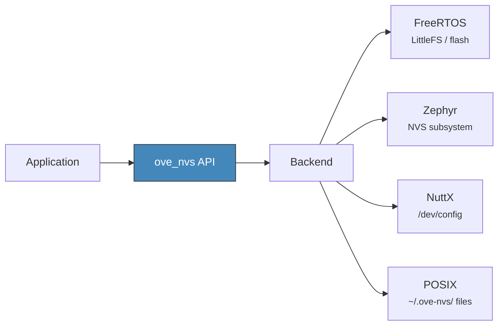

# Non-Volatile Storage

The NVS module provides a key-value store backed by non-volatile memory (flash, EEPROM, or host filesystem depending on the backend).

## Architecture



## API Reference

| Function | Description |
|----------|-------------|
| `ove_nvs_init()` | Initialize the NVS subsystem (call once at startup) |
| `ove_nvs_deinit()` | Tear down the NVS subsystem |
| `ove_nvs_read(key, buf, buf_len, &out_len)` | Read value by key. Pass `buf=NULL` to query size only. |
| `ove_nvs_write(key, data, len)` | Write or update a key-value pair |
| `ove_nvs_erase(key)` | Delete a key-value pair |

## Usage

```c
/* Initialize */
ove_nvs_init();

/* Write a setting */
uint8_t bypass = 1;
ove_nvs_write("bypass", &bypass, sizeof(bypass));

/* Read it back */
uint8_t val = 0;
size_t out_len = 0;
if (ove_nvs_read("bypass", &val, sizeof(val), &out_len) == OVE_OK) {
    /* val == 1, out_len == 1 */
}

/* Delete */
ove_nvs_erase("bypass");
```

## Error Codes

| Code | Meaning |
|------|---------|
| `OVE_OK` | Success |
| `OVE_ERR_NOT_FOUND` | Key does not exist (returned by `ove_nvs_read` / `ove_nvs_erase`) |
| `OVE_ERR_INVALID_PARAM` | NULL key or invalid arguments |
| `OVE_ERR_NOT_SUPPORTED` | `CONFIG_OVE_NVS` not enabled |

## Kconfig

| Option | Default | Description |
|--------|---------|-------------|
| `CONFIG_OVE_NVS` | `n` | Enable non-volatile key-value storage |

## Header

`ove/nvs.h`
