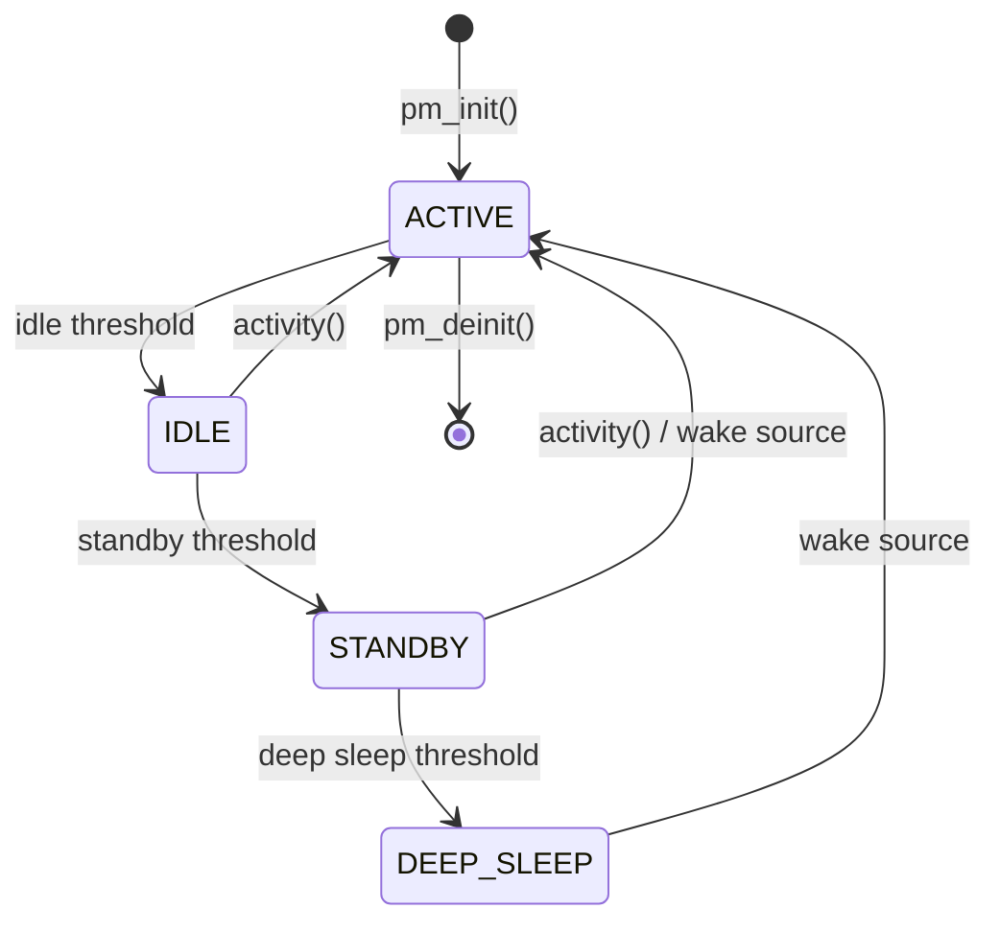

# Power Management

The oveRTOS power management subsystem provides a unified sleep state machine, peripheral power domains, wake source registration, and runtime statistics. It is a singleton module — there is exactly one system power state.

Requires `CONFIG_OVE_PM`.

## Power States

Four sleep states are defined, ordered by increasing depth:

| State | Value | Description |
|-------|-------|-------------|
| `OVE_PM_STATE_ACTIVE` | 0 | Full speed, all clocks running |
| `OVE_PM_STATE_IDLE` | 1 | Light sleep, fast wakeup, peripherals on |
| `OVE_PM_STATE_STANDBY` | 2 | Deeper sleep, some peripherals off |
| `OVE_PM_STATE_DEEP_SLEEP` | 3 | Lowest power, RAM retained, slow wakeup |

## State Machine



A pluggable policy engine decides when to transition between states based on idle duration, next scheduled timeout, and registered wake sources. The default policy uses configurable thresholds.

## Wake Sources

| Type | Description |
|------|-------------|
| `OVE_PM_WAKE_GPIO` | GPIO pin edge |
| `OVE_PM_WAKE_TIMER` | Timer expiry |
| `OVE_PM_WAKE_UART` | UART RX activity |
| `OVE_PM_WAKE_RTC` | RTC alarm |

Register wake sources with `ove_pm_wake_register()`. Each wake source is described by a `struct ove_pm_wake_src` containing the type and a union of type-specific parameters (GPIO port/pin/edge, timer timeout, UART instance, RTC alarm).

## Power Domains

Peripheral power domains are reference-counted: power is gated when the last user releases a domain.

| Domain | Description |
|--------|-------------|
| `OVE_PM_DOMAIN_RADIO` | Radio / wireless |
| `OVE_PM_DOMAIN_SENSOR` | Sensor peripherals |
| `OVE_PM_DOMAIN_DISPLAY` | Display controller |
| `OVE_PM_DOMAIN_AUDIO` | Audio subsystem |
| `OVE_PM_DOMAIN_STORAGE` | Storage peripherals |
| `OVE_PM_DOMAIN_COMMS` | Communications |
| `OVE_PM_DOMAIN_USER0` | Application-defined |
| `OVE_PM_DOMAIN_USER1` | Application-defined |

Use `ove_pm_domain_request()` to power on a domain (increments refcount) and `ove_pm_domain_release()` to release it (decrements refcount, powers off at zero).

## Configuration

Initialise the PM subsystem with `ove_pm_init()`, passing a `struct ove_pm_cfg`:

| Field | Type | Description |
|-------|------|-------------|
| `idle_threshold_ms` | `uint32_t` | Idle ms before ACTIVE → IDLE |
| `standby_threshold_ms` | `uint32_t` | Idle ms before IDLE → STANDBY |
| `deep_sleep_threshold_ms` | `uint32_t` | Idle ms before → DEEP_SLEEP |

## API Reference

| Function | Description |
|----------|-------------|
| `ove_pm_init(cfg)` | Initialise the PM subsystem |
| `ove_pm_deinit()` | Tear down and release resources |
| `ove_pm_set_state(state)` | Request explicit state transition |
| `ove_pm_get_state()` | Query current power state |
| `ove_pm_activity()` | Report system activity (resets idle timer, ISR-safe) |
| `ove_pm_wake_register(src)` | Register a wake source |
| `ove_pm_wake_unregister(src)` | Unregister a wake source |
| `ove_pm_domain_request(domain)` | Increment domain refcount (power on) |
| `ove_pm_domain_release(domain)` | Decrement domain refcount (power off at zero) |
| `ove_pm_domain_get_refcount(domain)` | Query domain reference count |
| `ove_pm_set_policy(policy, user_data)` | Register custom policy callback (NULL restores default) |
| `ove_pm_notify_register(cb, user_data)` | Register transition notification callback |
| `ove_pm_notify_unregister(cb, user_data)` | Unregister notification callback |
| `ove_pm_get_stats(stats)` | Query accumulated power statistics |
| `ove_pm_reset_stats()` | Reset all statistics to zero |
| `ove_pm_set_budget(target)` | Set target low-power percentage (hundredths) |
| `ove_pm_get_budget_status(actual)` | Query actual vs. budget low-power percentage |
| `ove_pm_idle_process()` | Process idle (called by HAL, not application code) |

All functions that can fail return `int` (`OVE_OK` on success, negative error code on failure).

## Policy Engine

The default threshold-based policy transitions to deeper sleep states as idle duration increases. Replace it with `ove_pm_set_policy()`:

```c
ove_pm_state_t my_policy(ove_pm_state_t current, uint32_t idle_ms,
                         uint32_t next_timeout_ms, void *user_data)
{
    /* Custom logic to recommend next state */
    if (idle_ms > 5000 && next_timeout_ms > 10000)
        return OVE_PM_STATE_DEEP_SLEEP;
    return current;
}

ove_pm_set_policy(my_policy, NULL);
```

Pass NULL to restore the default policy.

## Transition Notifications

Register callbacks to be notified before sleep entry and after wake:

```c
void my_notify(ove_pm_event_t event, ove_pm_state_t from,
               ove_pm_state_t to, void *user_data)
{
    if (event == OVE_PM_EVENT_PRE_SLEEP)
        /* save state before sleep */;
    else if (event == OVE_PM_EVENT_POST_WAKE)
        /* restore state after wake */;
}

ove_pm_notify_register(my_notify, NULL);
```

## Power Statistics

Query runtime statistics with `ove_pm_get_stats()`:

| Field | Type | Description |
|-------|------|-------------|
| `time_in_state_us[4]` | `uint64_t[]` | Cumulative time per state (microseconds) |
| `transition_count[4]` | `uint32_t[]` | Number of entries per state |
| `total_runtime_us` | `uint64_t` | Total tracked time |
| `active_pct_x100` | `uint32_t` | Active percentage in hundredths |

Statistics require `CONFIG_OVE_PM_STATS` (enabled by default when PM is on).

The power budget API (`ove_pm_set_budget()` / `ove_pm_get_budget_status()`) requires `CONFIG_OVE_PM_BUDGET`.

## Example

See the [Power Management example](../examples/example_pm/index.md) for a complete application demonstrating sleep states, power domains, and wake sources.

## Kconfig Options

| Option | Type | Default | Description |
|--------|------|---------|-------------|
| `CONFIG_OVE_PM` | bool | `n` | Enable the power management framework |
| `CONFIG_OVE_PM_MAX_WAKE_SOURCES` | int | `8` | Maximum registered wake sources (~32 bytes each) |
| `CONFIG_OVE_PM_MAX_NOTIFIERS` | int | `4` | Maximum transition notification callbacks |
| `CONFIG_OVE_PM_IDLE_THRESHOLD_MS` | int | `10` | Idle ms before ACTIVE → IDLE |
| `CONFIG_OVE_PM_STANDBY_THRESHOLD_MS` | int | `1000` | Idle ms before IDLE → STANDBY |
| `CONFIG_OVE_PM_DEEP_SLEEP_THRESHOLD_MS` | int | `10000` | Idle ms before → DEEP_SLEEP |
| `CONFIG_OVE_PM_STATS` | bool | `y` | Track per-state time and transition counts |
| `CONFIG_OVE_PM_BUDGET` | bool | `n` | Enable power budget target tracking |

## Header

| Header | Contents |
|--------|----------|
| `ove/pm.h` | Power management framework |
