# Shell & Console

The oveRTOS shell and console subsystems provide an interactive command-line interface over a serial connection. The console layer handles raw byte I/O against the hardware UART; the shell layer sits on top and provides command parsing, dispatch, and built-in help.

## Architecture

```mermaid
graph LR
    UART["Serial RX<br/><small>UART / USB CDC</small>"]
    GETCHAR["ove_console_getchar()<br/><small>or ISR / DMA callback</small>"]
    PROCESS["ove_shell_process_char()<br/><small>line buffer + backspace</small>"]
    LOOKUP["command lookup<br/><small>registered ove_shell_cmd table</small>"]
    HANDLER["handler(argc, argv)<br/><small>application command function</small>"]
    OUTPUT["ove_console_putchar() / write()<br/><small>Serial TX</small>"]

    UART --> GETCHAR --> PROCESS --> LOOKUP --> HANDLER --> OUTPUT

    style UART fill:#4a9,stroke:#333,color:#fff
    style GETCHAR fill:#48b,stroke:#333,color:#fff
    style PROCESS fill:#48b,stroke:#333,color:#fff
    style LOOKUP fill:#666,stroke:#333,color:#fff
    style HANDLER fill:#a54,stroke:#333,color:#fff
    style OUTPUT fill:#4a9,stroke:#333,color:#fff
```



Characters arrive one at a time from `ove_console_getchar()` or directly from an ISR/DMA callback and are fed into `ove_shell_process_char()`. The shell accumulates them into a line buffer, handling backspace and other editing characters transparently. On newline, the line is split into whitespace-delimited tokens (up to `OVE_SHELL_MAX_ARGS` = 8) and dispatched to the matching registered handler.

## Shell API

| Function | Signature | Description |
|----------|-----------|-------------|
| `ove_shell_init` | `(void) → int` | Initialise the shell and register built-in commands (e.g. `help`). |
| `ove_shell_register_cmd` | `(const struct ove_shell_cmd *cmd) → int` | Add a command to the dispatch table; the descriptor must remain valid for the system lifetime. |
| `ove_shell_process_char` | `(char c) → void` | Feed one raw character into the shell; call from console RX task or ISR. |
| `ove_shell_process_line` | `(const char *line) → void` | Process a complete already-buffered input line through the shell (useful for piping non-UART input like HTTP). |
| `ove_shell_set_output_hook` | `(ove_shell_output_hook_t hook) → void` | Install a hook called with every shell output chunk — used to forward shell responses to alternate sinks (e.g. an HTTP client). Pass `NULL` to clear. |

Output-hook prototype:

```c
typedef void (*ove_shell_output_hook_t)(const char *data, size_t len);
```

## Console API

| Function | Signature | Description |
|----------|-----------|-------------|
| `ove_console_init` | `(void) → int` | Configure the serial peripheral (baud rate, framing) as defined by the BSP |
| `ove_console_getchar` | `(void) → int` | Read one character; returns -1 if none is available or on error |
| `ove_console_putchar` | `(c) → void` | Transmit one character; may block until the TX buffer has space |
| `ove_console_write` | `(buf, len) → void` | Transmit exactly `len` raw bytes with no newline translation |

## Command Descriptor

Each registered command is described by a persistent `ove_shell_cmd` structure. Pass a pointer to `ove_shell_register_cmd`; the struct must remain valid (e.g. declared `static`) after registration.

```c
struct ove_shell_cmd {
    const char       *name;    /* token matched against the first word of input */
    const char       *help;    /* one-line description shown by the built-in help command */
    ove_shell_cmd_fn  handler; /* called when the command is matched */
};

/* Handler prototype */
typedef void (*ove_shell_cmd_fn)(int argc, const char *argv[]);
```

`argc` is always at least 1 (`argv[0]` is the command name). `argv` is `NULL`-terminated. The argument strings are valid only for the duration of the handler call.

## Example: Registering a Custom "status" Command

```c
#include "ove/ove.h"

static void cmd_status(int argc, const char *argv[])
{
    (void)argc;
    (void)argv;
    OVE_LOG_INF("RTOS:  %s", OVE_RTOS_NAME);
    OVE_LOG_INF("Board: %s", ove_board_name());
    OVE_LOG_INF("LEDs:  %u", ove_led_count());
}

static const struct ove_shell_cmd status_cmd = {
    .name    = "status",
    .help    = "Print system status information",
    .handler = cmd_status,
};

void shell_setup(void)
{
    ove_console_init();
    ove_shell_init();
    ove_shell_register_cmd(&status_cmd);
}

/* Drive the shell from a dedicated task */
static void console_task(void *arg)
{
    (void)arg;
    for (;;) {
        int c = ove_console_getchar();
        if (c >= 0)
            ove_shell_process_char(c);
    }
}
```

Typing `status` at the console will invoke `cmd_status`. Typing `help` prints the name and help string for every registered command.

## Kconfig Options

| Option | Default | Description |
|--------|---------|-------------|
| `CONFIG_OVE_SHELL` | `n` | Enable the interactive shell subsystem |
| `CONFIG_OVE_CONSOLE` | `n` | Enable low-level serial console I/O |

## Headers

| Header | Contents |
|--------|----------|
| `ove/shell.h` | `OVE_SHELL_MAX_ARGS`, `ove_shell_cmd` struct, `ove_shell_cmd_fn` and `ove_shell_output_hook_t` typedefs, shell init/register/process/set_output_hook. |
| `ove/console.h` | Console init, getchar, putchar, write |
