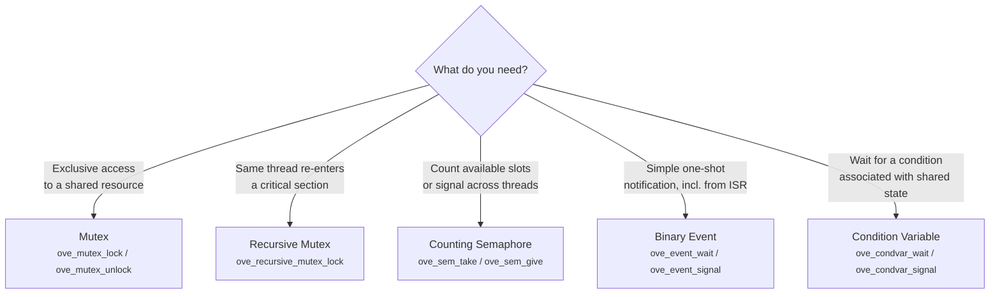
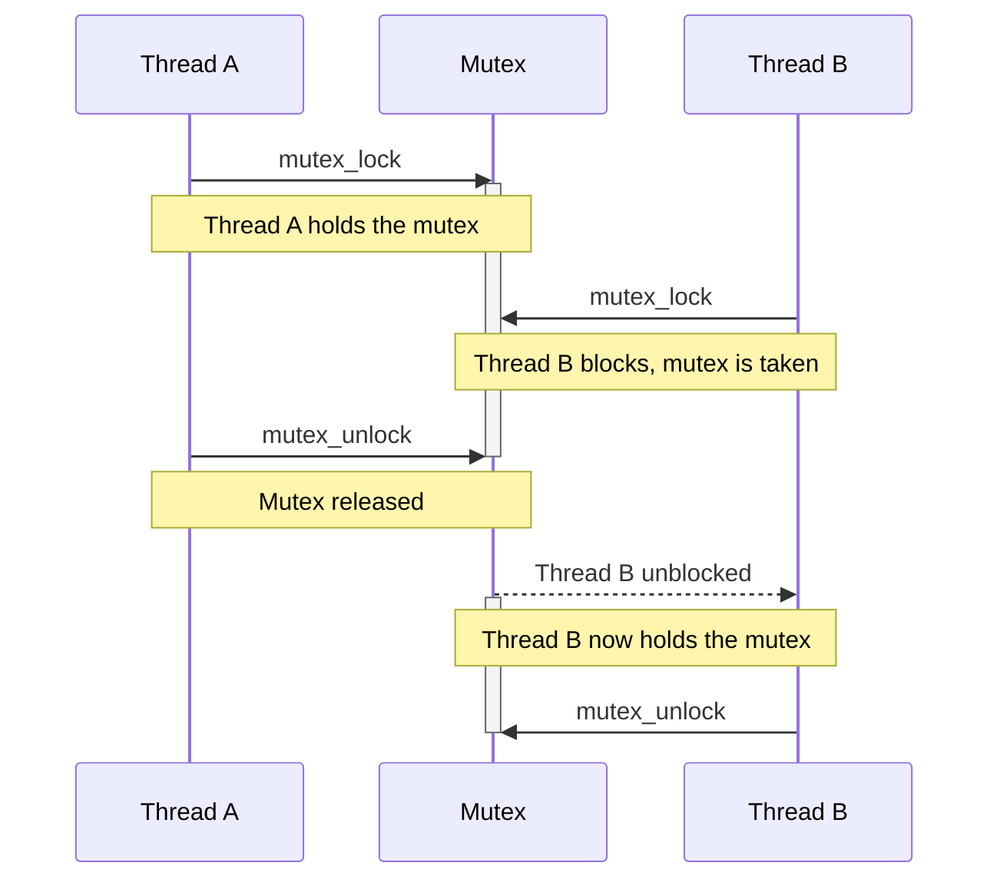
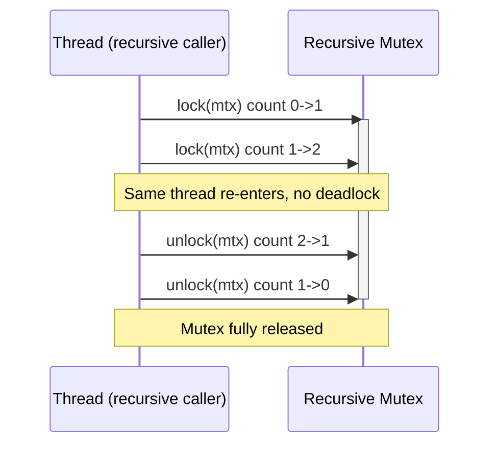
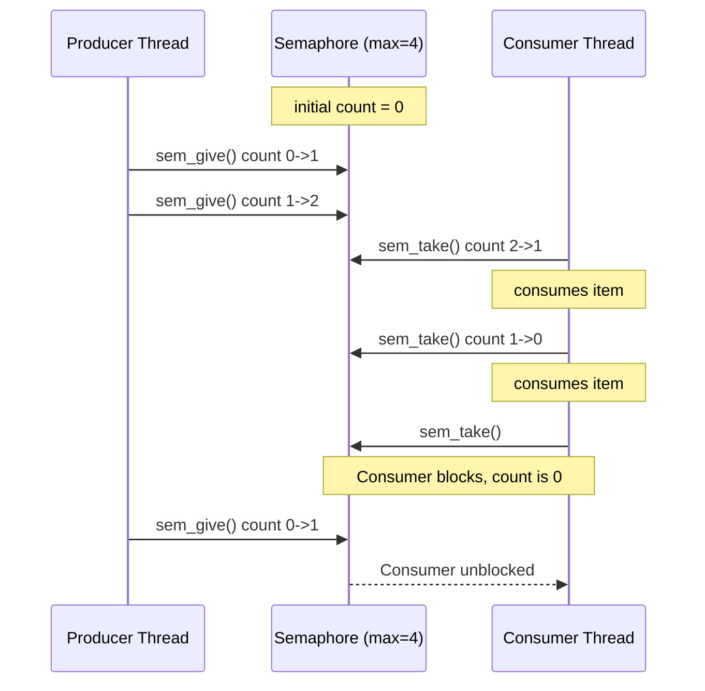
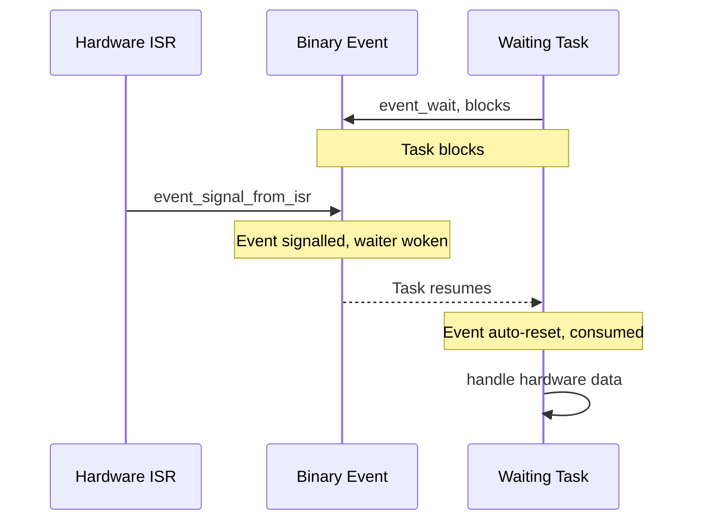
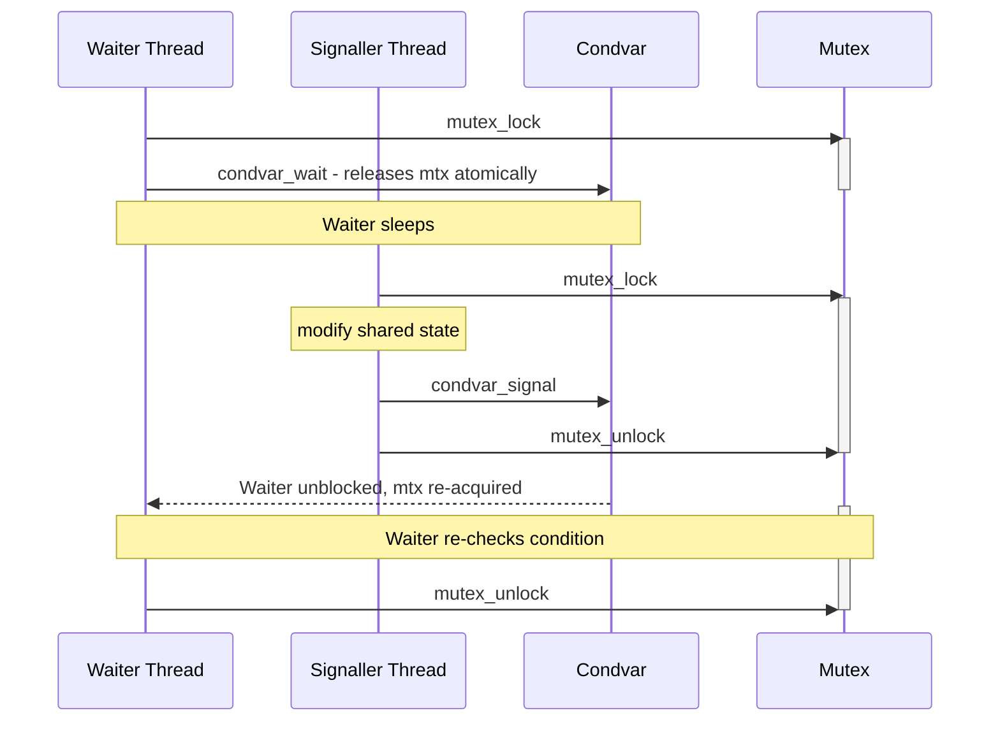
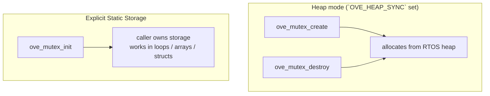
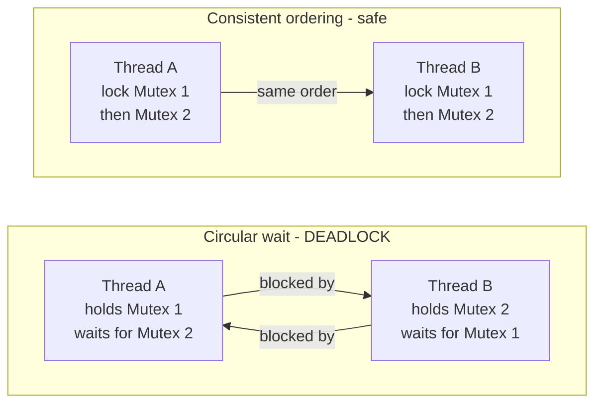

# Synchronization Primitives

`ove/sync.h` provides five portable synchronization primitives: a non-recursive mutex, a recursive mutex, a counting semaphore, a binary event, and a condition variable. Each maps to the equivalent native object on every supported backend (FreeRTOS, Zephyr, NuttX, POSIX) with no virtual dispatch and [minimal runtime overhead](../benchmarks/index.md) over the native API.

All primitives require `CONFIG_OVE_SYNC`. When it is not set, every function is replaced by a static inline stub that returns `OVE_ERR_NOT_SUPPORTED`.

## Primitive Comparison



| Primitive | Use when | ISR-safe signal | Recursive |
|-----------|----------|-----------------|-----------|
| **Mutex** | Protecting a shared resource from concurrent access | No | No |
| **Recursive mutex** | Re-entrant critical sections; same thread locks multiple times | No | Yes |
| **Semaphore** | Counting available resources; producer/consumer slot tracking | No (use a binary event for ISR signalling) | N/A |
| **Binary event** | Simple one-shot wakeup; hardware interrupt notifies a task | Yes (`ove_event_signal_from_isr`) | N/A |
| **Condition variable** | Waiting for an arbitrary predicate guarded by a mutex | No | N/A |

## ISR safety

Only the binary event has an ISR-safe producer. `ove_sem_give()` and the mutex / condvar operations are **not** callable from an interrupt context, even though FreeRTOS, Zephyr, and NuttX each have native ISR variants for some of these — the portable layer doesn't expose them because the semantics differ across backends.

For ISR → thread handoff:

- One-bit wakeup → `ove_event_signal_from_isr()` (this header).
- Bitmask wakeup → `ove_eventgroup_set_bits_from_isr()` (in `ove/eventgroup.h`).
- Queue a message → `ove_queue_send_from_isr()` (in `ove/queue.h`).

## Mutex

A non-recursive mutex serializes access to a shared resource. A thread that already holds the mutex must not call `ove_mutex_lock()` again — this causes a deadlock.



```c
static ove_mutex_t shared_mutex;

void init(void)
{
    ove_mutex_create(&shared_mutex);
}

void update_shared_state(void)
{
    if (ove_mutex_lock(shared_mutex, OVE_MS(100)) != OVE_OK)
        return;  /* timed out after 100 ms */

    /* --- critical section --- */
    shared_value++;
    /* ------------------------ */

    ove_mutex_unlock(shared_mutex);
}
```

## Recursive Mutex

A recursive mutex allows the same thread to lock it multiple times without deadlocking. Each `ove_recursive_mutex_lock()` must be balanced by a matching `ove_recursive_mutex_unlock()`. The mutex is only fully released — and made available to other threads — when the lock count returns to zero.



## Counting Semaphore

A counting semaphore tracks a pool of `max` tokens. `ove_sem_take()` consumes one token (blocks if count is zero); `ove_sem_give()` returns one token. Useful for producer/consumer patterns and for limiting concurrent access to a resource pool.



```c
#define QUEUE_SLOTS 8

static ove_sem_t slots_used;
static ove_sem_t slots_free;

void sync_init(void)
{
    ove_sem_create(&slots_used, 0,          QUEUE_SLOTS);
    ove_sem_create(&slots_free, QUEUE_SLOTS, QUEUE_SLOTS);
}

void producer(void *arg)
{
    for (;;) {
        ove_sem_take(slots_free, OVE_WAIT_FOREVER);
        enqueue_item(produce_item());
        ove_sem_give(slots_used);
    }
}

void consumer(void *arg)
{
    for (;;) {
        ove_sem_take(slots_used, OVE_WAIT_FOREVER);
        process_item(dequeue_item());
        ove_sem_give(slots_free);
    }
}
```

## Binary Event

A binary event provides a lightweight one-bit signal. The waiting task blocks until the event is signalled; the signal is consumed on wakeup (auto-reset). `ove_event_signal_from_isr()` is the ISR-safe variant — it may trigger an immediate context switch to a higher-priority waiter when the interrupt exits.



```c
static ove_event_t data_ready_evt;

void init(void)
{
    ove_event_create(&data_ready_evt);
}

/* Called from ISR context */
void DMA_IRQHandler(void)
{
    ove_event_signal_from_isr(data_ready_evt);
}

static void processing_entry(void *arg)
{
    for (;;) {
        ove_event_wait(data_ready_evt, OVE_WAIT_FOREVER);
        process_dma_buffer();
    }
}
```

## Condition Variable

A condition variable lets a thread atomically release a mutex and sleep until an arbitrary condition becomes true. `ove_condvar_wait()` releases `mtx` on entry and re-acquires it before returning, whether the wakeup was due to `ove_condvar_signal()`, `ove_condvar_broadcast()`, or a timeout.

Always recheck the guarded condition in a `while` loop — spurious wakeups are possible on some backends.



```c
static ove_mutex_t  state_mutex;
static ove_condvar_t state_ready_cv;
static bool          data_available = false;

void sync_init(void)
{
    ove_mutex_create(&state_mutex);
    ove_condvar_create(&state_ready_cv);
}

void producer_entry(void *arg)
{
    for (;;) {
        prepare_data();

        ove_mutex_lock(state_mutex, OVE_WAIT_FOREVER);
        data_available = true;
        ove_condvar_signal(state_ready_cv);
        ove_mutex_unlock(state_mutex);
    }
}

void consumer_entry(void *arg)
{
    ove_mutex_lock(state_mutex, OVE_WAIT_FOREVER);
    while (!data_available) {
        /* spurious-wakeup safe: always recheck in a while loop */
        ove_condvar_wait(state_ready_cv, state_mutex, OVE_WAIT_FOREVER);
    }
    data_available = false;
    consume_data();
    ove_mutex_unlock(state_mutex);
}
```

## API Reference

> `_create()` / `_destroy()` are gated behind `OVE_HEAP_SYNC` and unavailable in zero-heap mode. For zero-heap apps (or code that compiles in both modes), use `_init()` with caller-supplied storage or the `OVE_*_DEFINE_STATIC()` macros.

### Mutex

| Function | Description |
|----------|-------------|
| `ove_mutex_init(mtx, storage)` | Initialise a non-recursive mutex from caller-supplied static storage. |
| `ove_mutex_deinit(mtx)` | Release resources; does not free static storage. |
| `ove_mutex_create(mtx)` | Allocate and initialise a mutex (heap mode only; gated by `OVE_HEAP_SYNC`). |
| `ove_mutex_destroy(mtx)` | Destroy and free a mutex created with `ove_mutex_create()` (heap mode only). |
| `ove_mutex_lock(mtx, timeout_ns)` | Acquire the mutex. Blocks up to `timeout_ns` ns; pass `OVE_WAIT_FOREVER` to block indefinitely. Returns `OVE_ERR_TIMEOUT` if the deadline expires. |
| `ove_mutex_unlock(mtx)` | Release the mutex. Must be called by the thread that acquired it. |

### Recursive Mutex

| Function | Description |
|----------|-------------|
| `ove_recursive_mutex_init(mtx, storage)` | Initialise a recursive mutex from static storage. |
| `ove_recursive_mutex_create(mtx)` | Allocate and initialise a recursive mutex (heap mode only; gated by `OVE_HEAP_SYNC`). |
| `ove_recursive_mutex_destroy(mtx)` | Destroy and free a recursive mutex (heap mode only). |
| `ove_recursive_mutex_lock(mtx, timeout_ns)` | Acquire one level of the recursive mutex. May be called multiple times by the same thread. |
| `ove_recursive_mutex_unlock(mtx)` | Release one level. The mutex is fully released when the count reaches zero. |

### Semaphore

| Function | Description |
|----------|-------------|
| `ove_sem_init(sem, storage, initial, max)` | Initialise a counting semaphore from static storage with the given initial and maximum count. |
| `ove_sem_deinit(sem)` | Release resources; does not free static storage. |
| `ove_sem_create(sem, initial, max)` | Allocate and initialise a semaphore (heap mode only; gated by `OVE_HEAP_SYNC`). |
| `ove_sem_destroy(sem)` | Destroy and free a semaphore created with `ove_sem_create()` (heap mode only). |
| `ove_sem_take(sem, timeout_ns)` | Decrement the count. Blocks up to `timeout_ns` ns if count is zero. Returns `OVE_ERR_TIMEOUT` on expiry. |
| `ove_sem_give(sem)` | Increment the count, potentially unblocking a waiting thread. Safe to call from normal thread context. |

### Binary Event

| Function | Description |
|----------|-------------|
| `ove_event_init(evt, storage)` | Initialise a binary event from static storage. Starts in the unsignalled state. |
| `ove_event_deinit(evt)` | Release resources; does not free static storage. |
| `ove_event_create(evt)` | Allocate and initialise an event (heap mode only; gated by `OVE_HEAP_SYNC`). |
| `ove_event_destroy(evt)` | Destroy and free an event created with `ove_event_create()` (heap mode only). |
| `ove_event_wait(evt, timeout_ns)` | Block until the event is signalled or timeout expires. The event is auto-reset (consumed) on success. |
| `ove_event_signal(evt)` | Signal the event from thread context, unblocking one waiter. |
| `ove_event_signal_from_isr(evt)` | ISR-safe signal; may trigger a context switch after the interrupt exits. |

### Condition Variable

| Function | Description |
|----------|-------------|
| `ove_condvar_init(cv, storage)` | Initialise a condition variable from static storage. |
| `ove_condvar_deinit(cv)` | Release resources; does not free static storage. |
| `ove_condvar_create(cv)` | Allocate and initialise a condition variable (heap mode only; gated by `OVE_HEAP_SYNC`). |
| `ove_condvar_destroy(cv)` | Destroy and free a condition variable created with `ove_condvar_create()` (heap mode only). |
| `ove_condvar_wait(cv, mtx, timeout_ns)` | Atomically release `mtx` and sleep. Re-acquires `mtx` before returning. |
| `ove_condvar_signal(cv)` | Wake one waiting thread. Signal is lost if no thread is waiting. |
| `ove_condvar_broadcast(cv)` | Wake all threads waiting on the condition variable. |

## Allocation Strategies

The same two strategies available for threads apply here:



Use `_create()` / `_destroy()` for the simplest code — it works identically in both heap and zero-heap mode. Use `_init()` / `_deinit()` when you need to manage an array of primitives or embed them inside a struct.

## Deadlock Avoidance



**Rules to follow:**

1. **Use a timeout.** Never pass `OVE_WAIT_FOREVER` when acquiring more than one mutex simultaneously. A bounded `timeout_ns` surfaces deadlocks as `OVE_ERR_TIMEOUT` instead of hangs.
2. **Consistent lock ordering.** When multiple mutexes are required, always acquire them in the same global order across all threads. This eliminates circular waits.
3. **Prefer a single mutex.** If possible, protect all shared state with one mutex rather than composing several fine-grained locks.
4. **Do not call `ove_mutex_lock()` recursively.** The non-recursive mutex will deadlock if the holding thread calls lock again. Use `ove_recursive_mutex_lock()` when re-entrancy is needed.
5. **Keep critical sections short.** Release the mutex before calling any blocking API.

## Kconfig Options

| Option | Default | Description |
|--------|---------|-------------|
| `CONFIG_OVE_SYNC` | `y` | Enable the synchronization subsystem. When disabled, all functions are replaced with stubs returning `OVE_ERR_NOT_SUPPORTED`. |

## Header

| Header | Contents |
|--------|----------|
| `ove/sync.h` | Mutex, recursive mutex, semaphore, binary event, and condition variable — init/deinit, create/destroy (heap mode), and operation variants (lock/unlock, take/give, wait/signal, broadcast, signal-from-ISR). Static-init macros are declared in `ove/storage.h`. |
