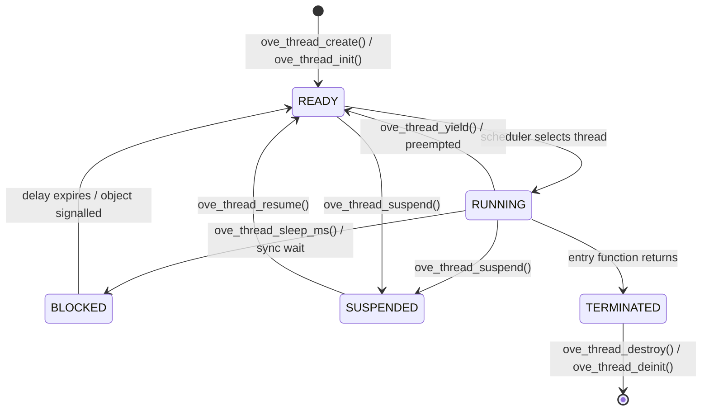
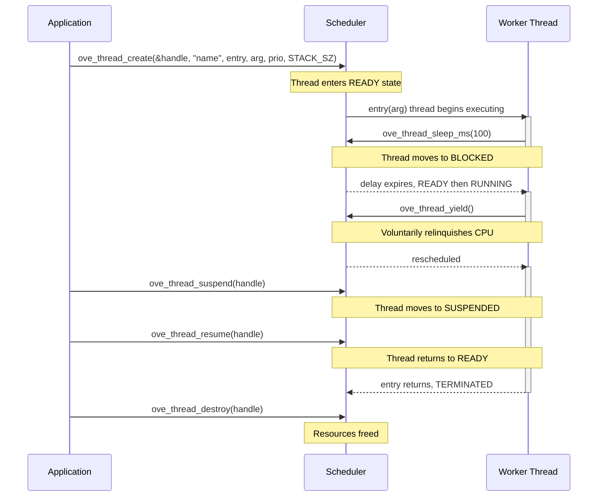
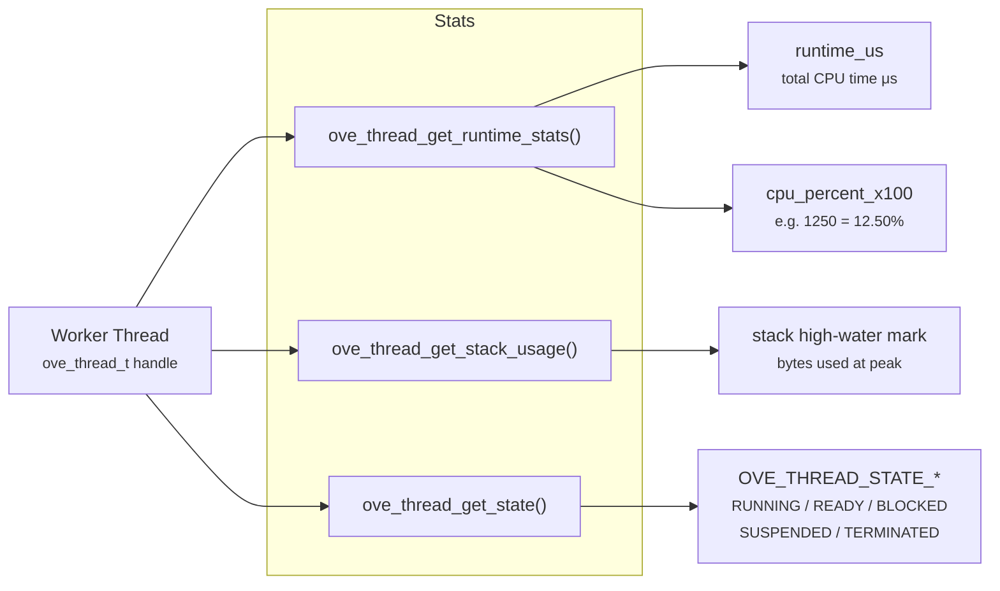

# Thread Management

oveRTOS threads are portable wrappers around the native thread primitive of each supported backend: FreeRTOS tasks, Zephyr threads, NuttX pthreads, and POSIX pthreads. The same `ove/thread.h` API compiles unchanged for all four backends — priority mapping, state reporting, and stack profiling are translated at compile time with no runtime indirection.

!!! warning "`ove_main()` locals are UB after `ove_run()`"
    Anything in `ove_main()`'s automatic storage becomes dangling once the scheduler starts. Pass long-lived state to workers via `static` locals, file-scope variables, or heap allocation. See [Troubleshooting → `ove_main` locals](../getting-started/troubleshooting.md#ove_main-locals-are-ub-after-ove_run) for the full rule.

## Thread States



| State | Meaning |
|-------|---------|
| **READY** | Thread is runnable; waiting for the CPU. |
| **RUNNING** | Currently executing on the CPU. |
| **BLOCKED** | Sleeping or waiting on a sync object; will be unblocked automatically. |
| **SUSPENDED** | Explicitly paused via `ove_thread_suspend()`; stays suspended until `ove_thread_resume()`. |
| **TERMINATED** | Entry function has returned. The handle is still valid until the thread is destroyed. |
| **UNKNOWN** | State could not be determined by the backend. |

## Priority Levels

| Constant | Value | Description |
|----------|-------|-------------|
| `OVE_PRIO_IDLE` | 0 | Lowest priority; runs only when no other thread is ready. Suitable for background statistics collection. |
| `OVE_PRIO_LOW` | 1 | Low-priority background work (logging, cleanup). |
| `OVE_PRIO_BELOW_NORMAL` | 2 | Below-default priority; useful for deferring non-urgent work. |
| `OVE_PRIO_NORMAL` | 3 | Default application priority. Most application threads should use this level. |
| `OVE_PRIO_ABOVE_NORMAL` | 4 | Slightly elevated; useful for UI or moderate-latency tasks. |
| `OVE_PRIO_HIGH` | 5 | High priority; prefer for time-sensitive processing threads. |
| `OVE_PRIO_REALTIME` | 6 | Real-time priority; use with care — starvation of lower-priority threads is possible. |
| `OVE_PRIO_CRITICAL` | 7 | Highest priority; reserved for critical system tasks (watchdog feeds, safety monitors). |

Each value maps to a backend-specific numeric priority at initialisation time. Higher values mean higher scheduling priority on all backends.

## Thread Lifecycle



## Allocation Strategies

### Heap allocation — `ove_thread_create` / `ove_thread_destroy`

The simpler API when the heap is available. Both the backend storage object and the stack are allocated from the RTOS heap. Available only when `OVE_HEAP_THREAD` is defined (i.e. `CONFIG_OVE_ZERO_HEAP` is **not** set).

```c
#include <ove/ove.h>

static void worker_entry(void *arg)
{
    (void)arg;
    for (;;) {
        /* do work */
        ove_thread_sleep_ms(50);
    }
}

static ove_thread_t worker;

void app_start(void)
{
    ove_thread_create(&worker, "worker", worker_entry, NULL, OVE_PRIO_NORMAL, 2048);
}
```

### Static allocation — `ove_thread_init` / `ove_thread_deinit`

Works in both heap and zero-heap mode. The caller supplies both a storage object and a stack buffer.

```c
#include <ove/ove.h>

/* Declare storage at file scope (backend-specific opaque type). */
static ove_thread_storage_t worker_storage;
static uint8_t              worker_stack[2048] __attribute__((aligned(8)));

static ove_thread_t worker;

void app_start(void)
{
    ove_thread_init(&worker, &worker_storage, "worker", worker_entry, NULL,
                    OVE_PRIO_NORMAL, sizeof(worker_stack), worker_stack);
}
```

### `OVE_THREAD_DEFINE_STATIC` macro

Combines storage declaration, stack allocation, and initialisation into a single file-scope statement. Works in both heap and zero-heap mode. Parameters: `(hname, stack_sz, fn, ctx, prio, tname)`.

```c
OVE_THREAD_DEFINE_STATIC(worker, 2048, worker_entry, NULL, OVE_PRIO_NORMAL, "worker");
```

## API Reference

| Function | Signature | Description |
|----------|-----------|-------------|
| `ove_thread_init` | `int (ove_thread_t *handle, ove_thread_storage_t *storage, const char *name, ove_thread_fn entry, void *arg, ove_prio_t priority, size_t stack_size, void *stack)` | Initialise a thread from caller-supplied static storage and stack. |
| `ove_thread_deinit` | `int (ove_thread_t handle)` | Stop and release a thread created with `ove_thread_init()`. Static storage is not freed. |
| `ove_thread_create` | `int (ove_thread_t *handle, const char *name, ove_thread_fn entry, void *arg, ove_prio_t priority, size_t stack_size)` | Heap-allocate and start a thread. Requires `OVE_HEAP_THREAD` (not declared in zero-heap mode). |
| `ove_thread_destroy` | `int (ove_thread_t handle)` | Stop and free a thread created with `ove_thread_create()`. Heap mode only. |
| `ove_thread_get_self` | `ove_thread_t (void)` | Return the handle of the currently executing thread. |
| `ove_thread_set_priority` | `void (ove_thread_t handle, ove_prio_t prio)` | Change the scheduling priority of a thread at runtime. |
| `ove_thread_sleep_ms` | `void (uint32_t ms)` | Block the calling thread for at least `ms` milliseconds. Passing `0` yields for one scheduler tick. |
| `ove_thread_yield` | `void (void)` | Voluntarily relinquish the CPU to another ready thread of equal or higher priority. |
| `ove_thread_start_scheduler` | `void (void)` | Start the RTOS scheduler. Usually called indirectly via `ove_run()`. Does not return on most platforms. |
| `ove_thread_suspend` | `void (ove_thread_t handle)` | Prevent a thread from being scheduled. May be called on the calling thread itself. |
| `ove_thread_resume` | `void (ove_thread_t handle)` | Resume a previously suspended thread. |
| `ove_thread_get_stack_usage` | `size_t (ove_thread_t handle)` | Return the historical peak stack usage in bytes (high-water mark). Returns `0` if the backend does not support stack profiling. |
| `ove_thread_get_state` | `ove_thread_state_t (ove_thread_t handle)` | Query the current execution state of a thread. |
| `ove_thread_request_stop` | `void (ove_thread_t handle)` | Cooperative stop signal. The thread keeps running until it observes `ove_thread_should_stop()` and exits its entry function. |
| `ove_thread_should_stop` | `bool (ove_thread_t handle)` | Returns `true` once `ove_thread_request_stop()` has been called for the thread. Polled inside the worker's main loop. |
| `ove_thread_get_runtime_stats` | `int (ove_thread_t handle, struct ove_thread_stats *stats)` | Retrieve total CPU time (`runtime_us`) and utilisation percentage (`cpu_percent_x100`) since the scheduler started. Returns `OVE_ERR_NOT_SUPPORTED` if the backend does not provide runtime accounting. |
| `ove_thread_list` | `int (struct ove_thread_info *out, size_t max_count, size_t *actual_count)` | Enumerate all threads. Each entry includes name, state, priority, stack usage/size, CPU usage, and per-state cumulative time. Returns `OVE_ERR_NOT_SUPPORTED` if unavailable. |
| `ove_sys_get_mem_stats` | `int (struct ove_mem_stats *stats)` | Query system heap totals: `total`, `free`, `used`, `peak_used` bytes. Returns `OVE_ERR_NOT_SUPPORTED` if unavailable. |

## Runtime Statistics and Stack Profiling



`ove_thread_get_runtime_stats()` returns `OVE_ERR_NOT_SUPPORTED` when the backend does not provide CPU accounting. `ove_thread_get_stack_usage()` returns `0` when stack profiling is unavailable.

```c
struct ove_thread_stats stats;
int rc = ove_thread_get_runtime_stats(worker, &stats);
if (rc == OVE_OK) {
    /* stats.cpu_percent_x100 == 1250 means 12.50 % */
}

size_t peak = ove_thread_get_stack_usage(worker);
/* peak > 0 only when the backend supports high-water marking */
```

## Example: Worker Thread with Sleep Loop

A typical pattern for a periodic background task — create once at startup, run forever with a fixed sleep interval, and inspect the stack peak during development.

```c
#include <ove/ove.h>

#define WORKER_STACK_SZ  2048
#define WORKER_PERIOD_MS 100

static volatile uint32_t sensor_value;
static ove_thread_t       sensor_thread;

static void sensor_entry(void *arg)
{
    (void)arg;
    for (;;) {
        sensor_value = read_sensor();
        ove_thread_sleep_ms(WORKER_PERIOD_MS);
    }
}

void ove_main(void)
{
    ove_thread_create(&sensor_thread, "sensor", sensor_entry, NULL,
                      OVE_PRIO_NORMAL, WORKER_STACK_SZ);
    ove_run();  /* starts the scheduler — does not return */
}
```

## Kconfig Options

| Option | Default | Description |
|--------|---------|-------------|
| `CONFIG_OVE_THREAD` | always enabled | Thread management subsystem. Always compiled; cannot be disabled. The scheduler must be running before any thread API is called. |

## Header

| Header | Contents |
|--------|----------|
| `ove/thread.h` | Priority enum (`ove_prio_t`), state enum (`ove_thread_state_t`), runtime stats (`struct ove_thread_stats`), thread info / state-time / memory stat structs, 16 thread/sys functions and the `OVE_THREAD_DEFINE_STATIC` macro (in `ove/storage.h`). |
