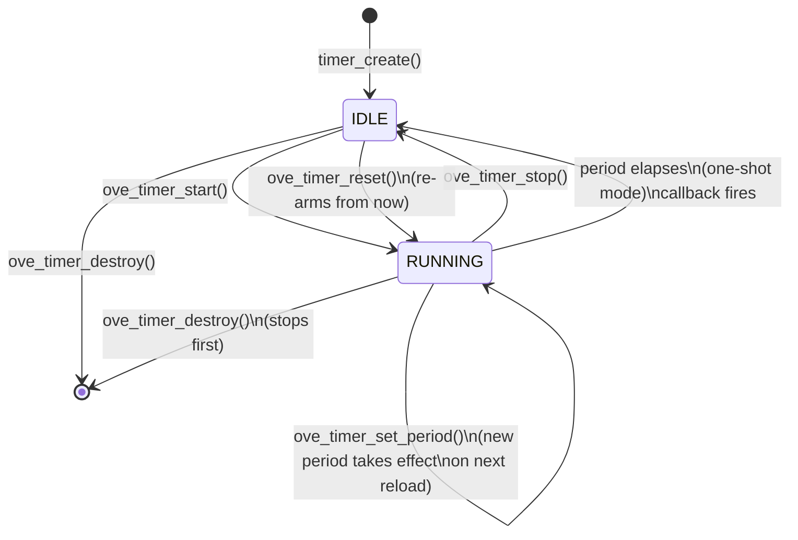
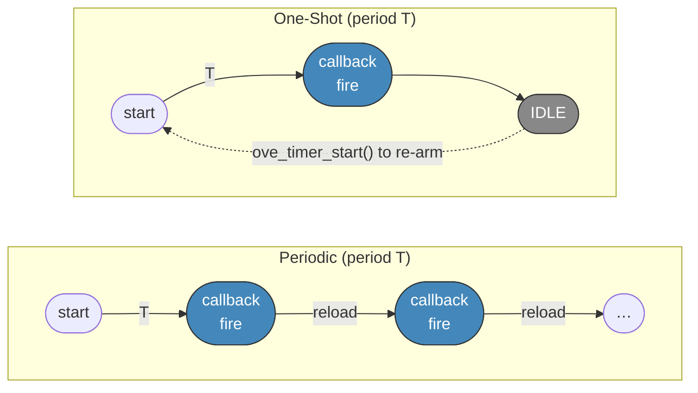
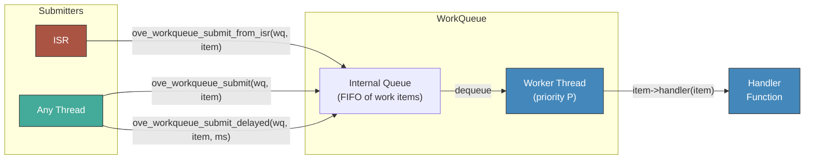
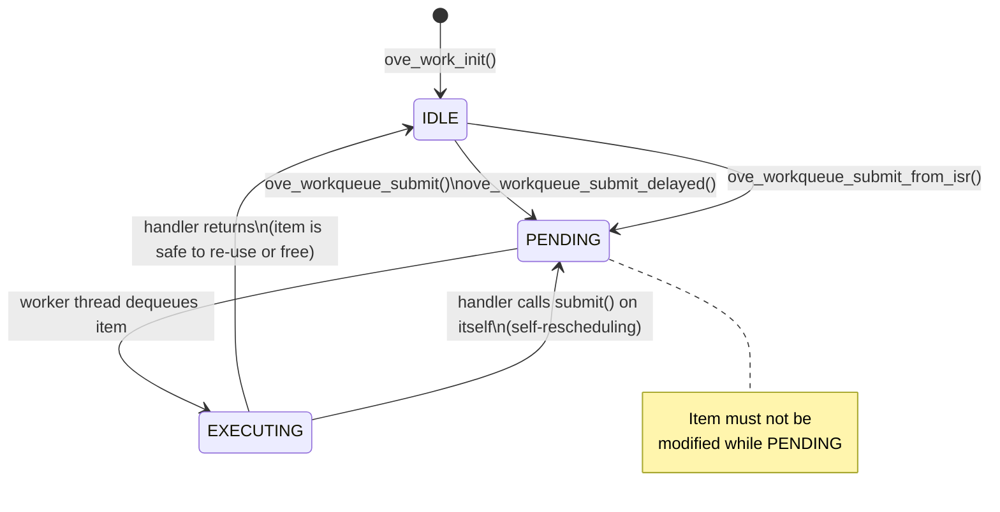

# Timers & Deferred Work

oveRTOS provides two complementary primitives for time-based and deferred execution:

| Primitive | Best for | Execution context |
|-----------|----------|------------------|
| **Timer** | Periodic or one-shot callbacks at a fixed interval | Timer daemon thread (configurable priority) |
| **WorkQueue** | Deferring work out of ISR context or off the hot path | Dedicated worker thread per queue |

Use a Timer when you need regular time-driven callbacks (polling, statistics, heartbeats). Use a WorkQueue when you need to run heavier work that was triggered from an ISR or a latency-sensitive thread.

---

## Timer

A software timer calls a user-supplied callback after a specified period. Timers run on a shared timer daemon thread — callbacks must be short and non-blocking. Two modes are supported:

- **One-shot**: fires once then transitions to IDLE.
- **Periodic**: automatically reloads and fires repeatedly at the configured interval.

### State Machine



### Periodic vs One-Shot



The callback receives a handle to the fired timer, allowing a single function to serve multiple timers:

```c
static void on_timer(ove_timer_t timer, void *arg)
{
    struct my_ctx *ctx = arg;
    ctx->ticks++;
}
```

### API

| Function | Description |
|----------|-------------|
| `ove_timer_init(cfg)` | Initialise timer subsystem (starts daemon thread) |
| `ove_timer_deinit()` | Tear down timer subsystem |
| `ove_timer_create(period_ms, mode, cb, arg)` | Allocate timer; `mode` is `OVE_TIMER_PERIODIC` or `OVE_TIMER_ONESHOT` |
| `ove_timer_destroy(t)` | Stop and free timer |
| `ove_timer_start(t)` | Arm timer; begins counting from now |
| `ove_timer_stop(t)` | Disarm timer without destroying it |
| `ove_timer_reset(t)` | Reload deadline from now (arm if not already running) |
| `ove_timer_set_period(t, period_ms)` | Change period; takes effect on next reload |

`ove_timer_start` on an already-running timer is a no-op. Use `ove_timer_reset` to restart the countdown.

### Example: 1 Hz Stats Collection

```c
static ove_timer_t g_stats_timer;

static void stats_cb(ove_timer_t t, void *arg)
{
    struct ove_audio_stats stats;
    ove_audio_graph_get_stats(&g_graph, &stats);
    LOG_INF("cycles=%u underruns=%u avg_us=%u",
            stats.cycles, stats.underruns, stats.avg_process_us);
}

/* Startup */
g_stats_timer = ove_timer_create(1000,              /* 1 Hz */
                                  OVE_TIMER_PERIODIC,
                                  stats_cb, NULL);
ove_timer_start(g_stats_timer);

/* On shutdown */
ove_timer_destroy(g_stats_timer);
```

---

## WorkQueue

A WorkQueue is a dedicated worker thread that drains a queue of work items. Each item carries a function pointer and an argument; the worker calls each item's handler in FIFO order. An optional delay allows items to be scheduled for future execution.

Work items are value types: callers initialise them on the stack or in static storage and submit them by pointer. An item may be re-submitted from inside its own handler to create a self-rescheduling pattern.

### Execution Flow



### Work Item Lifecycle



Once an item is submitted it must not be written until the handler has returned (i.e., it transitions back to IDLE). Check `ove_work_is_pending(item)` before re-submitting from outside the handler.

### API

| Function | Description |
|----------|-------------|
| `ove_workqueue_init(cfg)` | Initialise WorkQueue subsystem |
| `ove_workqueue_deinit()` | Tear down subsystem |
| `ove_workqueue_create(depth, priority, stack_size)` | Allocate queue and spawn worker thread |
| `ove_workqueue_destroy(wq)` | Drain queue, stop worker, free resources |
| `ove_work_init(item, handler)` | Initialise a work item with a handler function |
| `ove_workqueue_submit(wq, item)` | Enqueue item for immediate execution |
| `ove_workqueue_submit_delayed(wq, item, delay_ms)` | Enqueue item to run after `delay_ms` milliseconds |
| `ove_workqueue_submit_from_isr(wq, item, woken)` | ISR-safe submit (no delay variant) |
| `ove_work_is_pending(item)` | Returns true if item is queued or currently executing |

### Example: Deferred File I/O from ISR Context

A DMA completion ISR must not block on file I/O. Instead it submits a work item that runs on the worker thread.

```c
static ove_workqueue_t g_io_wq;

struct save_ctx {
    struct ove_work  work;      /* must be first member */
    uint8_t          buf[256];
    size_t           len;
};

static void save_handler(struct ove_work *item)
{
    struct save_ctx *ctx = (struct save_ctx *)item;
    ove_storage_write("/data/capture.bin", ctx->buf, ctx->len);
}

/* Startup */
g_io_wq = ove_workqueue_create(8,          /* queue depth   */
                                4,          /* thread priority */
                                2048);      /* stack bytes   */

/* Static item — safe to re-use after handler returns */
static struct save_ctx g_save_ctx;
ove_work_init(&g_save_ctx.work, save_handler);

/* DMA RX complete ISR */
void DMA1_Stream0_IRQHandler(void)
{
    if (ove_work_is_pending(&g_save_ctx.work))
        return;  /* previous save still in flight, drop frame */

    memcpy(g_save_ctx.buf, dma_rx_buf, DMA_RX_LEN);
    g_save_ctx.len = DMA_RX_LEN;

    bool woken = false;
    ove_workqueue_submit_from_isr(g_io_wq, &g_save_ctx.work, &woken);
    portYIELD_FROM_ISR(woken);
}
```

For periodic deferred work, a handler can reschedule itself:

```c
static void periodic_work_handler(struct ove_work *item)
{
    do_background_housekeeping();
    /* re-arm: run again in 500 ms */
    ove_workqueue_submit_delayed(g_io_wq, item, 500);
}
```

---

## Kconfig Options

| Option | Default | Description |
|--------|---------|-------------|
| `CONFIG_OVE_TIMER` | `y` | Enable software timer subsystem |
| `CONFIG_OVE_TIMER_DAEMON_PRIORITY` | `6` | Priority of the timer daemon thread |
| `CONFIG_OVE_TIMER_DAEMON_STACK` | `1024` | Stack size (bytes) of the timer daemon thread |
| `CONFIG_OVE_WORKQUEUE` | `n` | Enable WorkQueue subsystem |

## Headers

| Header | Contents |
|--------|----------|
| `ove/timer.h` | Timer handle, mode enum, create/destroy/start/stop/reset API |
| `ove/workqueue.h` | WorkQueue handle, work item struct, submit API |
