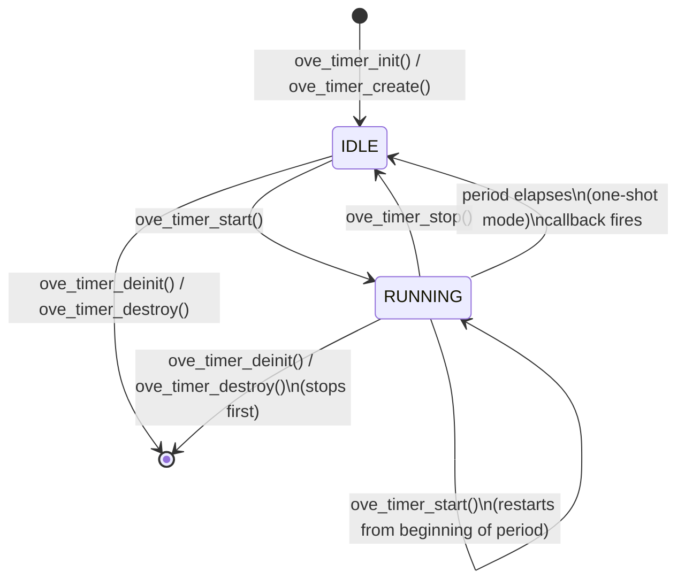
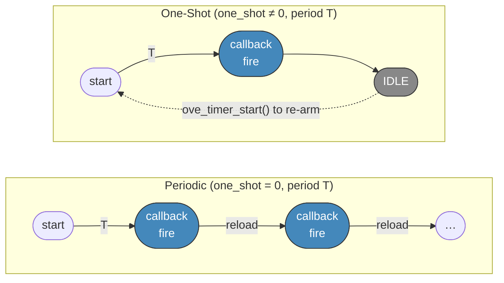
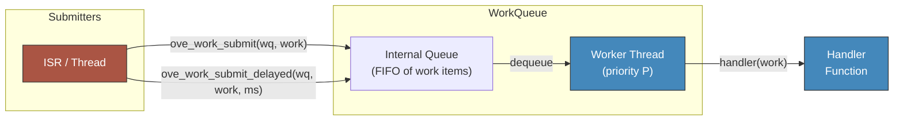
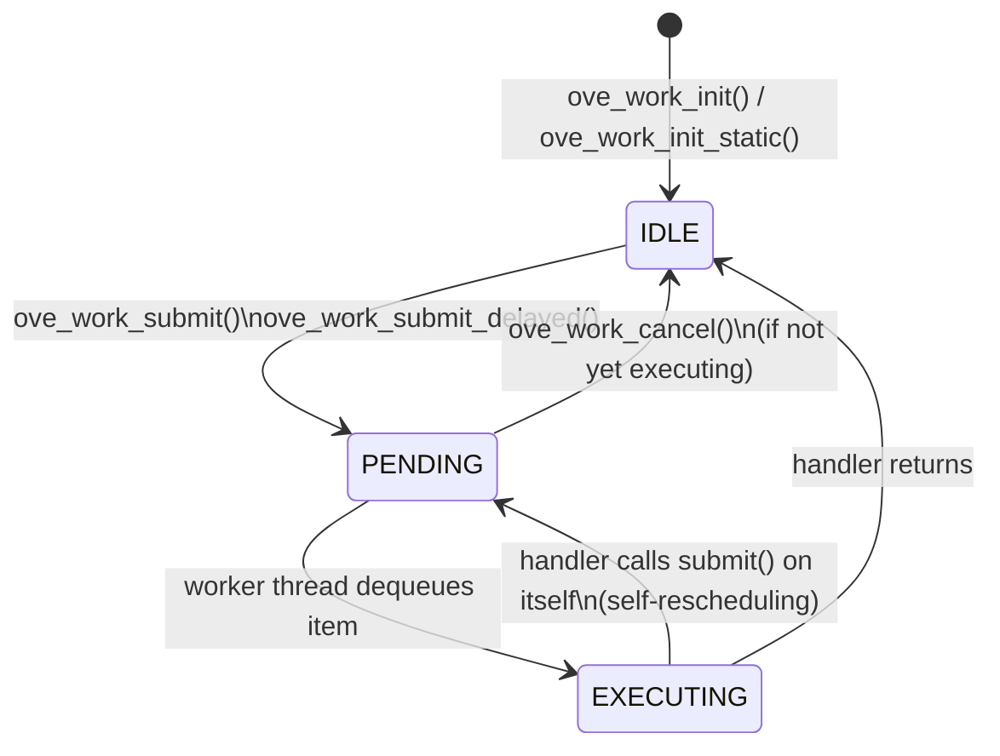

# Timers & Deferred Work

oveRTOS provides two complementary primitives for time-based and deferred execution:

| Primitive | Best for | Execution context |
|-----------|----------|------------------|
| **Timer** | Periodic or one-shot callbacks at a fixed interval | RTOS timer service (backend-specific) |
| **WorkQueue** | Deferring work out of ISR context or off the hot path | Dedicated worker thread per queue |

Use a Timer when you need regular time-driven callbacks (polling, statistics, heartbeats). Use a WorkQueue when you need to run heavier work that was triggered from an ISR or a latency-sensitive thread.

Both follow the standard oveRTOS allocation pattern: `_init` / `_deinit` work in zero-heap mode with caller-supplied storage, while `_create` / `_destroy` are heap-only. The matching `OVE_*_DEFINE_STATIC` macros in `ove/storage.h` combine declaration and init at file scope.

---

## Timer

A software timer calls a user-supplied callback after a specified period. Callbacks run in a backend-specific RTOS context (e.g. the FreeRTOS timer service task) — they must be short and non-blocking. Two modes are supported, selected by the `one_shot` flag at init/create time:

- `one_shot != 0`: fires once then stops automatically.
- `one_shot == 0`: periodic — reloads automatically and fires repeatedly.

### State Machine



### Periodic vs One-Shot



The callback receives a handle to the fired timer and the `user_data` pointer supplied at init/create, so a single handler can serve multiple timers:

```c
static void on_timer(ove_timer_t timer, void *user_data)
{
    struct my_ctx *ctx = user_data;
    ctx->ticks++;
}
```

### API

| Function | Signature | Description |
|----------|-----------|-------------|
| `ove_timer_init` | `int (ove_timer_t *timer, ove_timer_storage_t *storage, ove_timer_fn callback, void *user_data, uint32_t period_ms, int one_shot)` | Initialise a timer from caller-supplied storage in the stopped state. |
| `ove_timer_deinit` | `void (ove_timer_t timer)` | Stop and release the timer. Static storage is not freed. |
| `ove_timer_create` | `int (ove_timer_t *timer, ove_timer_fn callback, void *user_data, uint32_t period_ms, int one_shot)` | Heap-allocate a timer in the stopped state. Requires `OVE_HEAP_TIMER`. |
| `ove_timer_destroy` | `void (ove_timer_t timer)` | Stop and free a heap-allocated timer. |
| `ove_timer_start` | `int (ove_timer_t timer)` | Arm the timer. If already running, restarts from the beginning of the period. |
| `ove_timer_stop` | `int (ove_timer_t timer)` | Stop the timer without invoking the callback. |
| `ove_timer_reset` | `int (ove_timer_t timer)` | Atomically stop+start — useful for watchdog-style "kick" patterns. |

Static-storage macro: `OVE_TIMER_DEFINE_STATIC(name, cb, user_data, period_ms, one_shot)` (in `ove/storage.h`).

### Example: 1 Hz Stats Collection

```c
#include <ove/ove.h>

static ove_timer_t g_stats_timer;

static void stats_cb(ove_timer_t t, void *user_data)
{
    (void)t;
    struct ove_audio_graph_stats stats;
    ove_audio_graph_get_stats(g_graph, &stats);
    OVE_LOG_INF("cycles=%llu underruns=%u avg_us=%u",
                (unsigned long long)stats.cycles,
                stats.underruns, stats.avg_process_us);
}

void app_init(void)
{
    ove_timer_create(&g_stats_timer, stats_cb, NULL,
                     1000 /* ms */, 0 /* periodic */);
    ove_timer_start(g_stats_timer);
}

/* On shutdown */
ove_timer_destroy(g_stats_timer);
```

Or, with the static-init macro (works in both heap and zero-heap modes):

```c
OVE_TIMER_DEFINE_STATIC(g_stats_timer, stats_cb, NULL, 1000, 0);

/* … later … */
ove_timer_start(g_stats_timer);
```

---

## WorkQueue

A WorkQueue is a dedicated worker thread that drains a queue of work items. Each work item carries a handler function pointer; the worker calls each handler in FIFO order. An optional delay allows items to be scheduled for future execution, and pending items can be cancelled before execution begins.

### Execution Flow



### Work Item Lifecycle



### API

| Function | Signature | Description |
|----------|-----------|-------------|
| `ove_workqueue_init` | `int (ove_workqueue_t *wq, ove_workqueue_storage_t *storage, const char *name, ove_prio_t priority, size_t stack_size, void *stack)` | Initialise a work queue from caller-supplied storage and stack buffer. Spawns the worker thread. |
| `ove_workqueue_deinit` | `void (ove_workqueue_t wq)` | Stop the worker and release the queue. |
| `ove_workqueue_create` | `int (ove_workqueue_t *wq, const char *name, ove_prio_t priority, size_t stack_size)` | Heap-allocate the queue and its stack. Requires `OVE_HEAP_WORKQUEUE`. |
| `ove_workqueue_destroy` | `void (ove_workqueue_t wq)` | Stop the worker and free a heap-allocated queue. |
| `ove_work_init_static` | `int (ove_work_t *work, ove_work_storage_t *storage, ove_work_fn handler)` | Initialise a work item from caller-supplied storage. |
| `ove_work_init` | `int (ove_work_t *work, ove_work_fn handler)` | Heap-allocate a work item. Requires `OVE_HEAP_WORKQUEUE`. |
| `ove_work_free` | `void (ove_work_t work)` | Free a heap-allocated work item. Must not be pending. |
| `ove_work_submit` | `int (ove_workqueue_t wq, ove_work_t work)` | Enqueue for immediate execution. |
| `ove_work_submit_delayed` | `int (ove_workqueue_t wq, ove_work_t work, uint32_t delay_ms)` | Enqueue for execution after `delay_ms`. |
| `ove_work_cancel` | `int (ove_work_t work)` | Remove a pending item before it executes. Returns `OVE_ERR_INVAL` if not pending. |

Handler signature: `typedef void (*ove_work_fn)(ove_work_t work)`. The handler receives the opaque work handle (not a struct pointer), so any per-item context must be associated externally — typically by deriving the work item from a wrapping `OVE_WORK_DEFINE_STATIC` plus a lookup table, or by handing the wrapping struct's pointer via a closure variable.

Static-storage macros (in `ove/storage.h`):

- `OVE_WORKQUEUE_DEFINE_STATIC(name, stack_sz, wq_name, prio)`
- `OVE_WORK_DEFINE_STATIC(name, handler)`

### Example: Deferred I/O from ISR Context

```c
#include <ove/ove.h>

OVE_WORKQUEUE_DEFINE_STATIC(g_io_wq, 2048, "io_wq", OVE_PRIO_NORMAL);

static void save_handler(ove_work_t work)
{
    (void)work;
    do_blocking_save();
}
OVE_WORK_DEFINE_STATIC(g_save_work, save_handler);

/* DMA RX complete ISR */
void DMA1_Stream0_IRQHandler(void)
{
    ove_work_submit(g_io_wq, g_save_work);
}
```

For periodic deferred work, a handler can reschedule itself:

```c
static void periodic_work_handler(ove_work_t work)
{
    do_background_housekeeping();
    ove_work_submit_delayed(g_io_wq, work, 500); /* run again in 500 ms */
}
```

---

## Kconfig Options

| Option | Default | Description |
|--------|---------|-------------|
| `CONFIG_OVE_TIMER` | `n` | Enable software timer subsystem. |
| `CONFIG_OVE_WORKQUEUE` | `n` | Enable WorkQueue subsystem. |

When the corresponding `CONFIG_OVE_*` is unset, every function in that subsystem becomes a static inline stub returning `OVE_ERR_NOT_SUPPORTED`.

## Headers

| Header | Contents |
|--------|----------|
| `ove/timer.h` | Timer handle, `ove_timer_fn` callback typedef, init/deinit, create/destroy, start/stop/reset. |
| `ove/workqueue.h` | WorkQueue and work item handles, `ove_work_fn` typedef, queue and item init/deinit/create/destroy/submit/cancel APIs. |
| `ove/storage.h` | `OVE_TIMER_DEFINE_STATIC`, `OVE_WORKQUEUE_DEFINE_STATIC`, `OVE_WORK_DEFINE_STATIC`. |
