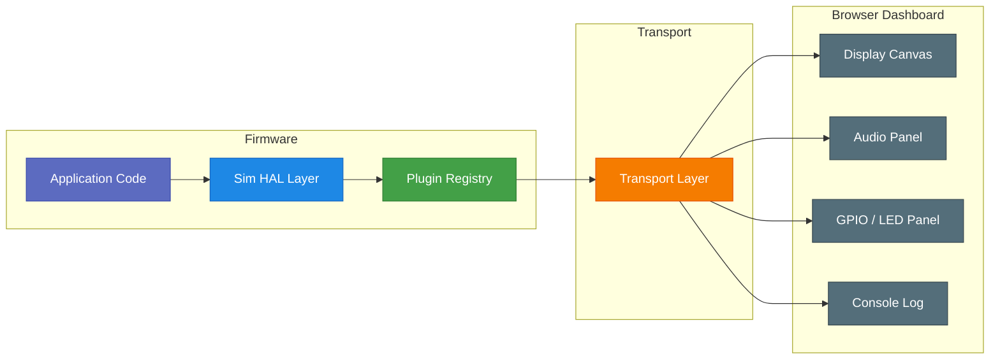

# Simulation Framework

The simulation framework provides virtual peripheral emulation for POSIX and WASM targets. It replaces bare-stub HAL implementations with plugin-aware versions that support virtual peripherals, sensor injection, and a browser-based web dashboard for real-time visualisation of display, audio, LEDs, GPIO, and console output.

Enabled by default for POSIX builds via `CONFIG_OVE_SIM`.

## Architecture



When `CONFIG_OVE_SIM` is enabled, the sim HAL layer intercepts calls to display, audio, GPIO, and other peripherals. Each peripheral is backed by a **plugin** that processes data and emits events through a **transport** to the browser dashboard.

## Plugin System

Plugins implement virtual peripherals using a vtable interface (`struct ove_sim_plugin_ops`):

| Callback | Required | Description |
|----------|----------|-------------|
| `init` | Yes | Initialise the plugin instance |
| `deinit` | No | Tear down and release resources |
| `handle_cmd` | No | Process a command from the dashboard |
| `tick` | No | Periodic callback (~1 kHz) |
| `get_state` | No | Serialise current state for dashboard polling |

### Plugin Types

| Type | Description |
|------|-------------|
| `OVE_SIM_PLUGIN_DISPLAY` | Display output (framebuffer capture) |
| `OVE_SIM_PLUGIN_AUDIO` | Audio I/O (PCM capture / injection) |
| `OVE_SIM_PLUGIN_GPIO` | GPIO port simulator |
| `OVE_SIM_PLUGIN_LED` | LED state visualiser |
| `OVE_SIM_PLUGIN_I2C_DEV` | Virtual I2C device (sensor, EEPROM) |
| `OVE_SIM_PLUGIN_SPI_DEV` | Virtual SPI device (flash, display) |
| `OVE_SIM_PLUGIN_UART` | Virtual UART / serial terminal |
| `OVE_SIM_PLUGIN_SENSOR` | High-level sensor (accel, gyro, temp) |
| `OVE_SIM_PLUGIN_BUTTON` | Virtual button / touch input |
| `OVE_SIM_PLUGIN_NVS` | Non-volatile storage simulator |

Up to 32 plugins can be registered concurrently (`OVE_SIM_MAX_PLUGINS`).

### Registering a Plugin

```c
#include "ove/sim/ove_sim_plugin.h"

static int my_sensor_init(void *ctx, const void *config, size_t config_len)
{
    /* initialise virtual sensor state */
    return 0;
}

static int my_sensor_cmd(void *ctx, const struct ove_sim_cmd *cmd)
{
    /* handle value injection from dashboard */
    return 0;
}

static const struct ove_sim_plugin_ops my_sensor_ops = {
    .name       = "bme280",
    .type       = OVE_SIM_PLUGIN_SENSOR,
    .init       = my_sensor_init,
    .handle_cmd = my_sensor_cmd,
};

/* At startup: */
int id = ove_sim_plugin_register(&my_sensor_ops, &my_ctx, NULL, 0);
```

## Transport Layers

The transport layer abstracts the communication channel between firmware and the dashboard. Three implementations are available:

| Transport | Config symbol | Use case | Mechanism |
|-----------|---------------|----------|-----------|
| Direct (in-process) | `OVE_SIM_TRANSPORT_DIRECT` | POSIX `host` builds | In-process ring buffers; dashboard served by an embedded WebSocket server |
| Shared Memory | `OVE_SIM_TRANSPORT_SHM` | QEMU cross-process | `/dev/shm/ove-{sim,fb,audio}` via mmap; external bridge process serves the dashboard |
| WASM | `OVE_SIM_TRANSPORT_WASM` | Browser (Emscripten) | `SharedArrayBuffer` between main thread and web workers; dashboard is the host page itself |

All transports implement the same `struct ove_sim_transport_ops` vtable, so plugin code is transport-agnostic. The transport is selected automatically based on the board configuration.

### Transport Operations

| Operation | Direction | Description |
|-----------|-----------|-------------|
| `send_event` | Firmware → Dashboard | Push a plugin event |
| `recv_cmd` | Dashboard → Firmware | Receive a command (blocking with timeout) |
| `flush_display` | Firmware → Dashboard | Send framebuffer pixel data (XRGB8888) |
| `push_audio` | Firmware → Dashboard | Send PCM audio samples for playback |
| `pull_audio` | Dashboard → Firmware | Receive PCM audio samples (microphone / file injection) |

## Web Dashboard

The browser-based dashboard (`sim/dashboard/`) provides real-time visualisation:

- **Display canvas** — renders the LVGL framebuffer into an HTML5 `<canvas>` element
- **Audio panel** — Web Audio playback of firmware output, waveform visualisation, microphone capture, and audio file injection for testing
- **LED / GPIO panel** — shows LED states and GPIO pin values; allows toggling inputs from the browser
- **Console log** — displays firmware serial output

The dashboard is served automatically when running a POSIX build:

```bash
make run   # opens http://localhost:8080 in the browser
```

The port is configurable via `CONFIG_OVE_SIM_DASHBOARD_PORT` (default: 8080).

## Sim HAL Modules

The `sim/hal/` directory contains HAL implementations that bridge oveRTOS subsystems to the plugin framework:

| File | Subsystem |
|------|-----------|
| `sim_display.c` | LVGL display flush → display plugin |
| `sim_audio.c` | Audio graph device nodes → audio plugin |
| `sim_lvgl.c` | LVGL tick and input driver |
| `sim_board.c` | Board init and plugin registration |
| `sim_net.c` | Network simulation |
| `sim_tls.c` | TLS simulation |
| `sim_pm.c` | Power management simulation |
| `sim_watchdog.c` | Watchdog simulation |
| `sim_console.c` | Console I/O routing |

## Kconfig Options

| Option | Type | Default | Description |
|--------|------|---------|-------------|
| `CONFIG_OVE_SIM` | bool | `y` if POSIX | Enable the simulation plugin framework |
| `CONFIG_OVE_SIM_TRANSPORT_DIRECT` | bool | `y` if POSIX + SIM | In-process transport (POSIX builds) |
| `CONFIG_OVE_SIM_TRANSPORT_SHM` | bool | `y` if !POSIX + SIM | Shared memory transport (QEMU builds) |
| `CONFIG_OVE_SIM_TRANSPORT_WASM` | bool | `y` if WASM + SIM | WASM SharedArrayBuffer transport |
| `CONFIG_OVE_SIM_DASHBOARD` | bool | `y` if SIM | Enable the browser-based dashboard |
| `CONFIG_OVE_SIM_DASHBOARD_PORT` | int | `8080` | Dashboard HTTP port |

## Headers

| Header | Contents |
|--------|----------|
| `ove/sim/ove_sim_plugin.h` | Plugin vtable, registry API, event/command types |
| `ove/sim/ove_sim_transport.h` | Transport abstraction and factory functions |
| `ove/sim/ove_sim_display.h` | Display plugin configuration |
| `ove/sim/ove_sim_audio.h` | Audio plugin configuration |
| `ove/sim/ove_sim_gpio_observer.h` | GPIO observation interface |
| `ove/sim/ove_sim_shm.h` | Shared memory layout definitions |
| `ove/sim/ove_sim_spi_dev.h` | SPI device plugin interface |
| `ove/sim/ove_sim_i2c_dev.h` | I2C device plugin interface |
