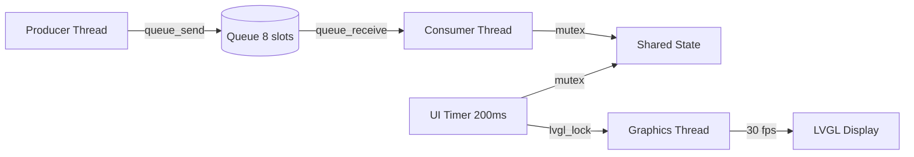

# Basic Example (Producer-Consumer)

The basic example demonstrates oveRTOS core APIs using a producer-consumer pattern with optional LVGL display output. It runs identically across all supported backends and in both heap and zero-heap modes.

## What it does

Three concurrent threads communicate through a shared queue and mutex:



1. **Producer** — increments a counter every 500 ms, sends to a fixed-size queue
2. **Consumer** — blocks on the queue, stores latest value behind a mutex
3. **Graphics** (optional) — drives LVGL display at ~30 fps with title, counter label, and progress bar

A periodic software timer fires every 200 ms to read the shared counter and update the LVGL widgets.

## Language implementations

| Language | Source | WASM Demo |
|----------|--------|-----------|
| [C](c.md) | `apps/c/example/src/app.c` | **[Run in browser](https://varcain.github.io/oveRTOS/example_c_heap/){:target="_blank"}** |
| [C++](cpp.md) | `apps/cpp/example/src/app.cpp` | **[Run in browser](https://varcain.github.io/oveRTOS/example_cpp_heap/){:target="_blank"}** |
| [Rust](rust.md) | `apps/rust/example/src/lib.rs` | **[Run in browser](https://varcain.github.io/oveRTOS/example_rust_heap/){:target="_blank"}** |
| [Zig](zig.md) | `apps/zig/example/src/main.zig` | *Not yet available* |

## Key APIs demonstrated

| API | Purpose |
|-----|---------|
| `ove_queue_create` / `send` / `receive` | Inter-thread FIFO communication |
| `ove_mutex_create` / `lock` / `unlock` | Shared state protection |
| `ove_timer_create` / `start` | Periodic callback timer |
| `ove_thread_create` / `sleep_ms` | Thread lifecycle and rate-limiting |
| `ove_lvgl_lock` / `unlock` / `handler` | Thread-safe LVGL access |
| `OVE_LOG_INF` / `OVE_LOG_WRN` | Compile-time filtered logging |
| `ove_run` | Start the RTOS scheduler |

## How to build

```bash
# Native POSIX (with display)
make host.posix.example_c
make configure && make && make run

# WASM (browser)
make wasm.posix.example_c
make configure && make download && make && make run

# STM32F746G-Discovery (FreeRTOS)
make stm32f746.freertos.example_c
make configure && make download && make flash
```

Replace `example_c` with `example_cpp`, `example_rust`, or `example_zig` for other languages.
