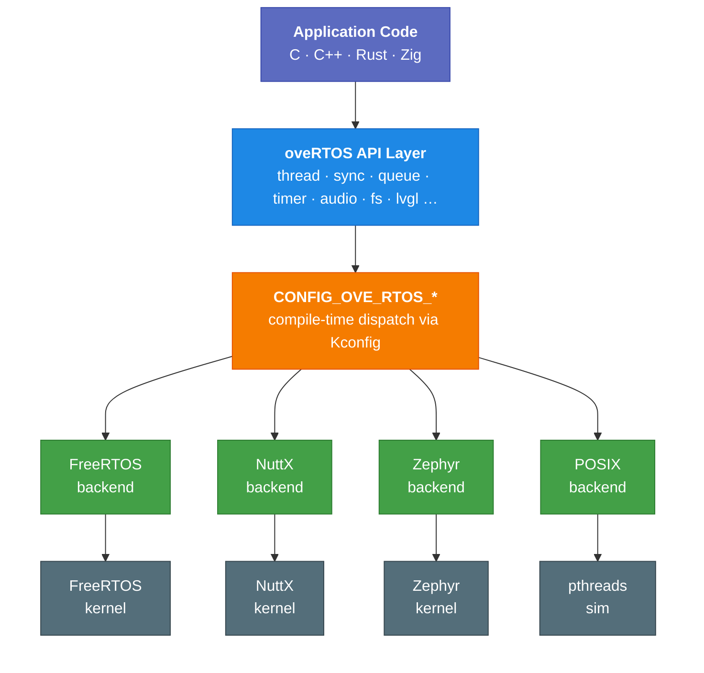

# Architecture Overview

A typed binding (C, C++, Rust, or Zig) sits on top of a portable C API that resolves to the selected RTOS at **compile time** — `CONFIG_OVE_RTOS_FREERTOS` / `..._NUTTX` / `..._ZEPHYR` / `..._POSIX` picks the backend, the preprocessor selects the corresponding source tree, and the compiler sees exactly one implementation per function. No vtables, no runtime branch on the backend identity.

## Two allocation modes

Every primitive has a heap-mode constructor (`_create()` / `_destroy()`) and a static-storage constructor (`_init()` / `_deinit()` with caller-owned `ove_*_storage_t`, or the `OVE_*_DEFINE_STATIC` one-step macro).

| Constructor | Heap mode (default) | Zero-heap (`CONFIG_OVE_ZERO_HEAP=y`) |
|---|---|---|
| `_create()` / `_destroy()` | Allocate / free from RTOS heap | **Symbol not declared** — calling is a link error |
| `_init()` / `_deinit()` | Caller-supplied storage | Caller-supplied storage |
| `OVE_*_DEFINE_STATIC()` | File-scope static + auto-init | Same — portable across both modes |

Apps that need both modes pick `OVE_*_DEFINE_STATIC` because that macro alone compiles identically in either configuration. The link-error in zero-heap mode is intentional — no silent fallback.

## See also

- [API Reference](../api/index.md) — every module
- [Build System → CMake](../build-system/cmake.md) — how the configure-time choice happens
- [Internals → Backends](../backends/index.md) — implementation details per RTOS
