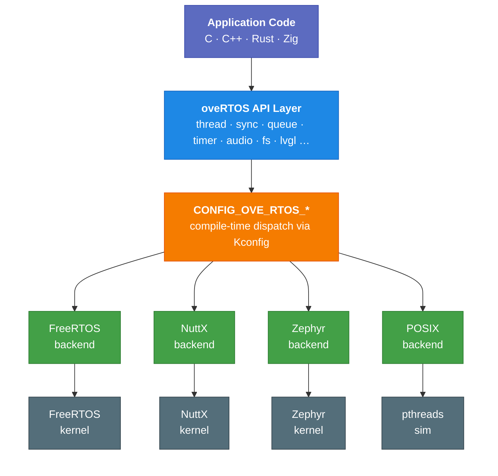

# Architecture Overview

## What oveRTOS Is

oveRTOS is an application framework for writing embedded RTOS firmware in **C++**, **Rust**, or **Zig** and deploying it on **FreeRTOS**, **Zephyr**, or **Apache NuttX** without source changes. The application-facing surface is a set of typed bindings — one per supported language — over a shared C API that resolves to the selected kernel's native calls at compile time. The kernel is a configure-time choice; the binding is a project-level choice; nothing about either decision incurs runtime overhead.

Three pieces make up the framework:

- **Language bindings** — `ove::*` (C++), the `ove` Rust crate, and the `ove` Zig module. These are where application code lives. The underlying C API (`<ove/ove.h>`) is the substrate the bindings target and is usable directly when needed.
- **Application API** — threads, synchronisation, queues, timers, event groups, work queues, audio graph engine, networking stack (sockets / TLS / HTTP / MQTT / HTTPD / SNTP), ML inference, LVGL widgets, NVS, filesystem, power management, shell, watchdog, bus drivers. Every module is portable across every supported kernel.
- **Build system** — downloads RTOS kernel sources and toolchains, generates RTOS-native configuration (`FreeRTOSConfig.h`, Zephyr `prj.conf`, NuttX defconfig) from a single Kconfig-driven `.config`, and orchestrates cross-compilation through each backend's native build system.

LVGL is integrated as the GUI toolkit; display and input drivers are wired per kernel. A POSIX backend lets you develop and test on Linux/macOS without hardware; a WebAssembly backend renders the same app in a browser.

## Layer Diagram

## Build System

The `ove` CLI handles the full build lifecycle:

| Phase | Command | What it does |
|-------|---------|--------------|
| Download | `make download` | Fetches RTOS kernel sources (FreeRTOS, NuttX, Zephyr) and cross-compilation toolchains into `dl/` |
| Configure | `make configure` | Reads `.config` and generates RTOS-native config files (`FreeRTOSConfig.h`, `prj.conf`, NuttX defconfig) plus framework headers |
| Build | `make build` | Invokes each RTOS's native build system (CMake for FreeRTOS/POSIX, `west build` for Zephyr, `make` for NuttX) |
| Run | `make run` | Launches firmware on QEMU or as a native POSIX process |
| Flash | `make flash` | Programs hardware via OpenOCD or the backend's flash runner |

RTOS source URLs, versions, and download methods are configurable via Kconfig (`Config.in.rtos`). Each RTOS also exposes its own native menuconfig through `make nuttx-menuconfig` or `make zephyr-menuconfig`, with a layered config system that preserves user customisations across rebuilds.

## Compile-Time Dispatch

The active backend is selected by a single `CONFIG_OVE_RTOS_*` symbol written into `ove_config.h` by Kconfig. Each backend directory provides its own implementation files for every oveRTOS module. The C preprocessor picks the right source tree at build time — there is no runtime branch on the backend identity.

Because the choice is entirely preprocessor-driven, the compiler sees exactly one implementation per function and inlines or optimises it as it would any other C code. The abstraction adds minimal overhead at runtime — the compiler sees the same code it would generate against the backend directly, plus a handful of inlined wrapper functions.

## Heap Mode vs Zero-Heap Mode

Heap mode and zero-heap mode are surfaced by **two distinct APIs sharing the same `_init()` foundation**. Heap-mode apps use `_create()` / `_destroy()`; zero-heap apps use `_init()` / `_deinit()` with caller-supplied storage, or `OVE_*_DEFINE_STATIC()` for file-scope objects. Apps that target both modes pick `OVE_*_DEFINE_STATIC()` because that macro alone is portable across the split.

| Function | Heap mode (default) | Zero-heap mode (`CONFIG_OVE_ZERO_HEAP=y`) |
|---|---|---|
| `_create()` / `_destroy()` | Allocate/free from RTOS heap | **Symbol not declared** — calling is a link error |
| `_init()` / `_deinit()` | Caller-supplied storage | Caller-supplied storage |
| `OVE_*_DEFINE_STATIC()` | File-scope static + auto-init via `_init()` | File-scope static + auto-init via `_init()` |

`_create()` / `_destroy()` are gated behind `OVE_HEAP_*` macros (defined only when `CONFIG_OVE_ZERO_HEAP` is unset). Calling them in a zero-heap build produces an "undefined reference" link error, which is the intended failure mode — no silent fallback, no per-call-site storage magic.

`OVE_*_DEFINE_STATIC()` always expands to `static ove_*_storage_t s; ove_*_init(&handle, &s, ...)` regardless of mode, so file-scope objects compile identically in both modes. Use it whenever the object's lifetime is the whole program.

## Backend Model

| Backend | Config symbol | Typical use |
|---|---|---|
| FreeRTOS | `CONFIG_OVE_RTOS_FREERTOS` | STM32 hardware targets via STM32CubeF7 |
| Apache NuttX | `CONFIG_OVE_RTOS_NUTTX` | POSIX-compliant embedded systems |
| Zephyr RTOS | `CONFIG_OVE_RTOS_ZEPHYR` | Broad hardware support via West |
| POSIX | `CONFIG_OVE_RTOS_POSIX` | Native Linux/macOS development and testing |

The POSIX backend runs natively on the host with pthreads for concurrency and a browser-based simulation dashboard for display and audio emulation — no cross-compilation or hardware required.

## Language Bindings

oveRTOS ships first-class bindings in four languages. All bindings target the same underlying C API and are built automatically by the framework's build system:

- **C** — direct use of `<ove/ove.h>`
- **C++** — RAII wrappers with move semantics, compile-time stack sizing, and fluent LVGL widget builders (`bindings/cpp/`)
- **Rust** — `no_std` crate with safe thread entry functions, error handling via `Result<T, Error>`, and LVGL bindings (`bindings/rust/ove/`)
- **Zig** — comptime-safe wrappers with generic `Queue(T, N)` types, `@hasDecl`-based feature detection, and LVGL bindings (`bindings/zig/ove/`)

## LVGL Integration

The [LVGL](https://lvgl.io) graphics library is downloaded, configured, and built as part of the oveRTOS framework. Each backend provides a display driver and tick source:

| Backend | Display driver | Input |
|---------|---------------|-------|
| FreeRTOS (STM32) | Hardware LCD via LTDC/DMA2D | Touch controller |
| Zephyr | Zephyr display subsystem | Zephyr input subsystem |
| NuttX | NuttX framebuffer (`/dev/fb0`) | NuttX input |
| POSIX | Sim dashboard (browser) | Browser mouse/keyboard |
| QEMU | Emulated framebuffer | — |

Thread safety is handled through `ove_lvgl_lock()` / `ove_lvgl_unlock()`, which each language binding wraps in its idiomatic RAII pattern (`LvglGuard` in C++, `lvgl::lock()` guard in Rust, `defer guard.deinit()` in Zig). LVGL is enabled via `CONFIG_OVE_LVGL` in Kconfig.
