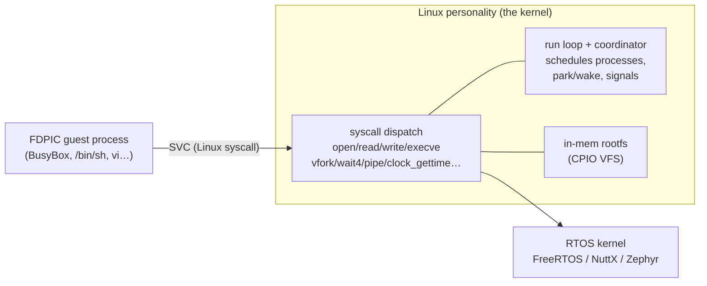

# Linux Personality

Run unmodified Linux/POSIX userspace software — BusyBox, uClibc-ng, `vi`/`less`,
`ps`/`top`, pthreads — as **processes** on top of FreeRTOS, NuttX, or Zephyr, on
an **MMU-less Cortex-M**. A real Buildroot uClinux boots to `init → login →
shell` over the serial console; the *same* rootfs runs on all three engines.

!!! note "Status"
    Functional on QEMU (mps2-an500 / an521) and on real **STM32F746G-DISCOVERY**
    hardware, across all three RTOS engines. Programs run **unprivileged in
    per-program MPU regions**; a stray access is contained (killed like SIGSEGV,
    the shell survives).

## Architecture

The "kernel" is the RTOS plus a thin **Linux syscall personality**. Guest
programs are **FDPIC** dynamic executables (uClibc-ng) whose read-only text is
executed in place (XIP) from a rootfs CPIO backed by internal flash, emulator
PSRAM, or external QSPI NOR, depending on the board.



- **Processes** are RTOS threads placed in fixed, MPU-isolated regions (a small
  pool of `NREG` slots). The single-source run loop + coordinator
  (`modules/lxp/src/lxp_run.c`) schedules them: `vfork`/`exec` co-run,
  `wait4`/pipe reads block via park/wake, signals deliver at syscall boundaries.
- **Isolation** — programs run unprivileged with a per-program MPU region set
  (Zephyr K_USER domains; FreeRTOS `ARM_CM4_MPU` restricted tasks; NuttX raw MPU
  regions). A fault traps to a containment handler → the process is killed, the
  kernel and other processes are untouched.
- **Filesystem** — a read-only Buildroot rootfs (BusyBox + coreutils + editors),
  supplied as a CPIO blob and served by an in-memory VFS. `/proc`, `/dev/null`,
  `/dev/console` are synthesised.
- **No MMU** — NOMMU FDPIC only (bFLT retired); `vfork` (no copy-on-write `fork`);
  shared-library text is XIP from the board's rootfs backing store.

## Use it

```bash
# QEMU (an500 = FreeRTOS/NuttX, an521 = Zephyr)
ove defconfig-fragments qemu.freertos.linux_interop
ove download && ove build
ove run                       # boots uClinux → `overtos login:` → root → /root #

# real hardware (STM32F746G-DISCOVERY via ST-Link)
ove defconfig-fragments stm32f746.freertos.linux_interop
ove download && ove build && ove flash
#   console: /dev/ttyACM0 @ 115200
```

Swap `freertos` for `nuttx` or `zephyr` — the same demo runs on each. At the
shell: `uname -a`, `ls -l /`, `ps`, `top`, `cat`, a pipe (`seq 5 | wc -l`), a
background job, `vi`, then `poweroff`.

The guest userspace is stock Buildroot (`../buildroot`, `output`). Add your
own guest programs as FDPIC binaries under `board/overtos/progs/` (see
`post-build.sh`) — that is how the test programs (`dbgdemo`, `lbench`) are built.

## More

- [Capabilities & limitations](capabilities.md) — what runs, and the current simplifications.
- [Debugging](debugging.md) — turnkey source-level GDB of FDPIC guest programs.
- [Benchmarks](benchmarks.md) — the personality tax (process vs native thread) on silicon.
