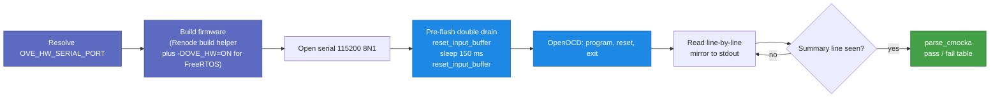
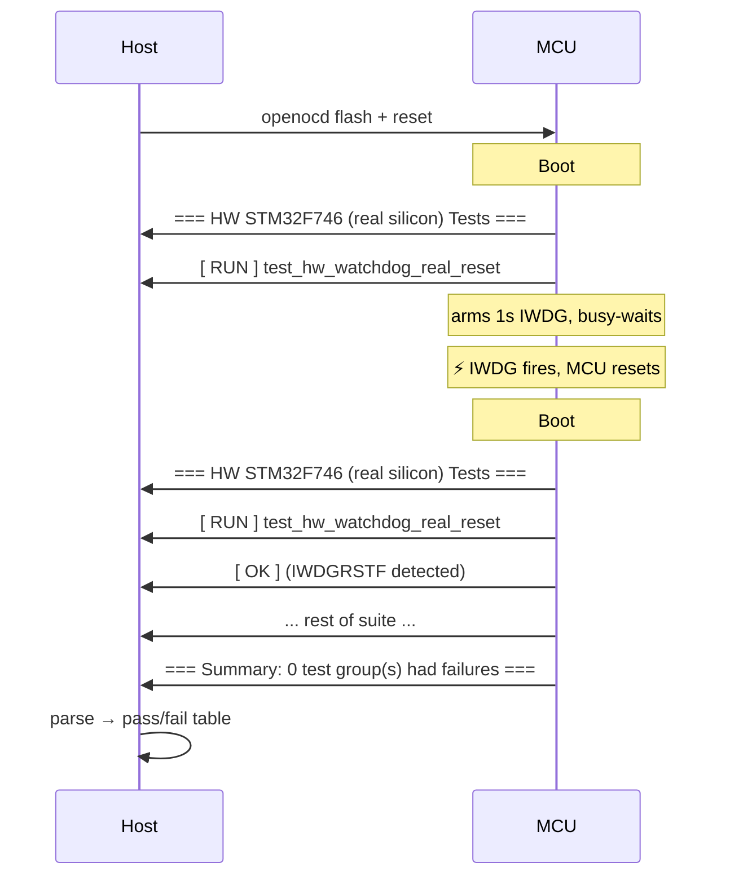

# Hardware-in-the-loop testing

The HW layer flashes the same firmware that the [Renode layer](renode.md)
emulates onto a real STM32F746G-Discovery board, then captures the
on-board ST-LINK VCP (USART1) over `/dev/ttyACMx` to read back the
CMocka summary.  It catches bugs Renode's models can't represent —
real PHY autonegotiation, real silicon timing, real watchdog reset.

**Manual-only.**  HW targets are intentionally absent from
`make test-all` and from `.github/workflows/ove-tests.yml` because
we don't have a board farm.  Run them on a developer machine with a
board connected.

## Prerequisites

- **STM32F746G-Discovery board** plugged in via the on-board ST-LINK
  USB connector (CN14).  The serial VCP shows up on Linux as
  `/dev/ttyACMx`; on macOS as `/dev/cu.usbmodem*`.
- **OpenOCD** installed system-wide (`apt install openocd` on
  Ubuntu).  The runner shells out to `openocd -f
  board/stm32f7discovery.cfg`.  `ove doctor` reports availability.
- **pyserial** in the project venv — `make .venv` installs it
  (`config/requirements.txt` lists `pyserial>=3.5`).  `ove doctor`
  reports availability.
- **Permissions** — your user needs read/write access to
  `/dev/ttyACM0` (typically via the `dialout` or `plugdev` group on
  Linux).

## Running

Set `OVE_HW_SERIAL_PORT` and invoke any `make test-hw-…` target:

```bash
export OVE_HW_SERIAL_PORT=/dev/ttyACM0
make test-hw-stm32f746-freertos
make test-hw-stm32f746-freertos-zeroheap
make test-hw-stm32f746-zephyr
make test-hw-stm32f746-zephyr-zeroheap
make test-hw-stm32f746-nuttx
make test-hw-stm32f746-nuttx-zeroheap
make test-hw                                 # all six in sequence
```

Without `OVE_HW_SERIAL_PORT` the runner errors out before flashing
with a clear message — no board interaction, no half-flashed state.

Optional knob: `OVE_HW_TIMEOUT=<seconds>` (default 120) bounds the
serial read window.  The runner exits as soon as it sees the
`=== Summary:` line; the timeout is only a guard for runaway boots.

## What the runner does



Source: `config/ove-cli/ove/test.py::_run_hw_stm32f746` plus six thin
wrappers (`test_hw_stm32f746_*`).  Build helpers are reused from the
Renode runner — only the runner step differs.

### Why the double pre-flash drain

A single `reset_input_buffer()` was undercounting CMocka frames on
Zephyr/NuttX zero-heap by ~9 tests because the ST-LINK USB pipeline
holds bytes in flight for a few hundred milliseconds after the
previous firmware halts.  Those bytes arrived in the kernel buffer
*after* the drain but *before* OpenOCD halted the CPU, mixing into
the new run's capture and double-counting frames.

The fix: drain → sleep 150 ms → drain again.  The sleep lets
in-flight bytes land in the kernel buffer so the second drain
catches them.  After OpenOCD halts the CPU the prior firmware can't
emit anything new, so by the time `reset exit` releases the new
firmware the buffer is fully clear.  The new code reads from byte
zero of the new firmware — no boot-output loss.

### `OVE_HW=ON` build switch

FreeRTOS HW builds toggle two things via `-DOVE_HW=ON`:

1. `tests/sim/renode-stm32f746-freertos*/CMakeLists.txt` switches the
   toolchain shim from `boards/qemu-mps2-an500/cmake/arm-none-eabi.cmake`
   (rdimon.specs → semihosting libc) to
   `boards/stm32f746g-discovery/freertos/cmake/arm-none-eabi.cmake`
   (nosys.specs → no host libc).  Done before `project()` because
   CMake processes toolchain files first.
2. `usart1_io.c` is linked instead of `semihosting_io.c`.  The new
   shim re-targets newlib's `_write` to a blocking
   `HAL_UART_Transmit` on USART1 (PA9/PB7 @ 115200) and provides a
   linker-script-backed `_sbrk`.

Zephyr and NuttX HW builds reuse the Renode build verbatim — Zephyr
already routes printk through USART1 via `CONFIG_UART_CONSOLE`, and
NuttX's `stm32f746g-disco:nsh` defconfig wires USART1 as the serial
console.

## Test matrix

Each HW target's count matches the corresponding Renode target
exactly — the same firmware ELF, the same CMocka suite list, the
same parser:

| Target | Tests | Mirrors Renode |
|---|---|---|
| `test-hw-stm32f746-freertos` | 219 | ✓ |
| `test-hw-stm32f746-freertos-zeroheap` | 192 | ✓ |
| `test-hw-stm32f746-zephyr` | 211 | ✓ |
| `test-hw-stm32f746-zephyr-zeroheap` | 184 | ✓ |
| `test-hw-stm32f746-nuttx` | 212 | ✓ |
| `test-hw-stm32f746-nuttx-zeroheap` | 185 | ✓ |

## HW-only tests

Three tests live in `tests/suites/test_hw_stm32f746.c` and run only
on the FreeRTOS HW target (gated on
`defined(OVE_HW) && defined(OVE_RENODE_STM32F746)`).  They each close
a coverage gap Renode/QEMU can't.

### `test_hw_watchdog_real_reset`

Runs **first** in the suite (and the suite runs **first** in
`suites.inc`).  On boot #1 it arms a 1 s IWDG via
`ove_watchdog_init` / `ove_watchdog_start`, busy-waits 2.5 s
without kicking; the MCU resets.  On boot #2 it detects
`RCC->CSR.IWDGRSTF`, clears it, and returns OK.  The runner's
"exit on first `=== Summary:`" logic naturally picks up the second
boot's complete output; only one CMocka counter is parsed.



Renode 1.16 doesn't model IWDG at all; this path was previously
unverified.

### `test_hw_time_sleep_accuracy`

`ove_thread_sleep_ms(1000)` bracketed by `ove_time_get_us`; asserts
the delta sits in `[990 ms, 1010 ms]` (±1 %).  Catches PLL
miscompute, AHB prescaler bugs, missing HSE.  Renode's virtual
clock is fake — these failure modes are invisible there.

### `test_hw_dwt_cycle_counter`

Samples `DWT->CYCCNT`, runs 10 000 NOPs, asserts `delta > 5000`
cycles.  `freertos_time.c::ove_time_delay_us` busy-waits on
`DWT->CYCCNT` in production.  Renode 1.16 leaves the counter stuck
at 0 — the Renode test target deliberately swaps in `stub_time.c`,
leaving DWT untested.  This closes that gap.

## Pin map for read-after-write tests

`tests/board_desc.h` defines `OVE_LED0_PORT/_PIN` as PI1 (port 8,
pin 1) — the Discovery's LD1 (green) LED.  This was originally PA0
(port 0, pin 0), which works on stub/Renode (both echo any pin's
ODR through IDR) but fails on real silicon: PA0 is wired to the
WAKE button's external 10 KΩ pull-up.

`test_gpio.c`, `test_led.c`, and `test_bsp.c` also explicitly call
`ove_gpio_configure(..., OVE_GPIO_MODE_OUTPUT_PP)` before any
read-after-write check.  Renode's STM32_GPIOPort echoes ODR through
IDR even when MODER says INPUT (unrealistic-but-convenient
simplification); real silicon's IDR only follows ODR in OUTPUT
mode.  The configure call is harmless on Renode/stub and
load-bearing on HW.

## What HW *can't* test (deferred)

`tests/suites/test_renode_stm32_obs.c` and
`test_renode_stm32_periph.c` skip three Renode-stimulus tests on
HW (`#ifndef OVE_HW`):

- `test_external_irq_trigger` — needs host-side stimulus injection
  (`sysbus.gpioPortA OnGPIO 0 true` in test.resc); no equivalent on
  silicon.
- `test_renode_i2c_ft5336_probe` — works on the real FT5336 chip,
  but needs I2C3 GPIO MspInit (`PH7`/`PH8`) which the test target
  doesn't link yet.  Re-enable once `bus_msp_init.c` lands in the
  HW build.
- `test_renode_spi_loopback` — `SPI.SPILoopback` is a Renode-only
  peripheral.  No physical loopback wire on the Discovery.

## Failure modes worth recognizing

| Symptom | Likely cause |
|---|---|
| `OVE_HW_SERIAL_PORT is not set` | Forgot to export the env var |
| `<openocd missing>` | `apt install openocd` |
| `<pyserial missing>` | Re-run `make .venv` |
| `<openocd flash failed>` | Board not detected — check `lsusb` for `0483:3752 STMicroelectronics ST-LINK/V2.1`, check `dmesg` for `/dev/ttyACMx` enumeration |
| `<no cmocka output>` after 120 s | Firmware didn't reach `printf` — sometimes a stale `.o` cache (NuttX); try `find tests/suites -name '*.c.*.o' -delete` |
| Test count off by ~9 from Renode | Should not happen with the current double-drain; if it does, raise `OVE_HW_DRAIN_IDLE_MS`-style knob would not help — file a bug |

## Doctor

```bash
ove doctor
```

reports `[✓] openocd` and `[✓] py:serial` under optional/HW
dependencies — both are required for HW runs but optional for sim
runs, so a missing one warns rather than fails.
