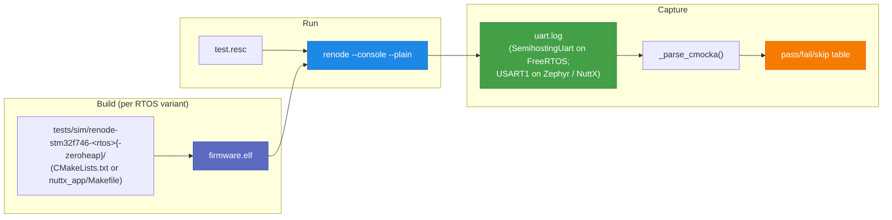

# Renode STM32F7 testing

Renode (Antmicro, MIT-licensed) is the open-source emulator that
models full STM32F7 silicon — IWDG, SAI, DMA, FMC/SDRAM, LTDC, NVIC,
and friends — at a fidelity where the unmodified `stm32f7xx_hal.h`
code runs.  oveRTOS uses Renode 1.16.1 with the
`platforms/boards/stm32f7_discovery-bb.repl` platform to gate every
PR on full-board execution of the CMocka suite.

## Why Renode

The QEMU MPS2-AN500 target exercises the CPU core, NVIC, SysTick,
scheduler, and the kernel-level parts of oveRTOS — but not any
STM32-specific peripheral code.  `backends/freertos/freertos_watchdog.c`
writes to `IWDG_HandleTypeDef` registers QEMU doesn't model;
`stm32f7xx_hal.c` is compiled-in-CI but never *executed*.  Renode
closes that gap on the fastest feedback loop CI can provide — the
same `firmware.elf` that goes on a real Discovery board boots under
Renode.  The complementary HW layer (manual-only,
[separate page](hw.md)) closes the gap to actual silicon.

## Test matrix

Six targets total — one per RTOS backend, two heap modes each:

| Target | Tests | Notes |
|---|---|---|
| `test-renode-stm32f746-freertos` | 219 | FreeRTOS heap-mode; full HAL + lwIP linked |
| `test-renode-stm32f746-freertos-zeroheap` | 192 | FreeRTOS static-only allocation |
| `test-renode-stm32f746-zephyr` | 211 | Zephyr `stm32f746g_disco`, heap pool 128 KiB |
| `test-renode-stm32f746-zephyr-zeroheap` | 184 | Zephyr `HW_STACK_PROTECTION=n` (workaround for Renode's MPU drift) |
| `test-renode-stm32f746-nuttx` | 212 | NuttX `stm32f746g-disco:nsh` |
| `test-renode-stm32f746-nuttx-zeroheap` | 185 | Same with `CONFIG_OVE_ZERO_HEAP` |

Group invocation:

```bash
make test-renode                                  # all six
make test-renode-stm32f746-freertos               # one
make test-renode-stm32f746-zephyr-zeroheap        # one
```

`ove test renode` is the equivalent inside the Python CLI.

## Architecture



The runner (`config/ove-cli/ove/test.py::_renode_run_elf`) is a thin
shim around `renode -e ... -e include @<resc> -e quit`.  Each RTOS has
its own build helper (`_build_renode_stm32f746`,
`_build_renode_stm32f746_zephyr`, `_build_renode_stm32f746_nuttx`)
that the HW runner reuses to avoid duplicating build logic.

## Per-RTOS notes

### FreeRTOS

Three sim trees: `tests/sim/renode-stm32f746-freertos/` (heap) and
`tests/sim/renode-stm32f746-freertos-zeroheap/`.  Both link the real
STM32F7 HAL, FreeRTOS ARM_CM7/r0p1 port, and lwIP.  Renode 1.16's
semihosting handler doesn't implement SYS_WRITE (0x05); the trees
ship a `semihosting_io.c` that overrides newlib's `_write` to emit
one byte at a time via SYS_WRITEC (0x03).  Test output is captured
through a `UART.SemihostingUart` attached by `test.resc`.

The FreeRTOS test target also exercises real HAL-backed drivers
against Renode's modelled peripherals:

- `STM32F7_I2C` answers FT5336 register reads at i2c3:0x38.
- `STM32F7_USART` accepts USART2 transmits.
- `STM32SPI` + `SPI.SPILoopback @ spi1` echoes SPI transfers.
- `Network.SynopsysEthernetMAC + EthernetPhysicalLayer` accepts the
  full lwIP TCP/IP path; the suite verifies static-IP bring-up and
  UDP loopback.

### Zephyr

`tests/sim/renode-stm32f746-{zephyr,zephyr-zeroheap}/`.  Built via
`west build -b stm32f746g_disco`.  printk goes through Zephyr's
`UART_CONSOLE` on USART1; `test.resc` taps that into a file backend.
Zero-heap variant disables `CONFIG_HW_STACK_PROTECTION` because
Zephyr's MPU programming for static thread stacks trips a USAGE_FAULT
("Illegal use of EPSR") on the first context switch back from
`k_sleep` under Renode 1.16's STM32F7 + ARM core combo.

`main()` ends in `for(;;)` rather than `semihosting_exit()` —
Renode 1.16 doesn't catch `SYS_EXIT_EXTENDED`, the bkpt fall-through
trips Zephyr's `k_thread_abort` cleanup into a fault loop, and the
resulting wall:sim ratio collapse blows past the 300 s harness ceiling.

### NuttX

`tests/sim/renode-stm32f746-{nuttx,nuttx-zeroheap}/`.  Built via
NuttX's `configure.sh stm32f746g-disco:nsh` followed by
`make olddefconfig && make`.  USART1 is the console.  The defconfig
overlay bumps `DEFAULT_TASK_STACKSIZE`, `PTHREAD_STACK_DEFAULT`,
`POSIX_SPAWN_DEFAULT_STACKSIZE`, and `IRQ_WORK_STACKSIZE` to 4 KiB
(the upstream `stm32f746g-disco:nsh` ships 2 KiB defaults that
overflow under cmocka).  It also sets `CONFIG_SCHED_WORKQUEUE=y` +
`CONFIG_SCHED_HPWORK=y` so `nuttx_timer.c`'s `SIGEV_THREAD` path
compiles.

`main()` returns rather than calling `semihosting_exit()` — same
rationale as Zephyr but additionally because the NuttX panic path
on Renode 1.16's STM32F7 halts the CPU at PC=0, which freezes
Renode's virtual clock so `RunFor` blocks forever.

## What Renode catches that QEMU doesn't

Concrete bugs Renode caught (or would catch) that QEMU misses:

- **HAL struct-layout regressions** — `IWDG_HandleTypeDef`,
  `SD_HandleTypeDef`, `ETH_HandleTypeDef` etc. depend on
  CubeF7 release.  QEMU never executes them, so a struct-size
  mismatch lands silently; Renode invokes them and trips canaries.
- **Driver descriptor wiring** — `freertos_eth.c::DMARxDscrTab` /
  `DMATxDscrTab` initialisation, ring-buffer pointer arithmetic.
- **Peripheral register-write bugs** — wrong bit positions, missing
  enable bits, incorrect prescaler computation.
- **lwIP integration bugs** — netif/socket lifecycles, ARP cache
  population (when paired with Renode's `Network.NetworkServer`).

## What Renode doesn't catch — see the [HW layer](hw.md)

- Real silicon errata (cache coherency, DMA-vs-CPU memory ordering).
- Real PHY autonegotiation timing (Renode's `EthernetPhysicalLayer`
  always reports link up).
- Real wall-clock from SysTick @ HCLK/1 kHz (Renode's virtual time
  is fake — PLL miscompute is invisible).
- DWT cycle counter advancing (Renode 1.16 leaves `DWT->CYCCNT`
  stuck at 0; oveRTOS's Renode-FreeRTOS firmware swaps in
  `stub_time.c` for this reason).
- IWDG actually resetting the MCU.
- SD card protocol — Renode's `STM32FSDMMC` rejects several
  registers `BSP_SD_Init` writes; FS/NVS coverage on FatFS is
  deferred (see the comment block at the bottom of
  `tests/suites/test_renode_stm32_periph.c`).

## Renode is downloaded automatically

Renode is tracked in `manifest.yaml` under `tools.renode`:

```yaml
tools:
  renode:
    version: "1.16.1"
    url:     "https://github.com/renode/renode/releases/download/v1.16.1/renode-1.16.1.linux-portable.tar.gz"
```

`make download` (or running any `test-renode-…` target the first
time) pulls the portable build into `output/tools/renode/`.
`ove doctor` reports its presence.
